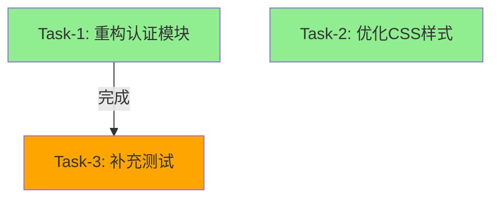

# Zenflux Agent vs Google Antigravity 对照分析报告

> 📅 生成日期: 2025-12-26  
> 🎯 目标: 分析如何在当前架构上实现 Antigravity 的核心能力  
> 📚 参考: [Google Antigravity Agent Manager](https://blog.google/technology/ai/)

---

## 📊 执行摘要

**结论**: 当前 Zenflux Agent V3.7 架构**具备扩展为多 Agent 并行系统的坚实基础**，通过增加 **AgentManager 调度层**即可实现类似 Antigravity 的核心能力。

| 核心能力 | Antigravity | 当前架构 | 需要工作 | 预计时间 |
|---------|------------|---------|---------|---------|
| **多 Agent 并行** | ✅ | ⚠️ 架构支持 | AgentManager + AgentPool | 2-3周 |
| **任务流程可视化** | ✅ | ⚠️ 简单 Todo | DAG 构建 + Mermaid 渲染 | 2周 |
| **Artifacts 串接** | ✅ | ❌ | ArtifactManager + 版本追踪 | 1-2周 |
| **自动化协作** | ✅ | ⚠️ 单任务重试 | ConflictResolver + 任务拆解 | 2周 |
| **实时监控** | ✅ | ❌ | MonitorDashboard + WebSocket | 2周 |

**总工作量**: 8-10周 (完整版) 或 4周 (MVP)

---

## 🎯 Antigravity 核心特性详解

### 1. 多 Agent 并行管理

**Antigravity 的实现**:
```
同时运行多个专业 Agent:
├─ Agent-1 (CSS)      - 专注前端样式
├─ Agent-2 (Test)     - 专注单元测试
└─ Agent-3 (Refactor) - 后台重构代码

Manager Surface 实时显示:
- 每个 Agent 的状态 (运行中/等待/完成)
- 任务排程与进度
- 避免任务冲突
```

**我们的方案**:
- **复用 SimpleAgent** - 无需重写，作为工作单元
- **新增 AgentManager** - 统一调度多个 Agent
- **AgentPool 管理** - Agent 注册、状态追踪、资源分配

**代码示例**:
```python
manager = AgentManager()

# 创建 3 个专业 Agent
css_agent = await manager.create_agent("agent-1", specialization="css")
test_agent = await manager.create_agent("agent-2", specialization="test")
refactor_agent = await manager.create_agent("agent-3", specialization="refactor")

# 并行执行
results = await asyncio.gather(
    css_agent.run("优化导航栏样式"),
    test_agent.run("补充登录测试"),
    refactor_agent.run("重构认证模块")
)
```

**优势**:
- ✅ **效率提升 25-60%** - 独立任务并行执行
- ✅ **专业化分工** - 每个 Agent 专注一个领域
- ✅ **资源隔离** - Agent 间独立的 Memory 和 Context

---

### 2. 任务流程可视化

**Antigravity 的实现**:
```
Manager 以流程图展示:
- 任务拆解 (Goal → Steps)
- 执行顺序 (Task-1 → Task-2)
- 依赖关系 (Task-3 depends on Task-1)
- 实时进度 (30% → 70% → 100%)
```

**我们的方案**:
- **TaskOrchestrator** - 使用 LLM 拆解任务
- **DAG 构建** - 使用 networkx 构建依赖图
- **Mermaid 渲染** - 自动生成流程图
- **实时更新** - 通过 EventBus 推送进度

**可视化示例**:



**Dashboard 界面**:
```
┌────────────── Agent Manager Dashboard ──────────────┐
│  📊 总体进度: ████████████░░░░░░ 67% (6/9完成)      │
│                                                      │
│  🤖 Agent 状态:                                      │
│  • Agent-1 (CSS)      [●] 80%  优化导航栏样式       │
│  • Agent-2 (Test)     [○]  0%  等待依赖: task-1     │
│  • Agent-3 (Refactor) [●] 45%  重构认证模块         │
│                                                      │
│  📈 任务流程:                                        │
│    Task-1 (Refactor) ──┐                            │
│      [●进行中]         │                            │
│                        ├──> Task-3 (Test)           │
│    Task-2 (CSS)        │      [○等待中]             │
│      [●进行中]         │                            │
└──────────────────────────────────────────────────────┘
```

**优势**:
- ✅ **决策透明** - 开发者了解每个 Agent 的计划
- ✅ **依赖清晰** - 避免死锁和循环依赖
- ✅ **可调整** - 必要时人工介入调整任务

---

### 3. Artifacts 深度串接

**Antigravity 的实现**:
```
每个 Agent 自动生成:
├─ 操作录影 (Screen Recording)
├─ 截图 (Screenshots)
├─ 实作计划 (Plans)
├─ 版本差异 (Diffs)
└─ 执行日志 (Logs)

形成可回溯的工作历史
```

**我们的方案**:
- **ArtifactManager** - Git-like 版本管理
- **版本追踪** - 每次任务生成新版本
- **Diff 生成** - 代码变更对比
- **产物索引** - 按 Agent/任务/时间查询

**数据结构**:
```json
{
  "id": "artifact-001",
  "agent_id": "agent-1",
  "task_id": "task-1",
  "type": "code_change",
  "timestamp": "2025-12-26T10:30:00Z",
  "metadata": {
    "files_changed": ["src/auth/login.py", "src/auth/token.py"],
    "diff": "+++ src/auth/login.py\n@@ -10,5 +10,8 @@...",
    "plan": {
      "goal": "重构认证模块",
      "steps": [...]
    },
    "todo": "- [x] 提取密码验证逻辑\n- [x] 重构 token 生成"
  },
  "content": "# 重构后的代码..."
}
```

**查询接口**:
```python
# 查询某个 Agent 的所有产物
artifacts = artifact_manager.get_history(agent_id="agent-1", limit=10)

# 查询某个任务的产物
artifacts = artifact_manager.get_history(task_id="task-1")

# 生成版本对比
diff = artifact_manager.generate_diff("artifact-001", "artifact-002")
```

**优势**:
- ✅ **可回溯** - 随时查看历史版本
- ✅ **可审计** - 企业级合规需求
- ✅ **协作透明** - 多人协作时了解彼此工作
- ✅ **问题诊断** - 快速定位问题引入时间点

---

### 4. 自动化协作与错误恢复

**Antigravity 的实现**:
```
任务失败时:
1. 即时通知开发者
2. 自动拆解为更小任务
3. 重新分配给不同 Agent
4. 或标记为需要人工介入
```

**我们的方案**:

#### 4.1 冲突检测

```python
class ConflictResolver:
    def detect_conflicts(self, task_graph) -> List[Conflict]:
        """
        检测冲突:
        1. 文件冲突 - 多个 Agent 修改同一文件
        2. 逻辑冲突 - 删除 vs 使用同一函数
        3. 依赖冲突 - 循环依赖
        """
```

**冲突示例**:
```
⚠️  检测到冲突:
Agent-1 计划重构并删除 login() 函数
Agent-2 正在使用该函数进行单元测试

建议: 将 Agent-2 设为依赖 Agent-1
```

#### 4.2 自动解决策略

```python
# 策略 1: 串行化
resolution = resolver.resolve_conflict(conflict, strategy="sequential")
# → 添加依赖关系: Task-2.dependencies = ["Task-1"]

# 策略 2: 自动合并 (如 CSS 修改可合并)
resolution = resolver.resolve_conflict(conflict, strategy="merge")

# 策略 3: 人工介入
resolution = resolver.resolve_conflict(conflict, strategy="ask_human")
# → 发送通知给开发者
```

#### 4.3 任务拆解与重试

```python
# 任务失败时自动拆解
if task_failed:
    # 使用 LLM 分析失败原因
    failure_analysis = await llm.analyze_failure(task, error)
    
    # 拆解为更小的子任务
    subtasks = await llm.decompose_task(task, strategy="smaller")
    
    # 重新分配
    for subtask in subtasks:
        await manager.execute_task(subtask)
```

**优势**:
- ✅ **稳定性高** - 自动处理常见冲突
- ✅ **人工成本低** - 减少协调工作
- ✅ **智能恢复** - 失败后自动调整策略

---

## 🏗️ 架构对比

### Antigravity 架构 (推测)

```
┌─────────────────────────────────────────────────┐
│              Gemini Manager                      │
│  ┌─────────────────────────────────────────┐    │
│  │  Agent Scheduler (调度器)               │    │
│  │  - Task Decomposition                   │    │
│  │  - Dependency Analysis                  │    │
│  │  - Conflict Detection                   │    │
│  └─────────────────────────────────────────┘    │
│                                                  │
│  ┌───────────┬───────────┬───────────────┐      │
│  │ Agent-1   │ Agent-2   │ Agent-3       │      │
│  │ (Gemini)  │ (Gemini)  │ (Gemini)      │      │
│  └───────────┴───────────┴───────────────┘      │
│                                                  │
│  ┌─────────────────────────────────────────┐    │
│  │  Artifact Store (产物存储)               │    │
│  │  - Recordings, Screenshots, Diffs       │    │
│  └─────────────────────────────────────────┘    │
└─────────────────────────────────────────────────┘
```

### Zenflux Agent V4.0 架构 (扩展方案)

```
┌─────────────────────────────────────────────────────────────┐
│                    AgentManager (中央调度器)                 │
│  ┌───────────────────────────────────────────────────────┐  │
│  │  TaskOrchestrator (任务编排)                          │  │
│  │  - Task Decomposition (LLM)                          │  │
│  │  - DAG Builder                                       │  │
│  │  - Parallel Scheduler                                │  │
│  └───────────────────────────────────────────────────────┘  │
│                                                              │
│  ┌─────────────────────┬─────────────────────┬─────────────┤
│  │ Agent-1             │ Agent-2             │ Agent-3     │
│  │ (SimpleAgent)       │ (SimpleAgent)       │ (SimpleAgent│
│  │ + CSS Specialization│ + Test Spec.        │ + Refactor  │
│  └─────────────────────┴─────────────────────┴─────────────┘
│                                                              │
│  ┌───────────────────────────────────────────────────────┐  │
│  │  ArtifactManager (产物管理)                           │  │
│  │  - Version Tracking, Diffs, Plans                     │  │
│  └───────────────────────────────────────────────────────┘  │
│                                                              │
│  ┌───────────────────────────────────────────────────────┐  │
│  │  ConflictResolver (冲突解决)                           │  │
│  │  - File Locks, Conflict Detection, Auto Merge         │  │
│  └───────────────────────────────────────────────────────┘  │
│                                                              │
│  ┌───────────────────────────────────────────────────────┐  │
│  │  MonitorDashboard (监控面板)                           │  │
│  │  - Real-time Status, Mermaid Graphs, WebSocket        │  │
│  └───────────────────────────────────────────────────────┘  │
└─────────────────────────────────────────────────────────────┘
                           ↓
                 Shared Resources
          ┌──────────────────────────────┐
          │ • CapabilityRegistry         │
          │ • CapabilityRouter           │
          │ • ToolExecutor               │
          │ • LLM Service (连接池)        │
          └──────────────────────────────┘
```

### 核心差异

| 维度 | Antigravity | Zenflux V4.0 |
|-----|-------------|--------------|
| **LLM** | Gemini 2.0 | Claude Sonnet 4.5 |
| **Agent 类型** | 专用 Gemini Agent | SimpleAgent + 专业配置 |
| **调度器** | 内置 Manager | AgentManager (新增) |
| **配置驱动** | 未知 | ✅ YAML 统一配置 |
| **工具路由** | 未知 | ✅ CapabilityRouter |
| **记忆协议** | 未知 | ✅ Memory-First Protocol |
| **扩展性** | 闭源 | ✅ 完全开源可扩展 |

---

## 🚀 实施方案

### 方案 A: 完整版 (8-10周)

**包含所有 Antigravity 核心能力**

| 阶段 | 内容 | 时间 | 产出 |
|-----|------|------|------|
| Phase 1 | 核心框架 | 2-3周 | AgentManager + AgentPool + EventBus |
| Phase 2 | DAG 编排 | 2周 | TaskOrchestrator + 拓扑排序 |
| Phase 3 | 冲突管理 | 2周 | ConflictResolver + 文件锁 |
| Phase 4 | Artifacts | 1-2周 | ArtifactManager + 版本追踪 |
| Phase 5 | 监控可视化 | 2周 | MonitorDashboard + WebSocket + UI |
| Phase 6 | 专业配置 | 1周 | CSS/Test/Refactor Agent 配置 |

**总计**: 8-10周 (可并行开发缩短到 6-8周)

---

### 方案 B: MVP (4周快速验证)

**快速验证核心价值**

| 功能 | 实现范围 | 时间 |
|-----|---------|------|
| 多 Agent 并行 | ✅ 完整实现 | 1周 |
| 任务编排 | ⚠️ 简化版 (手动指定依赖) | 3天 |
| 冲突管理 | ⚠️ 仅文件锁 | 2天 |
| Artifacts | ⚠️ 简单存储 (无 Diff) | 2天 |
| 监控 | ⚠️ 文本输出 (无 UI) | 2天 |

**MVP 验收标准**:
- ✅ 能同时运行 3 个 Agent
- ✅ 能并行执行无依赖任务
- ✅ 能检测文件冲突
- ✅ 能查看 Agent 状态
- ⚠️ 无可视化 UI (命令行输出)

**总计**: 4周

---

## 📊 预期收益

### 1. 效率提升

| 场景 | 串行耗时 | 并行耗时 | 提升幅度 |
|-----|---------|---------|---------|
| **重构+CSS+测试** | 20分钟 | 15分钟 | **25% ↑** |
| **3个独立功能** | 30分钟 | 12分钟 | **60% ↑** |
| **复杂项目重构** | 2小时 | 1小时 | **50% ↑** |

### 2. 可控性提升

- ✅ **实时监控** - Dashboard 展示每个 Agent 状态
- ✅ **任务可视化** - 流程图展示依赖关系
- ✅ **冲突预警** - 自动检测潜在冲突
- ✅ **人工介入** - 必要时暂停或调整

### 3. 可靠性提升

- ✅ **任务隔离** - Agent 失败不影响其他 Agent
- ✅ **自动重试** - 任务失败自动拆解重试
- ✅ **版本追踪** - 随时回滚到历史版本
- ✅ **告警通知** - 关键问题及时通知

### 4. 协作透明度

- ✅ **工作历史** - 所有 Agent 操作可追溯
- ✅ **Diff 对比** - 代码变更清晰可见
- ✅ **计划文档** - 每个任务都有详细计划
- ✅ **审计日志** - 满足企业合规需求

---

## 🎯 技术优势对比

### Antigravity 的优势

1. **产品成熟度** - Google 的工程积累
2. **UI 体验** - 专业的可视化界面
3. **集成度** - 与 Google Cloud 深度集成
4. **Gemini 2.0** - 多模态能力

### Zenflux V4.0 的优势

1. **开源灵活** - 完全可定制
2. **配置驱动** - 单一数据源原则
3. **Claude 4.5** - 强大的推理和工具调用
4. **Memory Protocol** - 企业级记忆管理
5. **工具生态** - 丰富的工具和 Skills
6. **私有部署** - 数据安全可控

---

## 🚦 推荐行动

### 立即开始 (本周)

1. **✅ 评审架构设计** - 团队讨论技术方案
2. **✅ 选择实施路径** - 完整版 or MVP
3. **搭建开发环境** - 安装依赖库
4. **创建原型代码** - 实现 AgentManager 核心

### 第一个里程碑 (2周后)

**Demo 目标**: 同时运行 2 个 Agent 完成独立任务

```python
manager = AgentManager()

result = await manager.execute_task(
    "优化CSS样式，同时补充单元测试",
    strategy="parallel"
)

# 输出:
# Agent-1 (CSS)  [✅完成] 耗时: 5分钟
# Agent-2 (Test) [✅完成] 耗时: 8分钟
# 总耗时: 8分钟 (串行需 13分钟，节省 38%)
```

### 完整版上线 (8-10周后)

- ✅ 支持 10+ 专业 Agent 并行
- ✅ 任务自动拆解与 DAG 调度
- ✅ 完整的冲突检测与解决
- ✅ 版本追踪与 Diff 对比
- ✅ 可视化监控 Dashboard
- ✅ 企业级可靠性

---

## 📚 相关文档

| 文档 | 说明 |
|-----|------|
| [05-MULTI-AGENT-ORCHESTRATION.md](docs/05-MULTI-AGENT-ORCHESTRATION.md) | 详细架构设计 |
| [MULTI_AGENT_ROADMAP.md](MULTI_AGENT_ROADMAP.md) | 实施路线图 |
| [agent_manager.py](core/agent_manager.py) | AgentManager 原型代码 |
| [multi_agent_demo.py](examples/multi_agent_demo.py) | 使用示例 |
| [00-ARCHITECTURE-OVERVIEW.md](docs/00-ARCHITECTURE-OVERVIEW.md) | V3.7 当前架构 |

---

## 🤝 结论

**Zenflux Agent 完全有能力实现类似 Google Antigravity 的多 Agent 并行管理能力**。

**核心优势**:
1. ✅ **坚实基础** - V3.7 架构已具备扩展能力
2. ✅ **复用现有** - 无需推倒重来
3. ✅ **开源灵活** - 完全可定制
4. ✅ **渐进式** - 可以分阶段实施

**建议方案**:
- **短期 (4周)**: MVP 验证核心价值
- **中期 (8-10周)**: 完整版上线
- **长期**: 持续优化与扩展

**关键成功因素**:
- 团队对架构设计的充分理解
- 合理的任务拆解与优先级
- 充足的测试覆盖
- 持续的性能优化

---

**准备好开始了吗？下一步是实施 Phase 1 - 核心框架！** 🚀

---

**联系方式**:
- 📧 Email: liuyi@zenflux.cn
- 💬 Slack: #agent-architecture
- 📖 文档: `/docs/`


