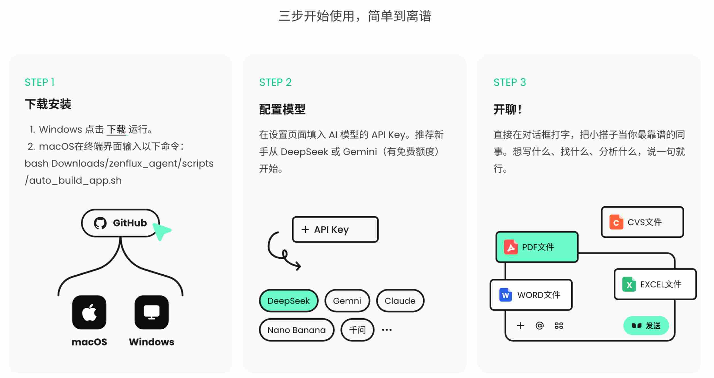
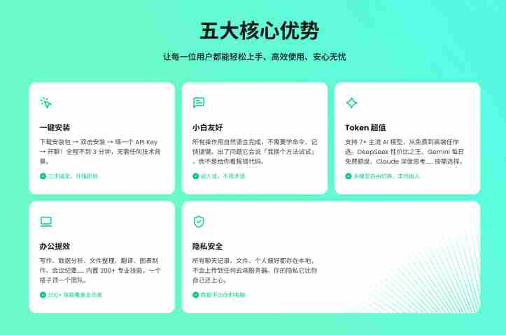

<p align="center">
  
</p>

<h1 align="center">小搭子</h1>

<p align="center">
  <strong>养在电脑里的开源 AI 搭子。</strong><br/>
  100% 本地存储 · 200+ 即插即用技能 · 7+ 大模型 · macOS & Windows
</p>

<p align="center">
  <a href="https://opensource.org/licenses/MIT"></a>
  <a href="https://www.python.org/downloads/"></a>
  <a href="https://github.com/malue-ai/dazee-small/stargazers"></a>
</p>

<p align="center">
  中文 | <a href="README.md">English</a>
</p>

<p align="center">
  
</p>

---

## 小搭子是什么？

小搭子是一个开源 AI 智能体，**以原生桌面应用（Tauri）运行在你的电脑上**。所有数据留在本地，能直接操作你的电脑——管理文件、自动化应用、生成文档，并且跨会话记住你的偏好。

### 演示视频

<video src="docs/assets/demo.mp4" width="720" controls>
  你的浏览器不支持视频播放。<a href="docs/assets/demo.mp4">下载演示视频</a>。
</video>

### 五大核心优势

<p align="center">
  
</p>

| | 云端 AI 助手 | 小搭子 |
|---|---|---|
| **数据** | 存储在服务商的服务器 | 100% 本地（SQLite + 纯文件） |
| **记忆** | 跨会话遗忘 | 通过可编辑的 `MEMORY.md` + 语义搜索记住偏好 |
| **技能** | 固定能力 | 200+ 即插即用技能，写 Markdown 就能添加 |
| **模型** | 锁定单一供应商 | 自由切换 Claude、GPT、千问、DeepSeek、Gemini、GLM 或 Ollama |
| **容错** | 静默失败或重试 | 错误分类 → 回溯错误路径 → 优雅降级 |

---

## 快速开始

### 方式一：一键安装（普通用户）

**Windows** — 从 [Releases](https://github.com/malue-ai/dazee-small/releases) 下载安装包，双击运行。

**macOS** — 打开终端，输入：

```bash
bash <(curl -fsSL https://raw.githubusercontent.com/malue-ai/dazee-small/main/scripts/auto_build_app.sh)
```

安装完成后，在设置页面填入 AI 模型的 API Key（新手推荐从 DeepSeek 或 Gemini 免费额度开始）。

### 方式二：从源码安装（开发者）

```bash
git clone https://github.com/malue-ai/dazee-small.git
cd dazee-small

python3 -m venv .venv
source .venv/bin/activate   # Windows: .venv\Scripts\activate
pip install -r requirements.txt
```

创建 `config.yaml`（或启动后通过设置页面配置）：

```yaml
api_keys:
  ANTHROPIC_API_KEY: sk-ant-api03-your-key-here   # 推荐
  # OPENAI_API_KEY: sk-xxx
  # DASHSCOPE_API_KEY: sk-xxx                      # 千问
  # GOOGLE_API_KEY: xxx                            # Gemini（免费：1500 次/天）
```

启动后端：

```bash
uvicorn main:app --host 0.0.0.0 --port 8000 --reload
```

启动前端：

```bash
cd frontend
npm install && npm run dev
# 打开 http://localhost:5174
```

<details>
<summary><strong>桌面应用（Tauri）— 需要 Rust 工具链</strong></summary>

```bash
# 安装 Rust: https://rustup.rs/
cd frontend
npm run tauri:dev     # 开发模式
npm run tauri:build   # 生产构建
```

</details>

<details>
<summary><strong>完全离线运行（Ollama）</strong></summary>

安装 [Ollama](https://ollama.ai)，然后在 `config.yaml` 中设置：

```yaml
llm:
  COT_AGENT_MODEL: ollama/llama3.1
```

无需 API Key，所有推理在本地运行。

</details>

---

## 核心设计理念

### LLM-First — 永远不做关键词匹配

所有语义任务——意图分类、技能选择、复杂度推断、回溯决策——全部由大模型完成。硬编码规则仅用于格式验证、数值计算和安全边界。

**为什么重要：** 当用户说 *"不要做 PPT，直接给我要点"*，关键词系统匹配到"PPT"会加载错误的工具。小搭子的 LLM 驱动意图分析能正确理解否定语义，加载零个 PPT 技能。

### Skills as Markdown — 200+ 且持续增长

每个技能是一个包含 `SKILL.md` 的目录。大多数技能不需要 Python 代码——LLM 读取指令并使用内置工具执行。

尽管有 200+ 技能，**默认加载零个**。每次请求只激活匹配用户意图的技能组（通常 200+ 中的 0–15 个）。一句"你好"消耗 0 技能 token；一个复杂研究任务消耗约 1,200。

### 本地优先 — 你的数据留在你的电脑

| 存储 | 技术 | 用途 |
|---|---|---|
| 消息与会话 | SQLite（WAL 模式） | 异步读写，并发访问 |
| 全文搜索 | SQLite FTS5 | BM25 排序，零配置 |
| 语义向量 | sqlite-vec（可选） | 向量相似度，单文件 |
| 用户记忆 | `MEMORY.md` | 纯文本，用户可编辑 |
| 文件附件 | 本地文件系统 | 实例隔离 |

无云数据库、无外部向量库、无第三方分析。大模型推理默认使用云 API，通过 Ollama 可实现完全离线运行。

---

## 架构概览

```
┌─────────────────────────────────────────────────────────────────────────────┐
│  Layer 1 — 用户界面                                                         │
│    Tauri 2.10 (Rust) · Vue 3.4 + TypeScript · Apple Liquid 设计              │
├─────────────────────────────────────────────────────────────────────────────┤
│  Layer 2 — API 与服务                                                       │
│    FastAPI (REST + SSE + WebSocket) · 多通道网关                              │
├─────────────────────────────────────────────────────────────────────────────┤
│  Layer 3 — Agent 引擎                                                       │
│    意图分析器（LLM，4 层缓存，<200ms）                                         │
│    RVR-B 执行器（React → Validate → Reflect → Backtrack）                     │
│    上下文工程（3 阶段注入，KV-Cache 90%+ 命中，scratchpad）                     │
│    计划管理器（DAG 任务，实时进度 UI）                                          │
├──────────────────────────────┬──────────────────────────────────────────────┤
│  Layer 4 — 能力层            │  Layer 5 — 基础设施                            │
│    200+ Skills（20 组）      │    7 大模型供应商 + Ollama                      │
│    工具系统（意图裁剪）       │    SQLite + FTS5 + sqlite-vec                  │
│    3 层记忆                  │    实例隔离                                     │
│    Playbook 学习             │    3 层评估                                     │
└──────────────────────────────┴──────────────────────────────────────────────┘
```

**请求生命周期：** 用户消息 → 意图分析（<200ms，缓存） → 技能与工具选择 → RVR-B 执行循环（流式输出、调用工具、验证、必要时回溯） → 记忆提取 → 响应完成。

<details>
<summary><strong>小搭子 vs 典型 Agent 框架</strong></summary>

| 能力 | 小搭子 | 典型框架 |
|---|---|---|
| **意图分析** | 每次请求 LLM 语义分析（4 层缓存，<200ms），按请求调整技能加载、规划深度和 token 预算 | 按会话或固定配置路由，每次请求分配相同资源 |
| **错误恢复** | RVR-B 循环：分类错误 → 回溯错误路径 → 清理上下文污染 → 部分结果优雅降级 | 重试 + 模型故障转移，解决基础设施故障而非策略失败 |
| **上下文管理** | 主动式：3 阶段注入、渐进式历史衰减、scratchpad 文件交换（100x 压缩）、KV-Cache 优化（90%+ 命中） | 被动式：上下文溢出时截断或摘要 |
| **技能加载** | 默认加载 0 个技能，意图驱动的延迟分配，token 成本随任务复杂度而非库大小缩放 | 预加载所有能力，或手动选择工具 |
| **规划** | 显式 DAG 计划，带 UI 进度组件，失败时重新规划 | 隐式思维链，无可见性，无恢复 |
| **评估** | 3 层评分（代码 + LLM-as-Judge + 人工），12 类失败分类，自动回归 | 外部评估工具或手动测试 |
| **学习** | Playbook 系统：提取策略 → 用户确认 → 应用到未来任务 | 无内置学习循环 |

</details>

---

## 技术栈

| 层级 | 技术 |
|---|---|
| 桌面壳 | Tauri 2.10 (Rust) |
| 前端 | Vue 3.4 + TypeScript + Tailwind CSS 4.1 + Pinia |
| 后端 | Python 3.12 + FastAPI + asyncio |
| 通信 | SSE + WebSocket + REST |
| 存储 | SQLite (WAL) + FTS5 + sqlite-vec |
| 大模型 | Claude、OpenAI、千问、DeepSeek、Gemini、GLM、Ollama |
| 记忆 | MEMORY.md + FTS5 + Mem0 |
| 评估 | 代码评分器 + LLM-as-Judge + 人工审核 |

## 项目结构

<details>
<summary><strong>点击展开</strong></summary>

```
xiaodazi/
├── frontend/            # Vue 3 + Tauri 桌面应用
├── core/
│   ├── agent/           # RVR-B 执行、回溯
│   ├── routing/         # LLM-First 意图分析
│   ├── context/         # 上下文工程（注入、压缩、缓存）
│   ├── tool/            # 工具注册、选择、执行
│   ├── skill/           # 技能加载器、分组注册
│   ├── memory/          # 3 层记忆（Markdown + FTS5 + Mem0）
│   ├── playbook/        # 在线学习（策略提取）
│   ├── llm/             # 7 大模型供应商 + 格式适配器
│   ├── planning/        # DAG 任务规划 + 进度追踪
│   ├── termination/     # 自适应终止策略
│   ├── state/           # 快照 / 回滚
│   └── monitoring/      # 故障检测、token 审计
├── routers/             # FastAPI HTTP/WS 端点
├── services/            # 业务逻辑（协议无关）
├── tools/               # 内置工具实现
├── skills/              # 共享技能库
├── instances/           # Agent 实例配置
├── evaluation/          # E2E 测试套件 + 评分器
├── models/              # Pydantic 数据模型
└── infra/               # 存储基础设施（SQLite、缓存）
```

</details>

---

## 扩展小搭子

### 添加技能（无需代码）

在 `skills/` 或 `instances/xiaodazi/skills/` 下创建目录，包含一个 `SKILL.md`：

```markdown
# 我的自定义技能

## When to Use
当用户要求 [描述触发场景]。

## Instructions
1. 首先，[步骤一]
2. 然后，[步骤二]
3. 最后，[步骤三]

## metadata
os_compatibility: common
dependency_level: builtin
```

技能会被自动发现、分类，下次请求即可使用。

### 添加大模型供应商

在 `core/llm/` 中参照现有适配器（Claude、OpenAI、千问等）实现 provider 类，注册到 `LLMRegistry`。

### 添加消息通道

在 `core/gateway/` 中实现网关适配器。`ChatService` 是协议无关的——你的适配器只需处理消息格式转换。

---

## 已知问题

我们坦诚面对目前做得不够好的地方。

<details>
<summary><strong>稳定性</strong></summary>

- **长会话记忆压力** — 在 80+ 轮对话中，上下文压缩偶尔会丢弃 Agent 后续需要的信息。
- **进程崩溃** — Python 后端在并发文件写入时可能意外退出。Tauri 壳尚未实现自动重启 sidecar。
- **SQLite 写入竞争** — 当记忆提取、会话保存和 Playbook 提取同时触发时，较慢的磁盘上偶尔出现 `database is locked` 错误。

</details>

<details>
<summary><strong>Agent 质量</strong></summary>

- **回溯时机** — RVR-B 循环有时回溯太晚（上下文已被污染）或太急（放弃了本可成功的方法）。
- **规划粒度** — 计划有时太粗（一个巨大步骤）或太细（简单任务 20 个微步骤）。

</details>

<details>
<summary><strong>平台</strong></summary>

- **macOS 是主要测试平台。** Windows 支持已有但测试较少。
- **仅限单机。** 无远程访问、无移动端、无多设备同步。
- **仅文本。** 暂无语音输入/输出。

</details>

---

## 路线图

- [ ] Windows 平台加固
- [ ] Sidecar 自动重启与健康监控
- [ ] 重要性感知的上下文压缩
- [ ] 技能市场 / 社区注册表
- [ ] 并行工具执行
- [ ] 语音输入/输出
- [ ] 更多消息通道（Discord、Slack、WhatsApp）

---

## 文档

| 文档 | 说明 |
|---|---|
| **[架构总览](docs/architecture/README.md)** | 完整 5 层架构，12 个深度模块 |
| [前端与桌面](docs/architecture/01-frontend-and-desktop.md) | Tauri + Vue 3，Apple Liquid 设计 |
| [API 与服务](docs/architecture/02-api-and-services.md) | 三层架构，预处理管线 |
| [意图分析](docs/architecture/03-intent-and-routing.md) | LLM-First 语义分析，4 层缓存 |
| [Agent 执行](docs/architecture/04-agent-execution.md) | RVR-B 循环，回溯，自适应终止 |
| [上下文工程](docs/architecture/05-context-engineering.md) | 3 阶段注入，压缩，KV-Cache |
| [工具系统](docs/architecture/06-tool-system.md) | 2 层注册，意图驱动裁剪 |
| [技能生态](docs/architecture/07-skill-ecosystem.md) | 200+ 技能，2D 分类，延迟分配 |
| [记忆系统](docs/architecture/08-memory-system.md) | 3 层记忆，双写，融合搜索 |
| [LLM 多模型](docs/architecture/09-llm-multi-model.md) | 7 供应商，格式适配，故障转移 |
| [实例与配置](docs/architecture/10-instance-and-config.md) | 提示词驱动的 schema，实例隔离 |
| [评估](docs/architecture/11-evaluation.md) | 3 层评分，E2E 管线，故障检测 |
| [Playbook 学习](docs/architecture/12-playbook-learning.md) | 闭环策略学习 |

---

## 贡献

欢迎各种形式的贡献：

- **编写技能** — 最低门槛的贡献方式。写一个 `SKILL.md`，提交 PR。
- **Bug 报告** — 尤其是 Windows 平台。每个崩溃报告都在改进项目。
- **提示词调优** — 帮助提升意图分析准确率或 Agent 响应质量。
- **文档** — 教程、示例、翻译。
- **代码** — 先阅读[架构文档](docs/architecture/README.md)了解代码库。

## Star History

<a href="https://star-history.com/#malue-ai/dazee-small&Date">
 <picture>
   <source media="(prefers-color-scheme: dark)" srcset="https://api.star-history.com/svg?repos=malue-ai/dazee-small&type=Date&theme=dark" />
   <source media="(prefers-color-scheme: light)" srcset="https://api.star-history.com/svg?repos=malue-ai/dazee-small&type=Date" />
   
 </picture>
</a>

## 贡献者

<a href="https://github.com/malue-ai/dazee-small/graphs/contributors">
  
</a>

## 作者

- **刘屹** ([@ironliuyi](https://github.com/ironliuyi)) — liuyi@zenflux.cn
- **汪康成** — wangkangcheng@zenflux.cn
- **曾梦旗** — zengmengqi@zenflux.cn
- **谢海鹏** — xiehaipeng@zenflux.cn

## 许可证

[MIT](LICENSE) — Copyright (c) 2025-2026 ZenFlux
