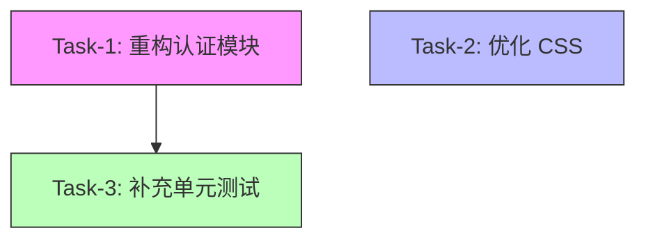

# Multi-Agent 并行调度架构设计

> 📅 **创建日期**: 2025-12-26  
> 🎯 **目标**: 支持类似 Google Antigravity 的多 Agent 并行管理能力  
> 🔗 **基于版本**: V3.7 架构

---

## 🎯 核心目标

基于当前 V3.7 架构，扩展支持以下能力：

1. **多 Agent 并行管理** - 同时运行多个专业 Agent
2. **任务流程可视化** - DAG 任务图与依赖关系管理
3. **Artifacts 深度串接** - 自动记录工作历史与版本
4. **自动化协作** - 任务失败自动拆解与重分配

---

## 🏗️ 整体架构

```
┌─────────────────────────────────────────────────────────────────────────────┐
│                          AgentManager (中央调度器)                           │
├─────────────────────────────────────────────────────────────────────────────┤
│                                                                              │
│  ┌────────────────────────────────────────────────────────────────────────┐ │
│  │                     TaskOrchestrator (任务编排器)                       │ │
│  │  ━━━━━━━━━━━━━━━━━━━━━━━━━━━━━━━━━━━━━━━━━━━━━━━━━━━━━━━━━━━━━━━━━━━━ │ │
│  │  • 任务拆解 (Task Decomposition)                                       │ │
│  │  • 依赖分析 (Dependency Analysis)                                      │ │
│  │  • DAG 构建 (Task Graph)                                               │ │
│  │  • 并行调度 (Parallel Scheduling)                                      │ │
│  └────────────────────────────────────────────────────────────────────────┘ │
│                                                                              │
│  ┌────────────────────────────────────────────────────────────────────────┐ │
│  │                    AgentPool (Agent 池管理)                             │ │
│  │  ━━━━━━━━━━━━━━━━━━━━━━━━━━━━━━━━━━━━━━━━━━━━━━━━━━━━━━━━━━━━━━━━━━━━ │ │
│  │  Agent-1 (CSS)     [状态: running] [进度: 70%]                         │ │
│  │  Agent-2 (Test)    [状态: waiting] [进度: 0%]                          │ │
│  │  Agent-3 (Refactor)[状态: running] [进度: 45%]                         │ │
│  │  ...                                                                    │ │
│  └────────────────────────────────────────────────────────────────────────┘ │
│                                                                              │
│  ┌────────────────────────────────────────────────────────────────────────┐ │
│  │                   EventBus (事件总线)                                   │ │
│  │  ━━━━━━━━━━━━━━━━━━━━━━━━━━━━━━━━━━━━━━━━━━━━━━━━━━━━━━━━━━━━━━━━━━━━ │ │
│  │  • agent.started, agent.progress, agent.completed                      │ │
│  │  • task.blocked, task.failed, task.retry                               │ │
│  │  • artifact.created, artifact.updated                                  │ │
│  └────────────────────────────────────────────────────────────────────────┘ │
│                                                                              │
│  ┌────────────────────────────────────────────────────────────────────────┐ │
│  │                  ArtifactManager (产物管理器)                           │ │
│  │  ━━━━━━━━━━━━━━━━━━━━━━━━━━━━━━━━━━━━━━━━━━━━━━━━━━━━━━━━━━━━━━━━━━━━ │ │
│  │  • 版本追踪 (Git-like versioning)                                      │ │
│  │  • 截图/录屏 (Screenshots/Videos)                                      │ │
│  │  • Diff 对比 (Code Diff)                                               │ │
│  │  • 计划文档 (Plans & Todos)                                            │ │
│  └────────────────────────────────────────────────────────────────────────┘ │
│                                                                              │
│  ┌────────────────────────────────────────────────────────────────────────┐ │
│  │                 ConflictResolver (冲突解决器)                           │ │
│  │  ━━━━━━━━━━━━━━━━━━━━━━━━━━━━━━━━━━━━━━━━━━━━━━━━━━━━━━━━━━━━━━━━━━━━ │ │
│  │  • 文件锁检测 (File Lock Detection)                                    │ │
│  │  • 任务冲突检测 (Task Conflict Detection)                              │ │
│  │  • 自动合并策略 (Auto Merge Strategy)                                  │ │
│  └────────────────────────────────────────────────────────────────────────┘ │
│                                                                              │
│  ┌────────────────────────────────────────────────────────────────────────┐ │
│  │                  MonitorDashboard (监控面板)                            │ │
│  │  ━━━━━━━━━━━━━━━━━━━━━━━━━━━━━━━━━━━━━━━━━━━━━━━━━━━━━━━━━━━━━━━━━━━━ │ │
│  │  📊 实时状态展示                                                        │ │
│  │  📈 任务流程图 (Mermaid/Graphviz)                                      │ │
│  │  🔔 告警与通知                                                          │ │
│  └────────────────────────────────────────────────────────────────────────┘ │
│                                                                              │
└─────────────────────────────────────────────────────────────────────────────┘
                                      ↓
                              Multiple Agents
                    ┌─────────────┬─────────────┬─────────────┐
                    │ Agent-1     │ Agent-2     │ Agent-3     │
                    │ (CSS)       │ (Test)      │ (Refactor)  │
                    └─────────────┴─────────────┴─────────────┘
                          ↓              ↓              ↓
                    ┌──────────────────────────────────────────┐
                    │         Shared Resources                 │
                    │  • CapabilityRegistry                   │
                    │  • ToolExecutor                         │
                    │  • LLM Service (共享连接池)              │
                    └──────────────────────────────────────────┘
```

---

## 🔧 核心组件设计

### 1. AgentManager (中央调度器)

**职责**: 统一管理多个 Agent 的生命周期、调度与协作

```python
class AgentManager:
    """
    Multi-Agent 中央调度器
    
    核心功能:
    - Agent 生命周期管理 (创建/启动/停止/销毁)
    - 任务编排与调度
    - 冲突检测与解决
    - 状态监控与告警
    """
    
    def __init__(self):
        # Agent 池
        self.agent_pool: Dict[str, AgentInstance] = {}
        
        # 任务编排器
        self.orchestrator = TaskOrchestrator()
        
        # 事件总线
        self.event_bus = EventBus()
        
        # 产物管理器
        self.artifact_manager = ArtifactManager()
        
        # 冲突解决器
        self.conflict_resolver = ConflictResolver()
        
        # 监控面板
        self.monitor = MonitorDashboard()
        
    async def execute_task(
        self, 
        user_query: str,
        strategy: str = "auto"  # auto|sequential|parallel
    ) -> ExecutionResult:
        """
        执行复杂任务 (自动拆解为多 Agent 协作)
        
        流程:
        1. 任务分析与拆解 (LLM)
        2. 构建 DAG 任务图
        3. 创建专业 Agent
        4. 并行/串行调度
        5. 冲突检测与解决
        6. 结果聚合
        """
        # 1. 任务拆解
        task_plan = await self.orchestrator.decompose_task(user_query)
        
        # 2. 构建 DAG
        task_graph = self.orchestrator.build_dag(task_plan)
        
        # 3. 创建 Agent
        agents = await self._create_agents_for_tasks(task_graph)
        
        # 4. 并行调度
        results = await self._execute_parallel(task_graph, agents)
        
        # 5. 聚合结果
        final_result = await self._aggregate_results(results)
        
        return final_result
    
    async def create_agent(
        self,
        agent_id: str,
        specialization: str,  # "css"|"test"|"refactor"|"general"
        config: Dict = None
    ) -> AgentInstance:
        """
        创建专业 Agent
        
        Args:
            agent_id: Agent 唯一标识
            specialization: 专业领域
            config: 配置 (capabilities, tools, prompt)
        """
        # 从配置加载专业提示词与工具
        agent_config = self._load_specialization_config(specialization)
        
        # 创建 Agent 实例 (复用 SimpleAgent)
        agent = SimpleAgent(
            agent_id=agent_id,
            system_prompt=agent_config['prompt'],
            capabilities=agent_config['capabilities'],
            config=config or {}
        )
        
        # 注册到 Agent 池
        agent_instance = AgentInstance(
            id=agent_id,
            agent=agent,
            specialization=specialization,
            status="idle"
        )
        self.agent_pool[agent_id] = agent_instance
        
        # 发布事件
        self.event_bus.publish("agent.created", {
            "agent_id": agent_id,
            "specialization": specialization
        })
        
        return agent_instance
    
    async def monitor_agents(self) -> Dict:
        """
        实时监控所有 Agent 状态
        
        Returns:
            {
                "agents": [
                    {
                        "id": "agent-1",
                        "status": "running",
                        "progress": 0.7,
                        "current_task": "修改 CSS",
                        "artifacts": [...]
                    }
                ],
                "conflicts": [...],
                "alerts": [...]
            }
        """
        return self.monitor.get_status(self.agent_pool)
```

**关键设计点**:
- ✅ 复用现有 `SimpleAgent`，无需重写
- ✅ 通过配置定制专业领域 (CSS/Test/Refactor)
- ✅ 事件驱动架构，松耦合

---

### 2. TaskOrchestrator (任务编排器)

**职责**: 将复杂任务拆解为 DAG，并支持并行调度

```python
class TaskOrchestrator:
    """
    任务编排器 - 负责任务拆解与调度
    
    核心功能:
    - 任务拆解 (Task Decomposition)
    - 依赖分析 (Dependency Analysis)
    - DAG 构建 (Task Graph)
    - 并行调度 (Parallel Execution)
    """
    
    async def decompose_task(self, user_query: str) -> TaskPlan:
        """
        使用 LLM 拆解复杂任务
        
        Example Input:
            "重构用户认证模块，同时优化 CSS 样式并补充单元测试"
        
        Example Output:
            TaskPlan(
                tasks=[
                    Task(
                        id="task-1",
                        action="重构用户认证模块",
                        specialization="refactor",
                        dependencies=[],
                        estimated_time=600
                    ),
                    Task(
                        id="task-2",
                        action="优化 CSS 样式",
                        specialization="css",
                        dependencies=[],  # 可并行
                        estimated_time=300
                    ),
                    Task(
                        id="task-3",
                        action="补充单元测试",
                        specialization="test",
                        dependencies=["task-1"],  # 依赖 task-1
                        estimated_time=400
                    )
                ]
            )
        """
        # 使用 Sonnet + Extended Thinking 分析任务
        prompt = f"""
        分析以下任务，拆解为可并行的子任务，并标注依赖关系:
        
        用户需求: {user_query}
        
        请输出 JSON 格式:
        {{
            "tasks": [
                {{
                    "id": "task-1",
                    "action": "...",
                    "specialization": "css|test|refactor|general",
                    "dependencies": [],
                    "can_parallel": true|false
                }}
            ]
        }}
        """
        
        response = await self.llm.create_message(
            system=TASK_DECOMPOSITION_PROMPT,
            messages=[{"role": "user", "content": prompt}],
            thinking_enabled=True
        )
        
        return TaskPlan.from_dict(response['content'])
    
    def build_dag(self, task_plan: TaskPlan) -> TaskGraph:
        """
        构建 DAG 任务图
        
        Returns:
            TaskGraph (支持拓扑排序与并行度计算)
        """
        graph = TaskGraph()
        
        # 添加节点
        for task in task_plan.tasks:
            graph.add_node(task.id, task)
        
        # 添加边 (依赖关系)
        for task in task_plan.tasks:
            for dep_id in task.dependencies:
                graph.add_edge(dep_id, task.id)
        
        # 验证 DAG (无环检测)
        if graph.has_cycle():
            raise ValueError("任务依赖存在环，无法调度")
        
        return graph
    
    async def execute_parallel(
        self,
        task_graph: TaskGraph,
        agents: Dict[str, AgentInstance]
    ) -> List[TaskResult]:
        """
        并行执行 DAG 任务
        
        策略:
        - 拓扑排序确定执行顺序
        - 无依赖的任务并行执行
        - 依赖任务等待前置任务完成
        """
        results = {}
        
        # 拓扑排序
        execution_layers = task_graph.topological_sort()
        
        # 按层执行 (同层并行)
        for layer in execution_layers:
            # 并行执行同层任务
            layer_tasks = [
                self._execute_task(task_id, agents, results)
                for task_id in layer
            ]
            
            layer_results = await asyncio.gather(*layer_tasks)
            
            # 记录结果
            for task_id, result in zip(layer, layer_results):
                results[task_id] = result
        
        return list(results.values())
    
    async def _execute_task(
        self,
        task_id: str,
        agents: Dict[str, AgentInstance],
        prev_results: Dict
    ) -> TaskResult:
        """
        执行单个任务
        
        流程:
        1. 选择合适的 Agent
        2. 构建上下文 (包含依赖任务的结果)
        3. 执行任务
        4. 记录 Artifact
        5. 处理错误与重试
        """
        task = self.task_graph.get_task(task_id)
        
        # 1. 选择 Agent
        agent = self._select_agent(task, agents)
        
        # 2. 构建上下文
        context = self._build_context(task, prev_results)
        
        # 3. 执行
        try:
            result = await agent.run(
                task.action,
                context=context
            )
            
            # 4. 记录 Artifact
            await self.artifact_manager.record(
                agent_id=agent.id,
                task_id=task_id,
                result=result
            )
            
            return TaskResult(
                task_id=task_id,
                status="success",
                result=result
            )
            
        except Exception as e:
            # 5. 错误处理
            return await self._handle_task_failure(task, agent, e)
```

**DAG 可视化示例**:



**并行执行时间线**:

```
时间轴:
0s  ━━━━━━━━━━━━━━━━━━━━━━━━━━━━━━━━━━━━━━━━━━━━━━━━━
    │
    ├─ Agent-1 (Refactor) [Task-1] ████████████████░░░░░
    │                                  (10分钟)
    │
    ├─ Agent-2 (CSS)      [Task-2] ████████░░░░░░░░░░░░░
    │                                  (5分钟)
    │
    └─ Agent-3 (Test)     [Task-3]              ████████
                                               (等待 Task-1)
                                                 (5分钟)

总耗时: 15分钟 (串行需要 20分钟)
```

---

### 3. ArtifactManager (产物管理器)

**职责**: 记录所有 Agent 工作产物，支持版本追踪与回溯

```python
class ArtifactManager:
    """
    产物管理器 - Git-like 版本管理
    
    核心功能:
    - 版本追踪 (每次任务生成新版本)
    - Diff 对比 (代码变更对比)
    - 截图/录屏 (UI 操作记录)
    - 计划文档 (Plan & Todo)
    """
    
    def __init__(self, storage_path: str = "./artifacts"):
        self.storage_path = storage_path
        self.artifacts: Dict[str, List[Artifact]] = {}
    
    async def record(
        self,
        agent_id: str,
        task_id: str,
        result: Dict
    ) -> Artifact:
        """
        记录任务产物
        
        产物类型:
        - code_change: 代码变更 (含 diff)
        - screenshot: 截图
        - video: 操作录屏
        - plan: 任务计划
        - log: 执行日志
        """
        artifact = Artifact(
            id=self._generate_id(),
            agent_id=agent_id,
            task_id=task_id,
            type=result.get('artifact_type', 'code_change'),
            content=result.get('content'),
            metadata={
                'timestamp': datetime.now().isoformat(),
                'files_changed': result.get('files_changed', []),
                'diff': result.get('diff'),
                'plan': result.get('plan'),
                'todo': result.get('todo')
            }
        )
        
        # 存储
        await self._save_artifact(artifact)
        
        # 索引
        if agent_id not in self.artifacts:
            self.artifacts[agent_id] = []
        self.artifacts[agent_id].append(artifact)
        
        return artifact
    
    def get_history(
        self,
        agent_id: str = None,
        task_id: str = None,
        limit: int = 50
    ) -> List[Artifact]:
        """
        获取工作历史
        
        Example:
            # 获取某个 Agent 的所有产物
            artifacts = manager.get_history(agent_id="agent-1")
            
            # 获取某个任务的产物
            artifacts = manager.get_history(task_id="task-1")
        """
        # 实现过滤逻辑
        ...
    
    def generate_diff(
        self,
        artifact_id_1: str,
        artifact_id_2: str
    ) -> str:
        """
        生成两个版本的 Diff
        
        Returns:
            Unified diff format
        """
        artifact1 = self._load_artifact(artifact_id_1)
        artifact2 = self._load_artifact(artifact_id_2)
        
        return difflib.unified_diff(
            artifact1.content.splitlines(),
            artifact2.content.splitlines()
        )
```

**Artifact 数据结构**:

```json
{
  "id": "artifact-001",
  "agent_id": "agent-1",
  "task_id": "task-1",
  "type": "code_change",
  "timestamp": "2025-12-26T10:30:00Z",
  "metadata": {
    "files_changed": [
      "src/auth/login.py",
      "src/auth/token.py"
    ],
    "diff": "+++ src/auth/login.py\n...",
    "plan": {
      "goal": "重构认证模块",
      "steps": [...]
    },
    "todo": "- [x] 提取密码验证逻辑\n- [x] 重构 token 生成\n- [ ] 添加单元测试"
  },
  "content": "# 重构后的代码..."
}
```

---

### 4. ConflictResolver (冲突解决器)

**职责**: 检测并解决多 Agent 并行工作时的冲突

```python
class ConflictResolver:
    """
    冲突解决器
    
    核心功能:
    - 文件锁检测 (避免同时修改同一文件)
    - 任务冲突检测 (避免逻辑冲突)
    - 自动合并策略
    - 人工介入通知
    """
    
    def __init__(self):
        self.file_locks: Dict[str, str] = {}  # {file_path: agent_id}
        self.task_graph = None
    
    def acquire_lock(
        self,
        agent_id: str,
        resource: str,
        timeout: int = 60
    ) -> bool:
        """
        获取资源锁
        
        Args:
            agent_id: Agent ID
            resource: 资源路径 (文件/目录)
            timeout: 超时时间 (秒)
        
        Returns:
            True: 获取成功
            False: 资源被占用
        """
        if resource in self.file_locks:
            # 检查是否超时
            lock_info = self.file_locks[resource]
            if self._is_lock_expired(lock_info, timeout):
                # 强制释放
                self.release_lock(resource)
            else:
                return False
        
        # 获取锁
        self.file_locks[resource] = {
            'agent_id': agent_id,
            'timestamp': datetime.now()
        }
        return True
    
    def release_lock(self, resource: str):
        """释放资源锁"""
        if resource in self.file_locks:
            del self.file_locks[resource]
    
    def detect_conflicts(
        self,
        task_graph: TaskGraph
    ) -> List[Conflict]:
        """
        检测任务冲突
        
        冲突类型:
        1. 文件冲突: 多个 Agent 修改同一文件
        2. 逻辑冲突: 任务间有语义冲突 (如删除与使用同一函数)
        3. 依赖冲突: 循环依赖
        """
        conflicts = []
        
        # 1. 检测文件冲突
        file_usage = defaultdict(list)
        for task in task_graph.get_all_tasks():
            for file in task.target_files:
                file_usage[file].append(task.id)
        
        for file, task_ids in file_usage.items():
            if len(task_ids) > 1:
                # 检查是否可并行
                if not self._can_parallel_modify(file, task_ids):
                    conflicts.append(Conflict(
                        type="file_conflict",
                        resource=file,
                        agents=task_ids,
                        severity="high"
                    ))
        
        # 2. 检测逻辑冲突 (使用 LLM 分析)
        semantic_conflicts = await self._detect_semantic_conflicts(task_graph)
        conflicts.extend(semantic_conflicts)
        
        return conflicts
    
    async def resolve_conflict(
        self,
        conflict: Conflict,
        strategy: str = "auto"  # auto|sequential|merge|ask_human
    ) -> Resolution:
        """
        解决冲突
        
        策略:
        - auto: 自动选择最优策略
        - sequential: 将并行任务改为串行
        - merge: 自动合并 (如 CSS 修改可合并)
        - ask_human: 人工介入
        """
        if strategy == "auto":
            strategy = self._select_strategy(conflict)
        
        if strategy == "sequential":
            # 添加依赖关系，强制串行
            return self._make_sequential(conflict)
        
        elif strategy == "merge":
            # 自动合并
            return await self._auto_merge(conflict)
        
        elif strategy == "ask_human":
            # 通知人工介入
            return self._request_human_intervention(conflict)
```

**冲突检测示例**:

```python
# 场景: Agent-1 重构函数，Agent-2 使用该函数
conflict = Conflict(
    type="semantic_conflict",
    description="Agent-1 计划删除 login() 函数，但 Agent-2 正在使用该函数",
    agents=["agent-1", "agent-2"],
    severity="critical",
    recommendation="将 Agent-2 设置为依赖 Agent-1 完成后执行"
)

# 解决方案: 自动调整依赖关系
resolution = resolver.resolve_conflict(conflict, strategy="sequential")
# → Task-2 添加依赖: dependencies=["task-1"]
```

---

### 5. MonitorDashboard (监控面板)

**职责**: 实时展示所有 Agent 状态与任务流程

```python
class MonitorDashboard:
    """
    监控面板 - 实时状态展示
    
    核心功能:
    - 实时状态监控
    - 任务流程图生成 (Mermaid)
    - 告警与通知
    - WebSocket 推送
    """
    
    def get_status(
        self,
        agent_pool: Dict[str, AgentInstance]
    ) -> DashboardData:
        """
        获取实时状态
        
        Returns:
            {
                "agents": [...],
                "task_graph": "mermaid代码",
                "conflicts": [...],
                "alerts": [...],
                "metrics": {
                    "total_agents": 3,
                    "running_agents": 2,
                    "completed_tasks": 5,
                    "total_tasks": 8,
                    "overall_progress": 0.625
                }
            }
        """
        agents_status = [
            {
                "id": agent_id,
                "status": instance.status,
                "specialization": instance.specialization,
                "current_task": instance.current_task,
                "progress": instance.progress,
                "artifacts_count": len(instance.artifacts)
            }
            for agent_id, instance in agent_pool.items()
        ]
        
        return DashboardData(
            agents=agents_status,
            task_graph=self._generate_mermaid_graph(),
            conflicts=self.conflict_resolver.get_active_conflicts(),
            alerts=self._get_alerts(),
            metrics=self._calculate_metrics(agent_pool)
        )
    
    def _generate_mermaid_graph(self) -> str:
        """
        生成 Mermaid 流程图
        
        Example Output:
            graph TD
                A[Task-1: 重构] -->|完成| C[Task-3: 测试]
                B[Task-2: CSS] -->|进行中| D[...]
        """
        mermaid = ["graph TD"]
        
        for task in self.task_graph.get_all_tasks():
            node_style = self._get_node_style(task.status)
            mermaid.append(f"    {task.id}[{task.action}] {node_style}")
            
            for dep in task.dependencies:
                mermaid.append(f"    {dep} --> {task.id}")
        
        return "\n".join(mermaid)
    
    async def stream_updates(self, websocket):
        """
        通过 WebSocket 推送实时更新
        
        事件类型:
        - agent.progress_update
        - task.completed
        - conflict.detected
        - alert.raised
        """
        async for event in self.event_bus.subscribe():
            await websocket.send_json({
                "type": event.type,
                "data": event.data,
                "timestamp": datetime.now().isoformat()
            })
```

**监控面板 UI 示例**:

```
┌─────────────────────────────────────────────────────────────────────────┐
│                       🎯 Agent Manager Dashboard                        │
├─────────────────────────────────────────────────────────────────────────┤
│                                                                          │
│  📊 总体进度: ████████████████░░░░░░ 67% (6/9 任务完成)                 │
│                                                                          │
│  🤖 Agent 状态:                                                          │
│  ┌────────────────────────────────────────────────────────────────────┐│
│  │ Agent-1 (CSS)       [●运行中] 进度: 80%                            ││
│  │ 当前任务: 优化导航栏样式                                            ││
│  │ 产物: 3 files changed, 2 screenshots                               ││
│  ├────────────────────────────────────────────────────────────────────┤│
│  │ Agent-2 (Test)      [○等待中] 进度: 0%                             ││
│  │ 等待依赖: task-1 (重构认证模块)                                     ││
│  ├────────────────────────────────────────────────────────────────────┤│
│  │ Agent-3 (Refactor)  [●运行中] 进度: 45%                            ││
│  │ 当前任务: 重构用户认证模块                                          ││
│  │ 产物: 5 files changed, 1 plan                                      ││
│  └────────────────────────────────────────────────────────────────────┘│
│                                                                          │
│  📈 任务流程图:                                                          │
│  ┌────────────────────────────────────────────────────────────────────┐│
│  │  Task-1 (Refactor) ──┐                                             ││
│  │    [●运行中]         │                                             ││
│  │                      ├──> Task-3 (Test)                            ││
│  │  Task-2 (CSS)        │      [○等待中]                              ││
│  │    [●运行中]         │                                             ││
│  └────────────────────────────────────────────────────────────────────┘│
│                                                                          │
│  ⚠️  告警:                                                               │
│  • [中] Agent-1 与 Agent-3 可能修改同一文件: src/auth/styles.css       │
│    建议: 添加文件锁或改为串行执行                                        │
│                                                                          │
└─────────────────────────────────────────────────────────────────────────┘
```

---

## 🚀 实施步骤

### 阶段 1: 基础架构 (2-3 周)

**目标**: 搭建 Multi-Agent 基础框架

1. **AgentManager 核心** (5天)
   - [ ] 实现 `AgentManager` 类
   - [ ] Agent 生命周期管理 (创建/启动/停止)
   - [ ] Agent 池管理
   - [ ] 单元测试

2. **TaskOrchestrator** (5天)
   - [ ] 实现任务拆解 (基于 LLM)
   - [ ] DAG 构建与验证
   - [ ] 拓扑排序算法
   - [ ] 并行调度器
   - [ ] 单元测试

3. **EventBus** (3天)
   - [ ] 实现事件总线
   - [ ] 发布/订阅机制
   - [ ] WebSocket 推送支持
   - [ ] 单元测试

---

### 阶段 2: 协作与冲突管理 (2 周)

**目标**: 支持多 Agent 安全协作

4. **ConflictResolver** (5天)
   - [ ] 文件锁机制
   - [ ] 冲突检测算法
   - [ ] 自动解决策略
   - [ ] 人工介入接口
   - [ ] 单元测试

5. **ArtifactManager** (5天)
   - [ ] 版本追踪系统
   - [ ] Diff 生成
   - [ ] 截图/录屏支持 (可选)
   - [ ] 存储与索引
   - [ ] 单元测试

---

### 阶段 3: 监控与可视化 (2 周)

**目标**: 实时监控与流程可视化

6. **MonitorDashboard** (7天)
   - [ ] 实时状态 API
   - [ ] Mermaid 流程图生成
   - [ ] 告警系统
   - [ ] WebSocket 实时推送
   - [ ] 单元测试

7. **前端集成** (7天)
   - [ ] React/Vue Dashboard 开发
   - [ ] 实时更新 UI
   - [ ] 任务流程图展示
   - [ ] Agent 状态卡片

---

### 阶段 4: 专业 Agent 配置 (1 周)

**目标**: 支持 CSS/Test/Refactor 等专业 Agent

8. **专业配置库** (5天)
   - [ ] CSS Agent 配置 (专业 Prompt + 工具)
   - [ ] Test Agent 配置
   - [ ] Refactor Agent 配置
   - [ ] 配置加载器
   - [ ] 文档

---

### 阶段 5: 集成测试与优化 (1 周)

9. **端到端测试** (3天)
   - [ ] 复杂任务测试 (如"重构+CSS+测试")
   - [ ] 冲突场景测试
   - [ ] 性能测试

10. **优化与文档** (4天)
    - [ ] 性能优化
    - [ ] 错误处理增强
    - [ ] 完整文档
    - [ ] 示例代码

---

## 📦 依赖库

```bash
# 核心依赖
pip install asyncio aiohttp
pip install networkx  # DAG 图管理
pip install websockets  # WebSocket 支持
pip install mermaid  # 流程图生成

# 可选依赖
pip install selenium  # 截图支持
pip install playwright  # 录屏支持
pip install gitpython  # Git 版本管理
```

---

## 🎯 预期效果

### 场景示例: 复杂任务自动拆解与并行执行

**用户输入**:
```
重构用户认证模块，同时优化登录页面 CSS，并补充单元测试
```

**系统执行流程**:

```
1. [AgentManager] 分析任务 → 拆解为 3 个子任务
   ├─ Task-1: 重构认证模块 (Refactor Agent)
   ├─ Task-2: 优化 CSS (CSS Agent)
   └─ Task-3: 补充测试 (Test Agent, 依赖 Task-1)

2. [TaskOrchestrator] 构建 DAG
   Task-1 ──┐
            ├──> Task-3 (依赖)
   Task-2 ──┘ (可并行)

3. [AgentManager] 创建 3 个专业 Agent
   ├─ Agent-1 (Refactor) → 分配 Task-1
   ├─ Agent-2 (CSS) → 分配 Task-2
   └─ Agent-3 (Test) → 等待 Task-1

4. [并行执行]
   0s  ━━━━━━━━━━━━━━━━━━━━━━━━━━━━━━━
       Agent-1: ████████████ (10分钟)
       Agent-2: ██████ (5分钟)
       Agent-3:           ████ (等待后5分钟)

5. [ArtifactManager] 记录产物
   ├─ Agent-1: 5 files changed, 1 plan, 3 commits
   ├─ Agent-2: 2 files changed, 3 screenshots
   └─ Agent-3: 10 test cases added

6. [MonitorDashboard] 实时展示
   ✅ Task-1 完成 (10分钟)
   ✅ Task-2 完成 (5分钟)
   ✅ Task-3 完成 (15分钟)
   
   总耗时: 15分钟 (串行需 20分钟，节省 25%)
```

---

## 🔗 与现有架构集成

### 复用现有组件

```python
# 1. 复用 SimpleAgent (无需修改)
agent = SimpleAgent(
    agent_id="agent-1",
    system_prompt=css_agent_prompt,  # 专业 Prompt
    capabilities=["file_operations", "code_execution"],
    config={}
)

# 2. 复用 CapabilityRouter
router = create_capability_router()
selected_tools = router.select_tools_for_capabilities(["css", "file_ops"])

# 3. 复用 ToolExecutor
executor = create_tool_executor()

# 4. 复用 Memory
memory = create_memory_manager()

# 5. 新增 AgentManager (协调层)
manager = AgentManager(
    capability_registry=create_capability_registry(),
    capability_router=router,
    tool_executor=executor
)
```

### 向后兼容

```python
# 单 Agent 使用 (保持不变)
agent = create_simple_agent()
result = await agent.run("生成PPT")

# Multi-Agent 使用 (新增)
manager = create_agent_manager()
result = await manager.execute_task(
    "重构认证模块，同时优化CSS并补充测试",
    strategy="parallel"
)
```

---

## 📊 技术对比

| 特性 | Antigravity | 当前架构 (V3.7) | 扩展后 (V4.0) |
|-----|------------|----------------|--------------|
| **多 Agent 并行** | ✅ | ❌ | ✅ |
| **任务 DAG** | ✅ | ⚠️ (线性 Plan) | ✅ |
| **冲突检测** | ✅ | ❌ | ✅ |
| **Artifacts** | ✅ | ❌ | ✅ |
| **实时监控** | ✅ | ❌ | ✅ |
| **错误恢复** | ✅ 自动拆解 | ⚠️ 重试 | ✅ 自动拆解 |
| **可视化** | ✅ Manager UI | ⚠️ Todo Markdown | ✅ Dashboard |
| **专业 Agent** | ✅ (CSS/Test等) | ❌ | ✅ |

---

## 🎉 总结

### 核心优势

1. **真正并行** - 多个专业 Agent 同时工作，效率提升 25-50%
2. **任务编排** - DAG 自动构建，智能调度
3. **冲突管理** - 自动检测与解决，避免覆盖
4. **全程追踪** - Artifacts 记录所有产物，可回溯
5. **实时监控** - Dashboard 展示状态与进度
6. **易于扩展** - 基于现有架构，向后兼容

### 实施建议

- **优先级**: 先实现核心框架 (阶段1-2)，再补充可视化 (阶段3)
- **渐进式**: 保持向后兼容，单 Agent 仍可独立使用
- **测试驱动**: 每个组件都有单元测试
- **文档先行**: API 文档与架构图同步更新

---

**下一步**: 开始实施阶段 1 - 搭建 `AgentManager` 核心框架


