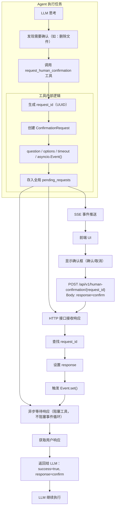
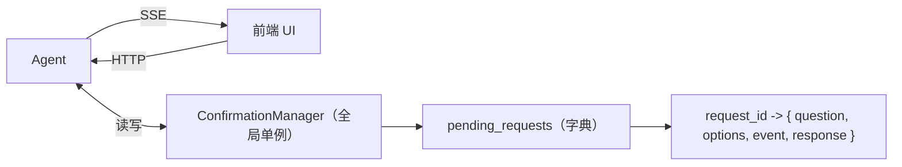
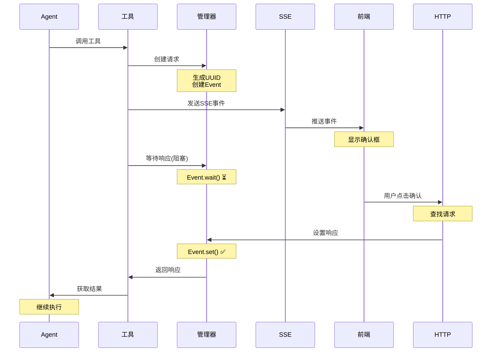

# HITL 人机确认机制设计文档

**版本**: v1.0  
**日期**: 2025-12-26  
**设计**: SSE + HTTP 异步确认机制

---

## 📋 目录

1. [概述](#概述)
2. [架构设计](#架构设计)
3. [核心组件](#核心组件)
4. [工作流程](#工作流程)
5. [实现方案](#实现方案)
6. [使用示例](#使用示例)
7. [前端集成](#前端集成)
8. [可行性分析](#可行性分析)
9. [未来扩展](#未来扩展)

---

## 概述

### 背景

当前 Agent 的 HITL 机制存在以下问题：
1. `confirm()` 和 `clarify()` 方法需要 UI 层主动轮询
2. 没有实时通知机制
3. 同步阻塞，不够优雅

### 目标

设计一个基于 **SSE + HTTP** 的异步确认机制：
- **SSE（Server-Sent Events）**：实时推送确认请求到前端
- **HTTP POST**：前端提交用户响应
- **asyncio.Event**：后端异步等待响应

### 核心优势

✅ **实时响应**：通过 SSE 实时推送确认请求  
✅ **异步非阻塞**：使用 `asyncio.Event` 实现高效等待  
✅ **架构清晰**：职责分离（SSE 推送、HTTP 响应）  
✅ **超时保护**：避免无限等待  
✅ **易于扩展**：支持多种确认类型

---

## 架构设计

### 整体流程图



### 数据流



---

## 核心组件

### 1. ConfirmationManager（确认请求管理器）

**位置**: `core/confirmation_manager.py`

**职责**:
- 管理所有待处理的确认请求
- 提供创建、等待、响应、清理等 API
- 全局单例模式

**关键方法**:
```python
class ConfirmationManager:
    def create_request(question, options, timeout) -> ConfirmationRequest
    async def wait_for_response(request_id, timeout) -> str
    def set_response(request_id, response) -> bool
    def get_request(request_id) -> ConfirmationRequest
    def cleanup_expired()
```

**核心机制**:
```python
class ConfirmationRequest:
    def __init__(self):
        self.request_id = str(uuid.uuid4())
        self.event = asyncio.Event()  # 🔥 核心：异步等待信号
        self.response = None
        
    async def wait(self):
        await asyncio.wait_for(self.event.wait(), timeout=60)
        
    def set_response(self, response):
        self.response = response
        self.event.set()  # 🔥 唤醒等待的协程
```

### 2. RequestHumanConfirmationTool（确认工具）

**位置**: `tools/request_human_confirmation.py`

**职责**:
- 作为 Agent 的工具，供 LLM 调用
- 创建确认请求
- 通过回调发送 SSE 事件
- 异步等待用户响应

**工具定义**:
```python
{
  "name": "request_human_confirmation",
  "description": "请求用户确认操作。适用于危险操作、重要决策等需要用户明确授权的场景。",
  "parameters": {
    "question": "要询问用户的问题",
    "options": ["confirm", "cancel"],  # 可选项
    "timeout": 60,  # 超时时间（秒）
    "metadata": {}  # 额外信息
  }
}
```

**执行流程**:
```python
async def execute(question, options, timeout, **kwargs):
    # 1. 创建确认请求
    manager = get_confirmation_manager()
    request = manager.create_request(question, options, timeout)
    
    # 2. 🔥 发送 SSE 事件（通过 emit_event 回调）
    emit_event = kwargs.get('emit_event')
    if emit_event:
        await emit_event({
            "type": "human_confirmation_request",
            "data": {
                "request_id": request.request_id,
                "question": question,
                "options": options,
                "timeout": timeout
            }
        })
    
    # 3. 🔥 异步等待用户响应（阻塞当前工具，但不阻塞事件循环）
    response = await manager.wait_for_response(request.request_id, timeout)
    
    # 4. 返回结果给 LLM
    return {
        "success": True,
        "response": response  # "confirm" / "cancel" / "timeout"
    }
```

### 3. HTTP 接口（接收用户响应）

**位置**: `routers/human_confirmation.py`

**接口定义**:

#### POST `/api/v1/human-confirmation/{request_id}`

提交用户确认响应

**请求**:
```json
{
  "response": "confirm",  // 或 "cancel"、自定义选项
  "metadata": {}  // 可选
}
```

**响应**:
```json
{
  "code": 200,
  "message": "响应已提交",
  "data": {
    "request_id": "uuid-xxx",
    "response": "confirm"
  }
}
```

**实现**:
```python
@router.post("/{request_id}")
async def submit_confirmation(request_id: str, body: ConfirmationResponse):
    manager = get_confirmation_manager()
    
    # 检查请求是否存在
    request = manager.get_request(request_id)
    if not request:
        raise HTTPException(404, "请求不存在或已过期")
    
    # 🔥 设置响应，唤醒等待的工具
    manager.set_response(request_id, body.response)
    
    return {"success": True}
```

#### GET `/api/v1/human-confirmation/{request_id}`

获取确认请求详情（可选，用于前端轮询检查）

### 4. SSE 事件流（实时推送）

**位置**: `routers/chat.py` 的 `event_generator()`

**新增事件类型**:

```
event: human_confirmation_request
data: {
  "request_id": "uuid-xxx",
  "question": "是否删除所有临时文件？",
  "options": ["confirm", "cancel"],
  "timeout": 60,
  "metadata": {}
}
```

**实现**:
```python
async def event_generator():
    async for event in agent.stream(message):
        event_type = event["type"]
        
        # 🆕 处理人类确认请求事件
        if event_type == "human_confirmation_request":
            yield f"event: human_confirmation_request\n"
            yield f"data: {json.dumps(event['data'])}\n\n"
            continue
        
        # ... 其他事件类型
```

---

## 工作流程

### 完整时序图



### 关键步骤说明

1. **Agent 调用工具**: LLM 识别需要确认，调用 `request_human_confirmation` 工具

2. **创建请求**: 工具创建 `ConfirmationRequest`，生成唯一 UUID，创建 `asyncio.Event`

3. **发送 SSE 事件**: 通过 `emit_event` 回调，将确认请求推送到 SSE 事件流

4. **前端接收**: 前端监听 SSE，收到 `human_confirmation_request` 事件，显示确认对话框

5. **异步等待**: 工具调用 `manager.wait_for_response()`，内部调用 `Event.wait()`，阻塞当前工具但不阻塞事件循环

6. **用户响应**: 用户点击确认/取消，前端调用 HTTP POST 接口提交响应

7. **唤醒工具**: HTTP 接口调用 `manager.set_response()`，触发 `Event.set()`，唤醒等待的工具

8. **返回结果**: 工具获取用户响应，返回给 LLM，继续执行

---

## 实现方案

### Phase 1: 核心基础设施

#### 1.1 创建 ConfirmationManager

```bash
# 创建文件
touch core/confirmation_manager.py
```

**实现要点**:
- 全局单例模式
- 使用 `asyncio.Event` 实现异步等待
- 超时保护（`asyncio.wait_for`）
- 定期清理过期请求

#### 1.2 创建 RequestHumanConfirmationTool

```bash
# 创建文件
touch tools/request_human_confirmation.py
```

**实现要点**:
- 继承 `BaseTool`
- 定义工具参数 schema
- 调用 `manager.create_request()`
- 通过 `emit_event` 发送 SSE 事件
- 异步等待响应

#### 1.3 创建 HTTP 接口

```bash
# 创建文件
touch routers/human_confirmation.py
```

**实现要点**:
- POST 接口接收用户响应
- GET 接口查询请求详情（可选）
- 调用 `manager.set_response()`

### Phase 2: Agent 集成

#### 2.1 注入 emit_event 回调

在 `core/agent.py` 的 `_execute_tools` 方法中：

```python
async def _execute_tools(self, tool_calls: List[Dict]) -> List[Dict]:
    for tool_call in tool_calls:
        # 🆕 注入 emit_event 回调
        enriched_input = {
            **tool_input,
            "emit_event": self._create_emit_event_callback()
        }
        
        result = await self.tool_executor.execute(tool_name, enriched_input)
```

#### 2.2 实现事件发射机制

**方案 A：队列模式（推荐）**

```python
class SimpleAgent:
    def __init__(self):
        self._event_queue = asyncio.Queue()  # 事件队列
    
    def _create_emit_event_callback(self):
        """创建事件发射回调"""
        async def emit_event(event):
            await self._event_queue.put(event)
        return emit_event
    
    async def stream(self, message):
        """流式输出"""
        # 启动后台任务：执行 Agent 逻辑
        task = asyncio.create_task(self._execute_with_events(message))
        
        # 从队列中读取事件并发送
        while True:
            try:
                event = await asyncio.wait_for(
                    self._event_queue.get(),
                    timeout=0.1
                )
                yield event
            except asyncio.TimeoutError:
                if task.done():
                    break
```

**方案 B：生成器模式**

```python
async def stream(self, message):
    """流式输出"""
    async for event in self._execute_stream(message):
        # 检查是否是工具发出的事件
        if event.get("source") == "tool":
            yield event
        else:
            # 正常的 Agent 事件
            yield event
```

### Phase 3: 前端集成

#### 3.1 监听 SSE 事件

```javascript
const eventSource = new EventSource('/api/v1/chat');

eventSource.addEventListener('human_confirmation_request', (e) => {
    const data = JSON.parse(e.data);
    
    console.log('收到确认请求:', data);
    
    // 显示确认对话框
    showConfirmationDialog(data);
});
```

#### 3.2 提交用户响应

```javascript
async function submitConfirmation(requestId, response) {
    const res = await fetch(`/api/v1/human-confirmation/${requestId}`, {
        method: 'POST',
        headers: {
            'Content-Type': 'application/json'
        },
        body: JSON.stringify({
            response: response  // "confirm" / "cancel"
        })
    });
    
    return res.json();
}
```

#### 3.3 UI 组件示例

```javascript
function showConfirmationDialog(data) {
    const dialog = document.createElement('div');
    dialog.className = 'confirmation-dialog';
    dialog.innerHTML = `
        <div class="dialog-content">
            <h3>需要确认</h3>
            <p>${data.question}</p>
            <div class="dialog-actions">
                ${data.options.map(opt => `
                    <button data-option="${opt}">${opt}</button>
                `).join('')}
            </div>
        </div>
    `;
    
    document.body.appendChild(dialog);
    
    // 绑定事件
    dialog.querySelectorAll('button').forEach(btn => {
        btn.addEventListener('click', async () => {
            const option = btn.dataset.option;
            await submitConfirmation(data.request_id, option);
            dialog.remove();
        });
    });
    
    // 超时自动关闭
    setTimeout(() => {
        if (document.body.contains(dialog)) {
            dialog.remove();
        }
    }, data.timeout * 1000);
}
```

### Phase 4: 注册工具

在 `config/capabilities.yaml` 中注册：

```yaml
capabilities:
  - name: request_human_confirmation
    type: TOOL
    subtype: CUSTOM
    provider: user
    
    implementation:
      module: "tools.request_human_confirmation"
      class: "RequestHumanConfirmationTool"
    
    capabilities:
      - human_interaction
      - confirmation
      - hitl
    
    priority: 100  # 最高优先级
    
    cost:
      time: variable  # 取决于用户响应速度
      money: free
    
    constraints:
      requires_user_interaction: true
    
    metadata:
      description: "请求用户确认操作，适用于危险操作、重要决策等场景"
      keywords:
        - 确认
        - 授权
        - 人工干预
        - HITL
      note: |
        使用场景：
        - 删除文件/数据
        - 修改重要配置
        - 执行不可逆操作
        - 选择方案/参数
    
    input_schema:
      type: object
      properties:
        question:
          type: string
          description: "要询问用户的问题"
        options:
          type: array
          items:
            type: string
          description: "可选项列表，默认 ['confirm', 'cancel']"
        timeout:
          type: integer
          description: "超时时间（秒），默认 60"
        metadata:
          type: object
          description: "额外的元数据"
      required:
        - question
```

---

## 使用示例

### 示例 1: 删除文件确认

**Agent Prompt**:
```
在删除文件之前，必须调用 request_human_confirmation 工具请求用户确认。
```

**LLM 思考**:
```
用户要求删除所有临时文件，这是危险操作，需要确认。

[调用工具]
request_human_confirmation({
  "question": "即将删除 /tmp 目录下的所有临时文件，是否继续？",
  "options": ["confirm", "cancel"],
  "timeout": 60,
  "metadata": {
    "operation_type": "delete",
    "target": "/tmp/*",
    "file_count": 42
  }
})
```

**工具执行**:
1. 创建确认请求（request_id: `abc-123`）
2. 发送 SSE 事件 → 前端显示确认框
3. 等待用户响应（阻塞 60 秒）
4. 用户点击"确认" → HTTP POST 提交响应
5. 工具返回: `{"success": true, "response": "confirm"}`

**LLM 继续**:
```
用户已确认，现在执行删除操作。

[调用工具]
bash({"command": "rm -rf /tmp/*"})
```

### 示例 2: 方案选择

**LLM 思考**:
```
用户要求生成 PPT，但没有指定风格。我需要询问。

[调用工具]
request_human_confirmation({
  "question": "请选择 PPT 风格",
  "options": ["商务风格", "学术风格", "创意风格"],
  "timeout": 60
})
```

**工具返回**:
```json
{
  "success": true,
  "response": "商务风格"
}
```

**LLM 继续**:
```
用户选择了商务风格，现在生成 PPT。
```

### 示例 3: 超时处理

**工具返回**:
```json
{
  "success": false,
  "response": "timeout",
  "message": "用户未在 60 秒内响应"
}
```

**LLM 处理**:
```
用户未响应，取消操作或使用默认选项。
```

---

## 前端集成

### 完整示例（React）

```typescript
import { useEffect, useState } from 'react';

interface ConfirmationRequest {
  request_id: string;
  question: string;
  options: string[];
  timeout: number;
  metadata?: any;
}

export function useConfirmationDialog() {
  const [request, setRequest] = useState<ConfirmationRequest | null>(null);
  
  useEffect(() => {
    const eventSource = new EventSource('/api/v1/chat');
    
    eventSource.addEventListener('human_confirmation_request', (e) => {
      const data = JSON.parse(e.data);
      setRequest(data);
    });
    
    return () => eventSource.close();
  }, []);
  
  const respond = async (response: string) => {
    if (!request) return;
    
    await fetch(`/api/v1/human-confirmation/${request.request_id}`, {
      method: 'POST',
      headers: { 'Content-Type': 'application/json' },
      body: JSON.stringify({ response })
    });
    
    setRequest(null);
  };
  
  return { request, respond };
}

// 使用组件
export function ConfirmationDialog() {
  const { request, respond } = useConfirmationDialog();
  
  if (!request) return null;
  
  return (
    <div className="dialog-overlay">
      <div className="dialog">
        <h3>需要确认</h3>
        <p>{request.question}</p>
        <div className="actions">
          {request.options.map(option => (
            <button key={option} onClick={() => respond(option)}>
              {option}
            </button>
          ))}
        </div>
      </div>
    </div>
  );
}
```

### 完整示例（Vue 3）

```vue
<template>
  <div v-if="request" class="confirmation-dialog">
    <div class="dialog-content">
      <h3>需要确认</h3>
      <p>{{ request.question }}</p>
      <div class="actions">
        <button 
          v-for="option in request.options" 
          :key="option"
          @click="respond(option)"
        >
          {{ option }}
        </button>
      </div>
    </div>
  </div>
</template>

<script setup lang="ts">
import { ref, onMounted, onUnmounted } from 'vue';

interface ConfirmationRequest {
  request_id: string;
  question: string;
  options: string[];
  timeout: number;
}

const request = ref<ConfirmationRequest | null>(null);
let eventSource: EventSource;

onMounted(() => {
  eventSource = new EventSource('/api/v1/chat');
  
  eventSource.addEventListener('human_confirmation_request', (e) => {
    const data = JSON.parse(e.data);
    request.value = data;
  });
});

onUnmounted(() => {
  eventSource?.close();
});

async function respond(response: string) {
  if (!request.value) return;
  
  await fetch(`/api/v1/human-confirmation/${request.value.request_id}`, {
    method: 'POST',
    headers: { 'Content-Type': 'application/json' },
    body: JSON.stringify({ response })
  });
  
  request.value = null;
}
</script>
```

---

## 可行性分析

### ✅ 技术可行性

#### 1. asyncio.Event 机制

**原理**:
```python
# 工具线程
event = asyncio.Event()
await event.wait()  # 阻塞，直到 set() 被调用

# HTTP 接口线程
event.set()  # 唤醒等待的协程
```

**优势**:
- 原生 Python 异步机制
- 不阻塞事件循环
- 支持超时（`asyncio.wait_for`）

#### 2. SSE 实时推送

**原理**:
```python
async def event_generator():
    while True:
        event = await event_queue.get()
        yield f"event: {event['type']}\n"
        yield f"data: {json.dumps(event['data'])}\n\n"
```

**优势**:
- HTTP/1.1 标准协议
- 浏览器原生支持
- 单向推送，适合通知场景

#### 3. 跨线程通信

**方案**: 全局单例 ConfirmationManager

```python
# 工具执行（在 Agent 事件循环中）
manager = get_confirmation_manager()
request = manager.create_request(...)
response = await manager.wait_for_response(request_id)

# HTTP 接口（在 FastAPI 事件循环中）
manager = get_confirmation_manager()
manager.set_response(request_id, response)
```

**关键**: FastAPI 和 Agent 在同一个事件循环中，可以安全共享 `asyncio.Event`

### ⚠️ 潜在挑战

#### 1. emit_event 回调集成

**问题**: 工具如何发送 SSE 事件？

**方案 A**: 注入回调（推荐）
```python
# Agent 注入
enriched_input = {
    **tool_input,
    "emit_event": self._emit_event_callback
}

# 工具调用
emit_event = kwargs.get('emit_event')
await emit_event({"type": "...", "data": {...}})
```

**方案 B**: 工具返回特殊标记
```python
# 工具返回
return {
    "success": True,
    "emit_sse": {
        "type": "human_confirmation_request",
        "data": {...}
    }
}

# Agent 识别并发送
if result.get("emit_sse"):
    await self._send_sse_event(result["emit_sse"])
```

#### 2. 流式输出同步

**问题**: SSE 事件需要在流式输出中正确插入

**解决**: 使用 `asyncio.Queue` 统一管理事件

```python
class SimpleAgent:
    def __init__(self):
        self._event_queue = asyncio.Queue()
    
    async def stream(self, message):
        # 后台任务：执行 Agent
        task = asyncio.create_task(self._run(message))
        
        # 前台：从队列读取事件
        while not task.done() or not self._event_queue.empty():
            try:
                event = await asyncio.wait_for(
                    self._event_queue.get(),
                    timeout=0.1
                )
                yield event
            except asyncio.TimeoutError:
                continue
```

#### 3. 多会话并发

**问题**: 多个用户同时请求确认，如何隔离？

**解决**: request_id 唯一标识

```python
# 每个请求都有唯一 UUID
request_id = str(uuid.uuid4())

# ConfirmationManager 全局管理所有请求
pending_requests = {
    "user1-request-abc": {...},
    "user2-request-def": {...}
}
```

**不会冲突**: 不同用户的 request_id 不同，互不影响

### 🔒 安全性考虑

1. **超时保护**: 避免无限等待
2. **请求验证**: HTTP 接口需要验证 request_id 是否存在
3. **权限控制**: （可选）验证响应的用户身份
4. **清理机制**: 定期清理过期请求

---

## 未来扩展

### 1. 多种确认类型

```python
# 是/否确认
request_human_confirmation({
    "type": "yes_no",
    "question": "是否继续？"
})

# 单选题
request_human_confirmation({
    "type": "single_choice",
    "question": "选择风格",
    "options": ["A", "B", "C"]
})

# 多选题
request_human_confirmation({
    "type": "multiple_choice",
    "question": "选择功能",
    "options": ["功能1", "功能2", "功能3"]
})

# 输入框
request_human_confirmation({
    "type": "text_input",
    "question": "请输入文件名",
    "placeholder": "example.txt"
})
```

### 2. 批量确认

```python
# 一次性确认多个操作
request_human_confirmation({
    "type": "batch",
    "items": [
        {"id": 1, "question": "删除文件1？"},
        {"id": 2, "question": "删除文件2？"},
        {"id": 3, "question": "删除文件3？"}
    ]
})

# 返回
{
    "responses": {
        "1": "confirm",
        "2": "cancel",
        "3": "confirm"
    }
}
```

### 3. 条件确认

```yaml
# 在 capabilities.yaml 中配置
- name: bash
  confirmation_rules:
    - pattern: "rm -rf"
      require_confirmation: true
      question_template: "即将执行删除操作：{command}，是否继续？"
```

### 4. 审批流程

```python
# 多级审批
request_human_confirmation({
    "type": "approval",
    "question": "申请执行操作",
    "approvers": ["manager", "admin"],
    "require_all": True  # 所有审批人都需要同意
})
```

### 5. 历史记录

```python
# 记录所有确认请求和响应
class ConfirmationManager:
    def __init__(self):
        self.history = []
    
    def log_request(self, request, response):
        self.history.append({
            "request_id": request.request_id,
            "question": request.question,
            "response": response,
            "timestamp": datetime.now()
        })
```

### 6. WebSocket 支持

除了 SSE，也可以支持 WebSocket 双向通信：

```python
# WebSocket 推送
await websocket.send_json({
    "type": "human_confirmation_request",
    "data": {...}
})

# WebSocket 响应
response = await websocket.receive_json()
manager.set_response(request_id, response["response"])
```

---

## 总结

### 核心优势

1. **实时响应**: SSE 推送，无需轮询
2. **异步高效**: `asyncio.Event`，不阻塞事件循环
3. **架构清晰**: 职责分离，易于维护
4. **易于扩展**: 支持多种确认类型

### 实施建议

1. **先实现 MVP**: 基础的是/否确认
2. **逐步扩展**: 添加多选、输入框等
3. **完善监控**: 记录确认历史，分析用户习惯
4. **优化体验**: 美化 UI，添加动画效果

### 下一步

1. ✅ 实现 `ConfirmationManager`
2. ✅ 实现 `RequestHumanConfirmationTool`
3. ✅ 实现 HTTP 接口
4. ✅ 集成到 Agent（emit_event 回调）
5. ✅ 前端示例代码
6. ✅ 测试端到端流程

---

**文档版本**: v1.0  
**最后更新**: 2025-12-26  
**作者**: AI Assistant

