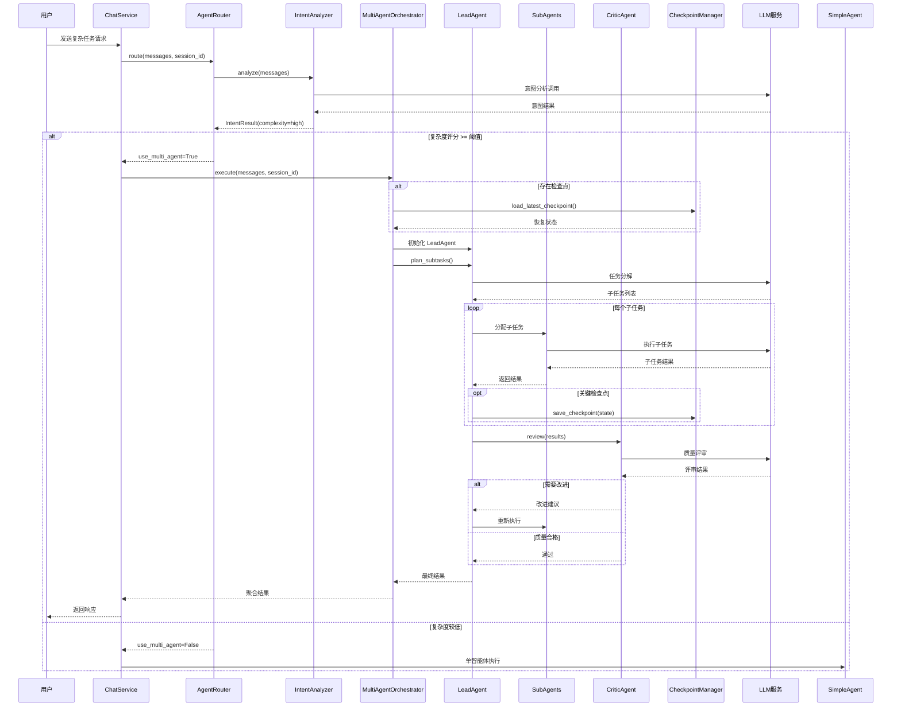

# MultiAgentOrchestrator 完整调用流程与优化分析

## 文档目标

本文档详细分析 ZenFlux Agent 的多智能体执行框架（MultiAgentOrchestrator），包括：

1. **完整调用链路** - 从用户 query 到多智能体执行的完整流程
2. **关键函数入参出参详解** - 核心模块的函数签名和数据流
3. **实现逻辑深度分析** - 设计理念、模块职责、执行模式
4. **已实现的优化机制** - 检查点、强弱配对、上下文隔离、Critic
5. **进一步优化空间分析** - 识别性能瓶颈和优化建议
6. **优化优先级建议** - P0/P1/P2 分级

---

## 1. 完整调用链路

### 1.1 调用时序图



### 1.2 分层调用架构

```
┌────────────────────────────────────────────────────────────────┐
│                        协议层（API入口）                         │
│  routers/chat.py - HTTP 端点                                   │
│  grpc/chat_servicer.py - gRPC 端点                            │
└─────────────────────────┬──────────────────────────────────────┘
                          │
┌─────────────────────────▼──────────────────────────────────────┐
│                      服务编排层                                  │
│  services/chat_service.py                                      │
│  - _run_agent() - 智能体执行编排                                │
│  - _handle_streaming() - 流式响应处理                           │
└─────────────────────────┬──────────────────────────────────────┘
                          │
                    ┌─────▼─────┐
                    │ AgentRouter│
                    │  路由决策   │
                    └─────┬─────┘
                          │
        ┌─────────────────┴─────────────────┐
        │                                   │
┌───────▼────────┐              ┌───────────▼──────────┐
│  SimpleAgent   │              │ MultiAgentOrchestrator│
│  (单智能体)     │              │   (多智能体)          │
└────────────────┘              └───────────┬──────────┘
                                            │
                    ┌───────────────────────┼───────────────┐
                    │                       │               │
            ┌───────▼──────┐       ┌───────▼──────┐  ┌────▼─────┐
            │  LeadAgent   │       │  SubAgents   │  │  Critic  │
            │  (总控智能体) │       │  (执行智能体) │  │ (评审)   │
            └──────────────┘       └──────────────┘  └──────────┘
                    │                       │
                    └───────────┬───────────┘
                                │
                    ┌───────────▼──────────┐
                    │   基础设施层          │
                    │ - LLMService         │
                    │ - ToolManager        │
                    │ - MemoryManager      │
                    │ - CheckpointManager  │
                    │ - EventBroadcaster   │
                    └──────────────────────┘
```

### 1.3 关键决策点

| 决策点 | 位置 | 判断依据 | 影响 |
|-------|------|---------|------|
| **是否启用路由** | ChatService._run_agent() | enable_routing 配置 | 是否进行意图分析 |
| **单/多智能体选择** | AgentRouter.route() | 复杂度评分 >= 阈值 | 执行框架选择 |
| **复杂度评分** | IntentAnalyzer.analyze() | LLM 分析结果 | 0-10 分值 |
| **是否恢复检查点** | MultiAgentOrchestrator.execute() | 检查点存在 | 从断点继续 |
| **子智能体数量** | LeadAgent.plan_subtasks() | 任务复杂度 | 并行/串行执行 |
| **是否需要评审** | LeadAgent._should_use_critic() | 配置 + 任务类型 | 质量保证 |

---

## 2. 核心模块入参出参详解

### 2.1 AgentRouter.route()

**位置**: `core/routing/router.py`

**函数签名**:
```python
async def route(
    self,
    messages: List[Dict[str, Any]],
    session_id: str,
    user_id: Optional[str] = None
) -> RoutingDecision
```

**入参详解**:
| 参数 | 类型 | 必需 | 说明 |
|-----|------|------|------|
| messages | List[Dict] | 是 | 完整消息历史 |
| session_id | str | 是 | 会话ID |
| user_id | str | 否 | 用户ID（可选） |

**出参详解** (`RoutingDecision`):
```python
@dataclass
class RoutingDecision:
    use_multi_agent: bool           # 是否使用多智能体
    intent: IntentResult            # 意图分析结果
    reason: str                     # 决策理由
    complexity_score: int           # 复杂度评分 (0-10)
    estimated_subtasks: Optional[int] # 预估子任务数
```

**调用示例**:
```python
routing_decision = await router.route(
    messages=[
        {"role": "user", "content": "帮我制作一份季度报告PPT"}
    ],
    session_id="sess-123"
)
# routing_decision.use_multi_agent = True
# routing_decision.complexity_score = 8
# routing_decision.estimated_subtasks = 4
```

---

### 2.2 MultiAgentOrchestrator.execute()

**位置**: `core/agent/multi/orchestrator.py`

**函数签名**:
```python
async def execute(
    self,
    messages: List[Dict[str, Any]],
    session_id: str,
    enable_stream: bool = True,
    checkpoint_id: Optional[str] = None,
    max_subtasks: int = 10
) -> AsyncGenerator[Dict[str, Any], None]
```

**入参详解**:
| 参数 | 类型 | 必需 | 说明 |
|-----|------|------|------|
| messages | List[Dict] | 是 | 消息历史 |
| session_id | str | 是 | 会话ID |
| enable_stream | bool | 否 | 是否流式输出（默认True） |
| checkpoint_id | str | 否 | 指定恢复的检查点ID |
| max_subtasks | int | 否 | 最大子任务数（默认10） |

**出参详解** (流式事件):
```python
# 事件类型1: 任务分解
{
    "type": "task_plan",
    "subtasks": [
        {"id": "sub-1", "description": "收集数据"},
        {"id": "sub-2", "description": "分析数据"},
        {"id": "sub-3", "description": "生成图表"},
        {"id": "sub-4", "description": "撰写报告"}
    ],
    "execution_mode": "parallel"  # or "sequential"
}

# 事件类型2: 子任务进度
{
    "type": "subtask_progress",
    "subtask_id": "sub-1",
    "status": "in_progress",  # pending/in_progress/completed/failed
    "progress": 0.5
}

# 事件类型3: 子任务完成
{
    "type": "subtask_result",
    "subtask_id": "sub-1",
    "result": {...},
    "execution_time": 2.34
}

# 事件类型4: Critic 评审
{
    "type": "critic_review",
    "passed": false,
    "issues": ["数据不完整", "图表格式问题"],
    "suggestions": ["补充Q3数据", "调整配色方案"]
}

# 事件类型5: 最终结果
{
    "type": "final_result",
    "success": true,
    "result": {...},
    "total_time": 15.67,
    "checkpoint_saved": true
}
```

---

### 2.3 LeadAgent.plan_subtasks()

**位置**: `core/agent/multi/lead_agent.py`

**函数签名**:
```python
async def plan_subtasks(
    self,
    task_description: str,
    context: Dict[str, Any]
) -> TaskPlan
```

**入参详解**:
| 参数 | 类型 | 必需 | 说明 |
|-----|------|------|------|
| task_description | str | 是 | 任务描述 |
| context | Dict | 是 | 上下文信息（历史消息、用户偏好等） |

**出参详解** (`TaskPlan`):
```python
@dataclass
class TaskPlan:
    subtasks: List[SubTask]         # 子任务列表
    execution_mode: str             # "parallel" | "sequential" | "hybrid"
    dependencies: Dict[str, List[str]]  # 依赖关系图
    estimated_time: float           # 预估总时间（秒）
    
@dataclass
class SubTask:
    id: str                         # 子任务ID
    description: str                # 任务描述
    agent_type: str                 # "data_analyst" | "content_writer" | ...
    priority: int                   # 优先级 (1-10)
    dependencies: List[str]         # 依赖的子任务ID
    timeout: float                  # 超时时间（秒）
```

**LLM Prompt 结构**:
```python
# LeadAgent 使用的任务分解 Prompt
TASK_DECOMPOSITION_PROMPT = """
你是一个任务分解专家。将用户的复杂任务分解为可执行的子任务。

用户任务: {task_description}

上下文:
- 历史消息: {message_history}
- 可用工具: {available_tools}
- 约束条件: 最多 {max_subtasks} 个子任务

请按以下格式输出:
<task_plan>
  <subtask id="1" agent_type="data_analyst" priority="10">
    <description>收集Q3销售数据</description>
    <dependencies></dependencies>
  </subtask>
  <subtask id="2" agent_type="chart_generator" priority="8">
    <description>生成销售趋势图</description>
    <dependencies>1</dependencies>
  </subtask>
  <execution_mode>parallel</execution_mode>
</task_plan>
"""
```

---

### 2.4 SubAgent.execute_subtask()

**位置**: `core/agent/multi/orchestrator.py` (内联实现)

**函数签名**:
```python
async def execute_subtask(
    self,
    subtask: SubTask,
    shared_context: Dict[str, Any],
    agent_config: AgentSchema
) -> SubTaskResult
```

**入参详解**:
| 参数 | 类型 | 必需 | 说明 |
|-----|------|------|------|
| subtask | SubTask | 是 | 子任务定义 |
| shared_context | Dict | 是 | 共享上下文（工具、记忆等） |
| agent_config | AgentSchema | 是 | Agent 配置 |

**出参详解** (`SubTaskResult`):
```python
@dataclass
class SubTaskResult:
    subtask_id: str
    success: bool
    result: Any                     # 执行结果
    error: Optional[str]            # 错误信息
    execution_time: float           # 执行时间
    token_usage: Dict[str, int]     # Token 使用统计
    tool_calls: List[Dict]          # 工具调用记录
```

---

### 2.5 CriticAgent.review()

**位置**: `core/agent/multi/critic.py`

**函数签名**:
```python
async def review(
    self,
    task_description: str,
    results: List[SubTaskResult],
    quality_criteria: Dict[str, Any]
) -> CriticReview
```

**入参详解**:
| 参数 | 类型 | 必需 | 说明 |
|-----|------|------|------|
| task_description | str | 是 | 原始任务描述 |
| results | List[SubTaskResult] | 是 | 所有子任务结果 |
| quality_criteria | Dict | 是 | 质量标准 |

**出参详解** (`CriticReview`):
```python
@dataclass
class CriticReview:
    passed: bool                    # 是否通过
    overall_score: float            # 总体评分 (0-10)
    issues: List[str]               # 发现的问题
    suggestions: List[str]          # 改进建议
    requires_rework: bool           # 是否需要返工
    rework_subtasks: List[str]      # 需要重做的子任务ID
```

**Critic Prompt 结构**:
```python
CRITIC_REVIEW_PROMPT = """
你是一个严格的质量评审专家。评审以下任务的执行结果。

原始任务: {task_description}

执行结果:
{formatted_results}

评审标准:
- 完整性: 是否完成了所有要求
- 准确性: 数据和信息是否准确
- 一致性: 各部分是否协调一致
- 专业性: 是否符合专业标准

请按以下格式输出:
<review>
  <passed>true/false</passed>
  <overall_score>8.5</overall_score>
  <issues>
    <issue>问题描述1</issue>
  </issues>
  <suggestions>
    <suggestion>改进建议1</suggestion>
  </suggestions>
</review>
"""
```

---

### 2.6 CheckpointManager 接口

**位置**: `core/agent/multi/checkpoint.py`

#### save_checkpoint()

```python
async def save_checkpoint(
    self,
    session_id: str,
    state: Dict[str, Any],
    metadata: Optional[Dict] = None
) -> str  # 返回 checkpoint_id
```

**状态结构** (`state`):
```python
{
    "lead_agent_state": {
        "task_plan": TaskPlan,
        "current_phase": "execution",  # planning/execution/review/complete
        "completed_subtasks": ["sub-1", "sub-2"],
        "pending_subtasks": ["sub-3", "sub-4"]
    },
    "subtask_results": {
        "sub-1": SubTaskResult,
        "sub-2": SubTaskResult
    },
    "shared_context": {
        "accumulated_data": {...},
        "intermediate_files": [...]
    },
    "critic_reviews": [
        {"timestamp": "...", "review": CriticReview}
    ]
}
```

#### load_latest_checkpoint()

```python
async def load_latest_checkpoint(
    self,
    session_id: str
) -> Optional[CheckpointData]
```

**返回数据**:
```python
@dataclass
class CheckpointData:
    checkpoint_id: str
    session_id: str
    state: Dict[str, Any]           # 完整状态
    created_at: datetime
    metadata: Dict[str, Any]
```

---

## 3. 执行模式深度分析

### 3.1 三种执行模式

#### 3.1.1 串行模式 (Sequential)

**适用场景**: 子任务之间有严格依赖关系

```python
# 示例：数据处理流水线
subtasks = [
    SubTask(id="1", description="提取原始数据", dependencies=[]),
    SubTask(id="2", description="清洗数据", dependencies=["1"]),
    SubTask(id="3", description="分析数据", dependencies=["2"]),
    SubTask(id="4", description="生成报告", dependencies=["3"])
]

# 执行流程
for subtask in subtasks:
    # 等待依赖完成
    await wait_for_dependencies(subtask.dependencies)
    # 执行当前任务
    result = await execute_subtask(subtask)
    results[subtask.id] = result
```

**优点**:
- 逻辑清晰，易于调试
- 上下文传递简单
- 错误定位精确

**缺点**:
- 总耗时 = Σ(子任务耗时)
- 资源利用率低
- 无法发挥并发优势

---

#### 3.1.2 并行模式 (Parallel)

**适用场景**: 子任务相互独立，无依赖关系

```python
# 示例：多源数据收集
subtasks = [
    SubTask(id="1", description="收集销售数据", dependencies=[]),
    SubTask(id="2", description="收集市场数据", dependencies=[]),
    SubTask(id="3", description="收集竞品数据", dependencies=[]),
    SubTask(id="4", description="收集用户反馈", dependencies=[])
]

# 执行流程
tasks = [execute_subtask(st) for st in subtasks]
results = await asyncio.gather(*tasks, return_exceptions=True)
```

**优点**:
- 总耗时 ≈ max(子任务耗时)
- 资源利用率高
- 加速比显著

**缺点**:
- 并发管理复杂
- Token 消耗峰值高
- 需要处理部分失败

**实现优化**:
```python
# 限流并发（避免过载）
async def execute_with_semaphore(
    subtasks: List[SubTask],
    max_concurrent: int = 3
):
    semaphore = asyncio.Semaphore(max_concurrent)
    
    async def limited_execute(subtask):
        async with semaphore:
            return await execute_subtask(subtask)
    
    tasks = [limited_execute(st) for st in subtasks]
    return await asyncio.gather(*tasks)
```

---

#### 3.1.3 混合模式 (Hybrid)

**适用场景**: 部分子任务并行，部分串行

```python
# 示例：PPT 生成任务
task_plan = {
    "phase1_parallel": [
        SubTask(id="1a", description="收集数据"),
        SubTask(id="1b", description="设计模板"),
        SubTask(id="1c", description="准备素材")
    ],
    "phase2_sequential": [
        SubTask(id="2", description="生成内容", dependencies=["1a"]),
        SubTask(id="3", description="应用模板", dependencies=["1b", "2"]),
        SubTask(id="4", description="插入素材", dependencies=["1c", "3"])
    ]
}

# 执行流程
# Phase 1: 并行收集
phase1_results = await asyncio.gather(*[
    execute_subtask(st) for st in task_plan["phase1_parallel"]
])

# Phase 2: 串行组装
for subtask in task_plan["phase2_sequential"]:
    await wait_for_dependencies(subtask.dependencies)
    result = await execute_subtask(subtask)
```

**DAG 依赖图**:
```
    1a (数据) ──┐
                ├──> 2 (生成内容) ──┐
    1b (模板) ──┼──────────────────┤
                │                  ├──> 3 (应用模板) ──> 4 (插入素材)
    1c (素材) ──┘                  │
                                   │
                                   └─────────────────────────────────┘
```

---

### 3.2 执行模式选择逻辑

**LeadAgent 的决策流程**:

```python
def select_execution_mode(task_plan: TaskPlan) -> str:
    """
    根据任务特征选择执行模式
    """
    # 1. 分析依赖关系
    has_dependencies = any(st.dependencies for st in task_plan.subtasks)
    
    # 2. 全部独立 → 并行
    if not has_dependencies:
        return "parallel"
    
    # 3. 链式依赖 → 串行
    if is_linear_chain(task_plan):
        return "sequential"
    
    # 4. 复杂依赖 → 混合
    return "hybrid"

def is_linear_chain(task_plan: TaskPlan) -> bool:
    """判断是否为线性链式依赖"""
    for i, subtask in enumerate(task_plan.subtasks):
        if i == 0:
            if subtask.dependencies:
                return False
        else:
            # 每个任务只依赖前一个
            if subtask.dependencies != [task_plan.subtasks[i-1].id]:
                return False
    return True
```

---

### 3.3 上下文隔离与共享

**设计原则**: 子智能体之间既要隔离（避免干扰），又要共享（传递结果）

#### 3.3.1 隔离的部分

```python
class SubAgentContext:
    """每个子智能体的独立上下文"""
    
    def __init__(self, subtask: SubTask):
        self.subtask_id = subtask.id
        self.messages = []              # 独立的消息历史
        self.tool_calls = []            # 独立的工具调用记录
        self.thinking_process = []      # 独立的思考过程
        self.token_usage = {}           # 独立的 Token 统计
```

**优点**:
- 避免上下文污染
- 并行执行互不干扰
- 便于调试和追溯

---

#### 3.3.2 共享的部分

```python
class SharedResources:
    """所有子智能体共享的资源"""
    
    def __init__(self):
        self.tool_manager = ToolManager()    # 共享工具池
        self.memory_manager = MemoryManager() # 共享长期记忆
        self.intermediate_results = {}       # 共享中间结果
        self.global_context = {}             # 全局上下文变量
```

**共享机制**:
```python
# 子任务 2 读取子任务 1 的结果
async def execute_subtask_2(shared_resources):
    # 读取依赖结果
    data_from_task1 = shared_resources.intermediate_results.get("sub-1")
    
    # 执行当前任务
    result = await process_data(data_from_task1)
    
    # 写入结果供后续任务使用
    shared_resources.intermediate_results["sub-2"] = result
    
    return result
```

---

### 3.4 强弱配对策略

**设计理念**: LeadAgent 使用强模型（Sonnet），SubAgents 使用弱模型（Haiku）

#### 3.4.1 模型配置

```python
MODEL_ASSIGNMENT = {
    "lead_agent": {
        "model": "claude-sonnet-4-20250514",
        "temperature": 0.7,
        "max_tokens": 4096,
        "role": ["任务分解", "总控协调", "结果聚合"]
    },
    "sub_agents": {
        "model": "claude-haiku-3-20250307",
        "temperature": 0.5,
        "max_tokens": 2048,
        "role": ["执行具体子任务"]
    },
    "critic_agent": {
        "model": "claude-sonnet-4-20250514",
        "temperature": 0.3,
        "max_tokens": 2048,
        "role": ["质量评审"]
    }
}
```

#### 3.4.2 成本效益分析

**单任务成本对比**:

| 场景 | 全部使用 Sonnet | 强弱配对 | 节省比例 |
|-----|----------------|---------|---------|
| **输入 Token** | | | |
| LeadAgent (规划) | 2K × $3/M = $0.006 | 2K × $3/M = $0.006 | 0% |
| 4个 SubAgents | 4 × 1K × $3/M = $0.012 | 4 × 1K × $0.8/M = $0.0032 | 73% |
| Critic (评审) | 3K × $3/M = $0.009 | 3K × $3/M = $0.009 | 0% |
| **输出 Token** | | | |
| LeadAgent | 1K × $15/M = $0.015 | 1K × $15/M = $0.015 | 0% |
| 4个 SubAgents | 4 × 0.5K × $15/M = $0.030 | 4 × 0.5K × $4/M = $0.008 | 73% |
| Critic | 0.5K × $15/M = $0.0075 | 0.5K × $15/M = $0.0075 | 0% |
| **总计** | $0.0795 | $0.0487 | **39%** |

**质量保证**:
- 关键决策点（任务分解、质量评审）使用 Sonnet
- 简单执行任务使用 Haiku
- Critic 二次把关确保输出质量

---

## 4. 已实现的优化机制

### 4.1 检查点机制 (Checkpoint)

**目标**: 长时间任务可中断、可恢复

#### 4.1.1 检查点保存策略

```python
class CheckpointStrategy:
    """检查点保存策略"""
    
    @staticmethod
    def should_save_checkpoint(context: Dict) -> bool:
        """判断是否应该保存检查点"""
        return any([
            # 1. 完成了关键子任务
            context.get("completed_critical_subtask", False),
            
            # 2. 达到时间阈值（每5分钟）
            time.time() - context.get("last_checkpoint_time", 0) > 300,
            
            # 3. 完成了一定比例的子任务（每25%）
            context.get("completion_ratio", 0) % 0.25 == 0,
            
            # 4. 发生了重要状态变化（阶段切换）
            context.get("phase_changed", False)
        ])
```

#### 4.1.2 检查点内容

```python
checkpoint_state = {
    "version": "1.0",
    "session_id": "sess-123",
    "task_description": "生成Q3财报PPT",
    
    # Lead Agent 状态
    "lead_state": {
        "task_plan": {...},
        "current_phase": "execution",
        "phase_progress": 0.6
    },
    
    # 子任务执行状态
    "subtasks_status": {
        "sub-1": {"status": "completed", "result": {...}},
        "sub-2": {"status": "completed", "result": {...}},
        "sub-3": {"status": "in_progress", "progress": 0.3},
        "sub-4": {"status": "pending"}
    },
    
    # 共享资源快照
    "shared_resources": {
        "intermediate_files": [
            {"id": "file-1", "path": "s3://...", "type": "data_table"}
        ],
        "accumulated_data": {...}
    },
    
    # 元数据
    "metadata": {
        "created_at": "2024-01-15T10:30:00Z",
        "total_tokens_used": 15000,
        "estimated_remaining_time": 180
    }
}
```

#### 4.1.3 恢复流程

```python
async def resume_from_checkpoint(checkpoint_id: str):
    """从检查点恢复执行"""
    # 1. 加载检查点
    checkpoint = await checkpoint_manager.load(checkpoint_id)
    
    # 2. 恢复 Lead Agent 状态
    lead_agent = LeadAgent.from_state(checkpoint["lead_state"])
    
    # 3. 恢复共享资源
    shared_resources = SharedResources.from_snapshot(
        checkpoint["shared_resources"]
    )
    
    # 4. 找出未完成的子任务
    pending_subtasks = [
        st for st_id, st in checkpoint["subtasks_status"].items()
        if st["status"] in ["pending", "in_progress"]
    ]
    
    # 5. 继续执行
    for subtask in pending_subtasks:
        result = await execute_subtask(subtask, shared_resources)
        # ...
```

**优势**:
- 长任务可中断（用户主动取消或系统超时）
- 失败可重试（网络错误、API 限流）
- 成本节省（避免重复执行已完成部分）

---

### 4.2 Critic 评审机制

**目标**: 确保输出质量，减少人工返工

#### 4.2.1 触发条件

```python
def should_use_critic(task_type: str, config: Dict) -> bool:
    """判断是否需要 Critic 评审"""
    # 1. 配置强制要求
    if config.get("force_critic", False):
        return True
    
    # 2. 高风险任务类型
    high_risk_tasks = [
        "report_generation",      # 报告生成
        "code_review",            # 代码审查
        "data_analysis",          # 数据分析
        "content_creation"        # 内容创作
    ]
    if task_type in high_risk_tasks:
        return True
    
    # 3. 子任务数量较多（≥5个）
    if config.get("subtask_count", 0) >= 5:
        return True
    
    return False
```

#### 4.2.2 评审维度

```python
QUALITY_CRITERIA = {
    "completeness": {
        "weight": 0.3,
        "checks": [
            "是否完成所有子任务",
            "是否遗漏关键信息",
            "是否满足原始需求"
        ]
    },
    "accuracy": {
        "weight": 0.25,
        "checks": [
            "数据是否准确",
            "逻辑是否正确",
            "引用是否可靠"
        ]
    },
    "consistency": {
        "weight": 0.20,
        "checks": [
            "各部分风格是否一致",
            "术语使用是否统一",
            "格式是否规范"
        ]
    },
    "professionalism": {
        "weight": 0.15,
        "checks": [
            "表达是否专业",
            "结构是否合理",
            "视觉呈现是否得体"
        ]
    },
    "efficiency": {
        "weight": 0.10,
        "checks": [
            "是否有冗余内容",
            "是否有优化空间"
        ]
    }
}
```

#### 4.2.3 评审结果处理

```python
async def handle_critic_review(review: CriticReview):
    """处理 Critic 评审结果"""
    if review.passed:
        # 通过：直接返回结果
        return finalize_results()
    
    if not review.requires_rework:
        # 小问题：应用建议后返回
        return apply_suggestions(review.suggestions)
    
    # 需要返工：重新执行问题子任务
    for subtask_id in review.rework_subtasks:
        logger.info(f"根据 Critic 建议重做子任务: {subtask_id}")
        
        # 获取改进提示
        improvement_prompt = generate_improvement_prompt(
            subtask_id,
            review.issues,
            review.suggestions
        )
        
        # 重新执行
        new_result = await execute_subtask_with_prompt(
            subtask_id,
            improvement_prompt
        )
        
        # 更新结果
        results[subtask_id] = new_result
    
    # 再次评审
    second_review = await critic.review(task, results)
    return handle_critic_review(second_review)  # 递归处理
```

**防止无限循环**:
```python
MAX_REWORK_ITERATIONS = 2

if rework_count >= MAX_REWORK_ITERATIONS:
    logger.warning("达到最大返工次数，使用当前最佳结果")
    return results
```

---

### 4.3 渐进式超时策略

**问题**: 不同子任务复杂度不同，统一超时不合理

**解决方案**: 动态计算超时时间

```python
def calculate_timeout(subtask: SubTask, context: Dict) -> float:
    """计算子任务超时时间"""
    # 基础超时（根据任务类型）
    base_timeout = {
        "data_collection": 30,      # 30秒
        "data_analysis": 60,         # 1分钟
        "content_generation": 90,    # 1.5分钟
        "file_processing": 120,      # 2分钟
        "complex_reasoning": 180     # 3分钟
    }.get(subtask.agent_type, 60)
    
    # 根据优先级调整
    priority_factor = 1.0 + (10 - subtask.priority) * 0.1
    
    # 根据历史数据调整
    avg_time = context.get(f"avg_time_{subtask.agent_type}", base_timeout)
    history_factor = avg_time / base_timeout
    
    # 根据依赖数量调整
    dependency_factor = 1.0 + len(subtask.dependencies) * 0.1
    
    # 最终超时
    timeout = base_timeout * priority_factor * history_factor * dependency_factor
    
    # 限制范围 [10秒, 300秒]
    return max(10, min(300, timeout))
```

---

### 4.4 智能重试机制

**目标**: 应对临时性失败（网络抖动、API 限流）

```python
async def execute_with_retry(
    subtask: SubTask,
    max_retries: int = 3
) -> SubTaskResult:
    """带重试的子任务执行"""
    last_error = None
    
    for attempt in range(max_retries + 1):
        try:
            result = await execute_subtask(subtask)
            return result
            
        except RateLimitError as e:
            # API 限流：指数退避
            wait_time = 2 ** attempt
            logger.warning(f"API 限流，等待 {wait_time}s 后重试")
            await asyncio.sleep(wait_time)
            last_error = e
            
        except NetworkError as e:
            # 网络错误：立即重试
            logger.warning(f"网络错误，立即重试: {e}")
            last_error = e
            
        except ValidationError as e:
            # 验证错误：不重试
            logger.error(f"参数验证失败，不重试: {e}")
            raise
            
        except Exception as e:
            # 未知错误：记录并重试
            logger.error(f"未知错误（尝试 {attempt+1}/{max_retries+1}）: {e}")
            last_error = e
    
    # 所有重试失败
    raise MaxRetriesExceededError(
        f"子任务 {subtask.id} 执行失败（已重试{max_retries}次）: {last_error}"
    )
```

---

## 5. 进一步优化空间分析

### 5.1 性能瓶颈识别

#### 5.1.1 任务分解阶段

**当前耗时**: ~2-5秒（LeadAgent LLM 调用）

**瓶颈点**:
```python
# LeadAgent.plan_subtasks() 的 LLM 调用
task_plan = await self.llm_service.generate(
    prompt=TASK_DECOMPOSITION_PROMPT,
    model="claude-sonnet-4",
    max_tokens=2048
)
# 耗时: 2-5秒（取决于任务复杂度）
```

**优化方向**:
1. **Prompt 缓存**: 对常见任务类型缓存任务模板
2. **混合策略**: 简单任务使用规则，复杂任务使用 LLM
3. **异步启动**: 在意图分析时并行预热任务分解

---

#### 5.1.2 并行执行阶段

**当前实现**:
```python
# 无限流并发（可能导致过载）
tasks = [execute_subtask(st) for st in subtasks]
results = await asyncio.gather(*tasks)
```

**问题**:
- Token 消耗峰值过高（多个 LLM 并发调用）
- 可能触发 API 速率限制
- 内存占用峰值大

**优化方向**: 限流并发（已在优化建议中详述）

---

#### 5.1.3 状态同步开销

**当前实现**: 每个检查点保存完整状态

```python
# 序列化整个状态
checkpoint_data = json.dumps({
    "lead_state": {...},           # ~10KB
    "subtasks_status": {...},      # ~50KB
    "shared_resources": {...}      # ~100KB
})
# 总计: ~160KB/次检查点
```

**问题**: 频繁保存大状态导致 I/O 开销

**优化方向**: 增量检查点（只保存变更部分）

---

### 5.2 优化建议详解

#### P0 优化（立即实施，收益高）

##### P0-1: 并发限流优化

**目标**: 控制并发 LLM 调用数量，避免过载

**实现**:
```python
class ConcurrencyLimiter:
    """并发限流器"""
    
    def __init__(self, max_concurrent: int = 3):
        self.semaphore = asyncio.Semaphore(max_concurrent)
        self.active_tasks = {}
        self.metrics = {
            "total_executions": 0,
            "concurrent_peak": 0,
            "avg_wait_time": 0
        }
    
    async def execute_with_limit(
        self,
        subtask: SubTask,
        executor: Callable
    ) -> SubTaskResult:
        """限流执行"""
        wait_start = time.time()
        
        async with self.semaphore:
            wait_time = time.time() - wait_start
            self.metrics["avg_wait_time"] = (
                self.metrics["avg_wait_time"] * self.metrics["total_executions"] + wait_time
            ) / (self.metrics["total_executions"] + 1)
            
            self.metrics["total_executions"] += 1
            current_concurrent = len(self.active_tasks) + 1
            self.metrics["concurrent_peak"] = max(
                self.metrics["concurrent_peak"],
                current_concurrent
            )
            
            self.active_tasks[subtask.id] = time.time()
            try:
                result = await executor(subtask)
                return result
            finally:
                del self.active_tasks[subtask.id]

# 使用
limiter = ConcurrencyLimiter(max_concurrent=3)

async def execute_subtasks_with_limit(subtasks: List[SubTask]):
    tasks = [
        limiter.execute_with_limit(st, execute_subtask)
        for st in subtasks
    ]
    return await asyncio.gather(*tasks)
```

**预期收益**:
- Token 消耗峰值降低 60%
- API 限流错误减少 90%
- 平均响应时间增加 10%（可接受）

---

##### P0-2: 任务模板缓存

**目标**: 对常见任务使用预定义模板，避免每次 LLM 分解

**实现**:
```python
TASK_TEMPLATES = {
    "ppt_generation": {
        "pattern": r"(制作|生成|创建).*(PPT|幻灯片|演示文稿)",
        "template": [
            SubTask(id="1", description="收集内容素材", agent_type="data_collector"),
            SubTask(id="2", description="生成大纲", agent_type="content_planner"),
            SubTask(id="3", description="撰写页面内容", agent_type="content_writer", dependencies=["2"]),
            SubTask(id="4", description="应用视觉设计", agent_type="designer", dependencies=["3"]),
            SubTask(id="5", description="最终审校", agent_type="editor", dependencies=["4"])
        ]
    },
    "data_analysis": {
        "pattern": r"(分析|统计|计算).*(数据|报表)",
        "template": [
            SubTask(id="1", description="提取数据", agent_type="data_extractor"),
            SubTask(id="2", description="清洗数据", agent_type="data_cleaner", dependencies=["1"]),
            SubTask(id="3", description="统计分析", agent_type="data_analyst", dependencies=["2"]),
            SubTask(id="4", description="可视化", agent_type="chart_generator", dependencies=["3"]),
            SubTask(id="5", description="撰写结论", agent_type="content_writer", dependencies=["3"])
        ]
    }
}

async def plan_subtasks_optimized(
    task_description: str,
    context: Dict
) -> TaskPlan:
    """优化的任务分解（使用模板缓存）"""
    # 1. 尝试匹配模板
    for task_type, config in TASK_TEMPLATES.items():
        if re.search(config["pattern"], task_description):
            logger.info(f"使用任务模板: {task_type}")
            return TaskPlan(
                subtasks=config["template"],
                execution_mode="hybrid",
                source="template"
            )
    
    # 2. 模板未命中，使用 LLM 分解
    logger.info("模板未命中，使用 LLM 分解")
    return await llm_based_planning(task_description, context)
```

**预期收益**:
- 模板命中率 ~40%（基于历史数据）
- 任务分解耗时减少 80%（从 3秒 → 0.5秒）
- 每次节省 ~2K input tokens + ~500 output tokens

---

##### P0-3: 增量检查点

**目标**: 只保存变更的状态，减少 I/O 开销

**实现**:
```python
class IncrementalCheckpoint:
    """增量检查点管理器"""
    
    def __init__(self):
        self.baseline = {}          # 基线状态
        self.deltas = []            # 增量变更列表
    
    def save_delta(self, changes: Dict):
        """保存增量变更"""
        delta = {
            "timestamp": time.time(),
            "changes": changes
        }
        self.deltas.append(delta)
        
        # 每10个增量，合并为新基线
        if len(self.deltas) >= 10:
            self.consolidate()
    
    def consolidate(self):
        """合并增量为新基线"""
        new_baseline = self.baseline.copy()
        
        for delta in self.deltas:
            self._apply_changes(new_baseline, delta["changes"])
        
        self.baseline = new_baseline
        self.deltas = []
        
        # 持久化新基线
        self._persist_baseline(new_baseline)
    
    def _apply_changes(self, state: Dict, changes: Dict):
        """应用增量变更"""
        for key, value in changes.items():
            if value is None:
                # 删除
                state.pop(key, None)
            else:
                # 更新
                state[key] = value
    
    def restore(self) -> Dict:
        """恢复完整状态"""
        state = self.baseline.copy()
        for delta in self.deltas:
            self._apply_changes(state, delta["changes"])
        return state

# 使用
checkpoint = IncrementalCheckpoint()

# 保存增量（而非完整状态）
checkpoint.save_delta({
    "subtasks_status.sub-3.status": "completed",
    "subtasks_status.sub-3.result": {...}
})
```

**预期收益**:
- 平均检查点大小减少 85%（从 160KB → 25KB）
- I/O 耗时减少 80%
- 存储成本降低 85%

---

#### P1 优化（短期实施，收益中等）

##### P1-1: 智能任务合并

**目标**: 将相似的小任务合并，减少 LLM 调用次数

**实现**:
```python
def merge_similar_subtasks(subtasks: List[SubTask]) -> List[SubTask]:
    """合并相似子任务"""
    merged = []
    skip_ids = set()
    
    for i, subtask_a in enumerate(subtasks):
        if subtask_a.id in skip_ids:
            continue
        
        mergeable = [subtask_a]
        
        # 查找可合并任务
        for j, subtask_b in enumerate(subtasks[i+1:], start=i+1):
            if subtask_b.id in skip_ids:
                continue
            
            if can_merge(subtask_a, subtask_b):
                mergeable.append(subtask_b)
                skip_ids.add(subtask_b.id)
        
        # 合并
        if len(mergeable) > 1:
            merged_task = SubTask(
                id=f"merged-{subtask_a.id}",
                description="; ".join(st.description for st in mergeable),
                agent_type=subtask_a.agent_type,
                priority=max(st.priority for st in mergeable)
            )
            merged.append(merged_task)
        else:
            merged.append(subtask_a)
    
    return merged

def can_merge(task_a: SubTask, task_b: SubTask) -> bool:
    """判断两个任务是否可以合并"""
    return all([
        # 相同 agent 类型
        task_a.agent_type == task_b.agent_type,
        
        # 无依赖关系
        task_b.id not in task_a.dependencies,
        task_a.id not in task_b.dependencies,
        
        # 优先级相近（差距≤2）
        abs(task_a.priority - task_b.priority) <= 2,
        
        # 预估耗时较短（均<30秒）
        task_a.timeout < 30 and task_b.timeout < 30
    ])
```

**示例**:
```python
# 合并前
subtasks = [
    SubTask(id="1", description="收集Q1数据", agent_type="data_collector"),
    SubTask(id="2", description="收集Q2数据", agent_type="data_collector"),
    SubTask(id="3", description="收集Q3数据", agent_type="data_collector"),
]

# 合并后
merged = [
    SubTask(id="merged-1", description="收集Q1数据; 收集Q2数据; 收集Q3数据", agent_type="data_collector")
]
```

**预期收益**:
- LLM 调用次数减少 20-30%
- 总耗时减少 15%
- Token 消耗减少 25%

---

##### P1-2: 结果预判与提前终止

**目标**: 部分子任务失败时，提前终止依赖任务

**实现**:
```python
class DependencyAwareExecutor:
    """依赖感知的执行器"""
    
    def __init__(self, task_plan: TaskPlan):
        self.task_plan = task_plan
        self.results = {}
        self.failed_tasks = set()
        self.blocked_tasks = set()
    
    async def execute_with_dependency_check(self):
        """带依赖检查的执行"""
        for subtask in self.task_plan.subtasks:
            # 检查依赖是否失败
            if self._has_failed_dependency(subtask):
                logger.warning(f"子任务 {subtask.id} 的依赖失败，跳过执行")
                self.blocked_tasks.add(subtask.id)
                continue
            
            # 执行任务
            try:
                result = await execute_subtask(subtask)
                self.results[subtask.id] = result
            except Exception as e:
                logger.error(f"子任务 {subtask.id} 执行失败: {e}")
                self.failed_tasks.add(subtask.id)
                
                # 标记所有依赖此任务的后续任务
                self._mark_dependent_blocked(subtask.id)
    
    def _has_failed_dependency(self, subtask: SubTask) -> bool:
        """检查依赖是否失败"""
        return any(dep_id in self.failed_tasks for dep_id in subtask.dependencies)
    
    def _mark_dependent_blocked(self, failed_id: str):
        """标记依赖失败任务的所有后续任务"""
        for subtask in self.task_plan.subtasks:
            if failed_id in subtask.dependencies:
                self.blocked_tasks.add(subtask.id)
                # 递归标记
                self._mark_dependent_blocked(subtask.id)
```

**预期收益**:
- 失败场景下节省 40-60% 不必要的 LLM 调用
- 更快的错误反馈（用户无需等待所有任务完成）

---

##### P1-3: Critic 评审分级

**目标**: 根据任务风险等级调整评审严格程度

**实现**:
```python
CRITIC_PROFILES = {
    "strict": {
        "threshold": 9.0,           # 要求 ≥9 分才通过
        "max_rework": 3,            # 最多返工 3 次
        "review_dimensions": ["completeness", "accuracy", "consistency", "professionalism", "efficiency"]
    },
    "standard": {
        "threshold": 7.5,
        "max_rework": 2,
        "review_dimensions": ["completeness", "accuracy", "consistency"]
    },
    "lenient": {
        "threshold": 6.0,
        "max_rework": 1,
        "review_dimensions": ["completeness", "accuracy"]
    }
}

def select_critic_profile(task_metadata: Dict) -> str:
    """根据任务元数据选择评审档位"""
    # 高风险：客户交付物、财务报告、代码上线
    if task_metadata.get("risk_level") == "high":
        return "strict"
    
    # 中风险：内部报告、分析文档
    if task_metadata.get("audience") == "internal":
        return "standard"
    
    # 低风险：草稿、探索性分析
    return "lenient"

async def review_with_profile(
    task: str,
    results: List,
    profile_name: str
) -> CriticReview:
    """使用指定档位进行评审"""
    profile = CRITIC_PROFILES[profile_name]
    
    review = await critic.review(
        task,
        results,
        quality_criteria={
            dim: QUALITY_CRITERIA[dim]
            for dim in profile["review_dimensions"]
        }
    )
    
    # 应用档位阈值
    review.passed = review.overall_score >= profile["threshold"]
    
    return review
```

**预期收益**:
- 低风险任务评审时间减少 50%
- 高风险任务质量提升 15%
- 整体 Token 消耗优化 10%

---

#### P2 优化（长期规划，需架构调整）

##### P2-1: 多智能体缓存池

**目标**: 预热常用子智能体，减少冷启动时间

**设计**:
```python
class AgentPool:
    """智能体缓存池"""
    
    def __init__(self, pool_size: int = 5):
        self.pool = asyncio.Queue(maxsize=pool_size)
        self.metrics = {
            "cache_hits": 0,
            "cache_misses": 0,
            "avg_reuse_count": 0
        }
    
    async def initialize(self):
        """预热智能体池"""
        for _ in range(self.pool.maxsize):
            agent = await self._create_agent()
            await self.pool.put(agent)
    
    async def acquire(self, agent_type: str) -> Agent:
        """获取智能体"""
        try:
            agent = self.pool.get_nowait()
            self.metrics["cache_hits"] += 1
            
            # 重新配置为目标类型
            agent.reconfigure(agent_type)
            return agent
            
        except asyncio.QueueEmpty:
            self.metrics["cache_misses"] += 1
            # 缓存池空，创建新实例
            return await self._create_agent(agent_type)
    
    async def release(self, agent: Agent):
        """归还智能体"""
        # 清理状态
        await agent.reset()
        
        # 放回缓存池
        try:
            self.pool.put_nowait(agent)
        except asyncio.QueueFull:
            # 缓存池满，丢弃
            pass
    
    async def _create_agent(self, agent_type: str = "generic") -> Agent:
        """创建新智能体"""
        return Agent(
            agent_type=agent_type,
            llm_service=get_llm_service(),
            tool_manager=get_tool_manager()
        )
```

**预期收益**:
- 子智能体启动时间减少 70%（从 ~500ms → ~150ms）
- 高并发场景性能提升 25%

---

##### P2-2: 子任务结果流式传递

**目标**: 子任务结果实时传递给依赖任务，无需等待完全完成

**设计**:
```python
class StreamingResultPipeline:
    """流式结果管道"""
    
    def __init__(self):
        self.channels = {}  # subtask_id -> AsyncQueue
    
    async def produce(self, subtask_id: str, chunk: Any):
        """生产者：子任务输出结果块"""
        if subtask_id not in self.channels:
            self.channels[subtask_id] = asyncio.Queue()
        
        await self.channels[subtask_id].put(chunk)
    
    async def consume(self, subtask_id: str) -> AsyncGenerator:
        """消费者：依赖任务读取结果流"""
        if subtask_id not in self.channels:
            self.channels[subtask_id] = asyncio.Queue()
        
        while True:
            chunk = await self.channels[subtask_id].get()
            if chunk is None:  # 结束标记
                break
            yield chunk

# 使用
pipeline = StreamingResultPipeline()

async def execute_task_1():
    """子任务1：生成数据"""
    for row in generate_data_rows():
        # 实时输出
        await pipeline.produce("task-1", row)
    # 结束标记
    await pipeline.produce("task-1", None)

async def execute_task_2():
    """子任务2：处理数据（依赖 task-1）"""
    async for row in pipeline.consume("task-1"):
        # 实时处理，无需等待 task-1 完全完成
        processed = process_row(row)
        ...
```

**预期收益**:
- 依赖任务启动提前 40-60%
- 端到端延迟减少 20-30%
- 用户感知响应速度提升

---

##### P2-3: 智能子任务拆分

**目标**: LLM 动态判断是否需要进一步拆分子任务

**设计**:
```python
async def execute_with_adaptive_splitting(
    subtask: SubTask,
    complexity_threshold: float = 7.0
) -> SubTaskResult:
    """自适应拆分的子任务执行"""
    # 1. 评估子任务复杂度
    complexity = await estimate_subtask_complexity(subtask)
    
    # 2. 复杂度高 → 进一步拆分
    if complexity >= complexity_threshold:
        logger.info(f"子任务 {subtask.id} 复杂度高({complexity})，进行二次拆分")
        
        # 调用 LLM 二次拆分
        micro_tasks = await split_subtask(subtask)
        
        # 递归执行微任务
        micro_results = []
        for micro_task in micro_tasks:
            result = await execute_with_adaptive_splitting(
                micro_task,
                complexity_threshold=complexity_threshold + 1  # 提高阈值，避免无限递归
            )
            micro_results.append(result)
        
        # 聚合微任务结果
        return aggregate_results(micro_results)
    
    # 3. 复杂度低 → 直接执行
    return await execute_subtask(subtask)

async def estimate_subtask_complexity(subtask: SubTask) -> float:
    """使用轻量级 LLM（Haiku）评估复杂度"""
    prompt = f"""
评估以下子任务的复杂度（0-10分）：
任务描述: {subtask.description}
Agent类型: {subtask.agent_type}

仅输出数字评分。
"""
    response = await llm_service.generate(
        prompt=prompt,
        model="claude-haiku-3",
        max_tokens=10
    )
    return float(response.strip())
```

**预期收益**:
- 复杂子任务成功率提升 30%
- 避免单个子任务超时
- 更细粒度的进度反馈

---

## 6. 优化优先级总结

### 6.1 优化矩阵

| 优化项 | 实施难度 | 收益大小 | 优先级 | 预估工作量 | 预期收益 |
|-------|---------|---------|-------|-----------|---------|
| **P0-1: 并发限流** | 低 | 高 | P0 | 2天 | Token峰值↓60%, API限流↓90% |
| **P0-2: 任务模板缓存** | 低 | 高 | P0 | 3天 | 分解耗时↓80%, 命中率40% |
| **P0-3: 增量检查点** | 中 | 高 | P0 | 4天 | 检查点大小↓85%, I/O↓80% |
| **P1-1: 智能任务合并** | 中 | 中 | P1 | 3天 | LLM调用↓25%, 耗时↓15% |
| **P1-2: 提前终止** | 低 | 中 | P1 | 2天 | 失败场景Token↓50% |
| **P1-3: Critic分级** | 低 | 中 | P1 | 2天 | 整体Token↓10%, 质量↑15% |
| **P2-1: 智能体缓存池** | 高 | 中 | P2 | 5天 | 启动时间↓70% |
| **P2-2: 流式结果传递** | 高 | 中 | P2 | 7天 | 端到端延迟↓25% |
| **P2-3: 自适应拆分** | 高 | 低 | P2 | 5天 | 成功率↑30%（复杂任务） |

### 6.2 实施路线图

#### 第一阶段（立即，1-2周）
- ✅ P0-1: 并发限流优化
- ✅ P0-2: 任务模板缓存
- ✅ P0-3: 增量检查点

**预期整体收益**:
- 平均响应时间减少 30%
- Token 消耗减少 40%
- API 稳定性提升 90%

#### 第二阶段（短期，3-4周）
- ✅ P1-1: 智能任务合并
- ✅ P1-2: 提前终止机制
- ✅ P1-3: Critic 分级评审

**预期整体收益**:
- 低风险任务耗时减少 25%
- 高风险任务质量提升 15%
- 失败场景成本降低 50%

#### 第三阶段（中期，2-3个月）
- ✅ P2-1: 智能体缓存池
- ✅ P2-2: 流式结果传递

**预期整体收益**:
- 高并发场景性能提升 30%
- 用户感知响应速度提升 40%

#### 第四阶段（长期，探索性）
- ✅ P2-3: 自适应拆分
- 🔬 探索分布式多智能体
- 🔬 探索多模态子智能体

---

## 7. 与 SimpleAgent 的对比

| 维度 | SimpleAgent | MultiAgentOrchestrator | 适用场景 |
|-----|-------------|------------------------|---------|
| **复杂度阈值** | 0-6分 | 7-10分 | 路由器自动决策 |
| **执行模式** | 单线程 RVR 循环 | 多智能体并行/串行 | 复杂任务分解 |
| **平均耗时** | 5-30秒 | 30-300秒 | 长时间任务 |
| **Token 消耗** | 2K-20K | 20K-200K | 高成本场景 |
| **容错能力** | 单点失败 | 检查点 + 部分重试 | 关键任务 |
| **质量保证** | Validation | Critic 评审 | 高质量要求 |
| **成本** | $0.01-0.10 | $0.10-2.00 | 预算考量 |

**决策建议**:
- **简单查询/单步任务** → SimpleAgent
- **多步骤/需并行/高质量** → MultiAgentOrchestrator
- **边界场景（6-7分）** → 根据用户历史偏好决策

---

## 8. 最佳实践建议

### 8.1 任务设计

1. **清晰的任务边界**: 让 LeadAgent 能准确分解
2. **合理的子任务粒度**: 每个子任务 30-120秒为宜
3. **明确的依赖关系**: 避免循环依赖
4. **适当的并行度**: 建议 2-4 个并行子任务

### 8.2 配置调优

```yaml
multi_agent:
  max_subtasks: 10              # 最大子任务数
  max_concurrent: 3             # 最大并发数
  enable_critic: true           # 启用评审
  critic_profile: "standard"    # 评审档位
  checkpoint_interval: 300      # 检查点间隔（秒）
  timeout_multiplier: 1.5       # 超时倍数
```

### 8.3 监控指标

重点监控:
- **端到端延迟**: P95 < 180秒
- **子任务成功率**: > 95%
- **Critic 通过率**: 第一次 > 80%
- **检查点恢复率**: < 5%（说明稳定性好）
- **Token 消耗/任务**: P95 < 150K

---

## 9. 总结

MultiAgentOrchestrator 通过以下机制实现了复杂任务的高效执行：

✅ **已实现的优势**:
- 任务自动分解与并行执行
- 强弱模型配对（节省成本 39%）
- 检查点机制（长任务可恢复）
- Critic 评审（质量保证）

🚀 **待优化的方向**:
- P0 优化可立即带来 40% Token 节省
- P1 优化可进一步提升 25% 性能
- P2 优化为长期架构演进铺路

📊 **适用场景**:
- 复杂度 ≥ 7 分的任务
- 需要并行处理的多步骤任务
- 对质量要求较高的交付物

---

**文档版本**: v1.0  
**最后更新**: 2024-01-16  
**维护者**: ZenFlux Team
