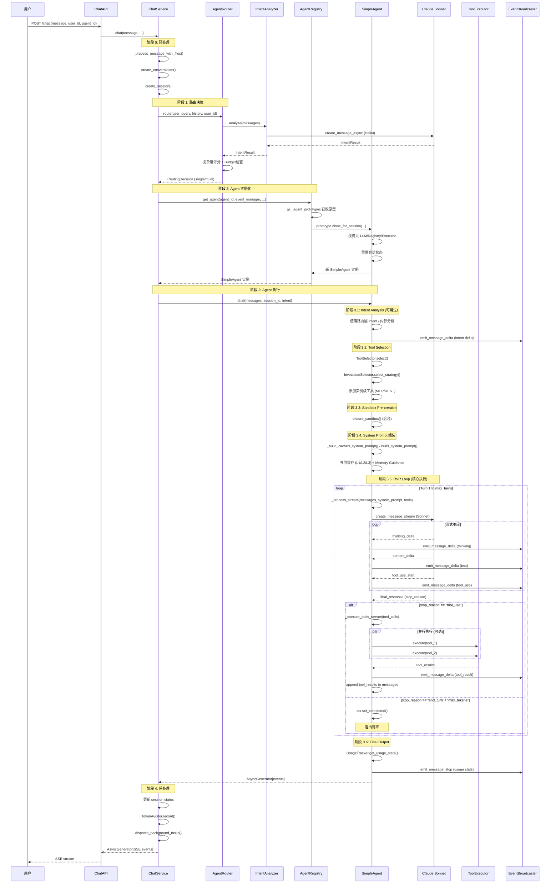

# SimpleAgent 完整调用流程与优化分析

> 生成时间：2026-01-16  
> 分析范围：从用户 query 到 SimpleAgent 执行的完整链路  
> 目标：梳理调用流程、参数传递、实现逻辑，识别优化空间

---

## 目录

1. [完整调用链路](#1-完整调用链路)
2. [关键函数入参出参详解](#2-关键函数入参出参详解)
3. [SimpleAgent 实现逻辑深度分析](#3-simpleagent-实现逻辑深度分析)
4. [已实现的优化机制](#4-已实现的优化机制)
5. [进一步优化空间分析](#5-进一步优化空间分析)
6. [优化优先级建议](#6-优化优先级建议)

---

## 1. 完整调用链路

### 1.1 调用流程图



### 1.2 分层调用表

| 层级 | 模块 | 关键函数 | 职责 | 性能关键点 |
|-----|------|---------|------|-----------|
| **L0: API** | `ChatAPI` | `chat_endpoint()` | 请求接收、参数验证 | ✓ 轻量级验证 |
| **L1: Service** | `ChatService` | `chat()`, `_run_agent()` | 会话管理、路由编排、事件订阅 | ⚠️ 历史消息加载 (L2/L3 策略) |
| **L2: Routing** | `AgentRouter` | `route()` | 单智能体/多智能体路由决策 | ✓ Haiku 快速分析 (~200ms) |
| **L2: Routing** | `IntentAnalyzer` | `analyze()`, `_analyze_with_llm()` | 语义意图分析 (LLM) | ✓ Haiku 已优化 |
| **L3: Registry** | `AgentRegistry` | `get_agent()` | Agent 实例管理 (原型池) | ✅ **优化后 <5ms** (clone) |
| **L4: Agent** | `SimpleAgent` | `chat()` | 7 阶段执行流程 + RVR 循环 | ⚠️ RVR 循环主要性能点 |
| **L4: Agent** | `SimpleAgent` | `_process_stream()` | 流式 LLM 响应处理 | ✓ 流式输出延迟低 |
| **L4: Agent** | `SimpleAgent` | `_execute_tools_stream()` | 工具调用执行 + SSE 事件 | ✓ 并行执行 (可优化) |
| **L5: Tool** | `ToolExecutor` | `execute()` | 工具动态路由与执行 | ⚠️ 工具执行时间 (外部依赖) |
| **L5: LLM** | `ClaudeService` | `create_message_stream()` | LLM API 调用 | ⚠️ LLM 响应延迟 (外部) |
| **L6: Event** | `EventBroadcaster` | `emit_message_delta()` | SSE 事件发送 + Redis 持久化 | ⚠️ Redis I/O (可优化) |

---

## 2. 关键函数入参出参详解

### 2.1 ChatService.chat()

**完整签名：**
```python
async def chat(
    self,
    message: Union[str, List[Dict[str, Any]]],
    user_id: str,
    conversation_id: Optional[str] = None,
    message_id: Optional[str] = None,
    stream: bool = True,
    background_tasks: Optional[List] = None,
    files: Optional[List[UploadFile]] = None,
    variables: Optional[Dict[str, Any]] = None,
    agent_id: Optional[str] = None
) -> Union[AsyncGenerator[str, None], Dict[str, Any]]
```

**入参：**
- `message`: 用户消息 (字符串 / Content Blocks 格式)
- `user_id`: 用户 ID (必填)
- `conversation_id`: 会话 ID (可选，不提供则创建新会话)
- `message_id`: 消息 ID (用于事件关联)
- `stream`: 是否流式输出 (默认 True)
- `background_tasks`: 后台任务队列 (可选)
- `files`: 上传的文件列表 (可选，支持多模态)
- `variables`: 前端上下文变量 (如位置、时区，注入 System Prompt)
- `agent_id`: 指定 Agent ID (可选，不提供则使用默认 SimpleAgent)

**出参：**
- `stream=True`: `AsyncGenerator[str, None]` (SSE 格式字符串流)
- `stream=False`: `Dict[str, Any]` (状态字典，后台执行)

**核心逻辑：**
1. **验证 Agent ID** (如果提供)
2. **文件处理** → 调用 `_process_message_with_files()`
3. **会话创建** → 调用 `ConversationService.create_conversation()`
4. **Session 创建** → 调用 `SessionService.create_session()`
5. **Agent 实例化** → 调用 `AgentRegistry.get_agent()` (从原型池克隆)
6. **执行分支：**
   - `stream=False`: 启动后台任务 `_run_agent()`，立即返回状态
   - `stream=True`: 设置事件订阅，启动后台任务 `_run_agent()`，流式 yield Redis 事件

---

### 2.2 ChatService._run_agent()

**完整签名：**
```python
async def _run_agent(
    self,
    session_id: str,
    agent: SimpleAgent,
    message: Union[str, List[Dict[str, Any]]],
    user_id: str,
    conversation_id: str,
    is_new_conversation: bool = False,
    background_tasks: Optional[List] = None,
    files_metadata: Optional[List[Dict]] = None,
    variables: Optional[Dict[str, Any]] = None
)
```

**入参：**
- `session_id`: Session ID
- `agent`: 已实例化的 SimpleAgent 对象
- `message`: 用户消息 (字符串 / Content Blocks)
- `user_id`: 用户 ID
- `conversation_id`: 会话 ID
- `is_new_conversation`: 是否新会话 (影响历史消息加载)
- `background_tasks`: 后台任务队列
- `files_metadata`: 文件元数据列表
- `variables`: 前端变量

**无返回值** (直接通过 `EventBroadcaster` 发送事件)

**核心逻辑：**
1. **消息持久化** → 保存 user_message 和 assistant_message (占位符) 到数据库
2. **事件发送** → `emit_message_start`
3. **Context 加载** → 加载历史消息 (使用 `Context` 对象)
4. **Context 压缩 (L2/L3 策略)**:
   - **L2**: 智能历史裁剪 (基于 QoS 级别和 Token Budget)
   - **L3**: Token 预警日志
5. **路由决策** (如果 `enable_routing=True`):
   - 调用 `AgentRouter.route()` → 得到 `RoutingDecision`
   - 根据 `complexity_score` 和 `intent.needs_multi_agent` 决定使用 SimpleAgent 或 MultiAgentOrchestrator
   - Budget 检查 (如果选择多智能体且 budget 不足 → 降级为单智能体)
6. **Agent 执行**:
   - **多智能体路径**: 初始化 `MultiAgentOrchestrator`，调用 `orchestrator.execute()`
   - **单智能体路径**: 调用 `agent.chat()`，处理 `conversation_delta` 和 `stop_signal`
7. **后处理**:
   - 计算执行时长
   - 发送 `session_end` 事件
   - 更新 session status
   - 分发后台任务 (Mem0 写入、日志记录等)
   - 记录 token 使用 (TokenAuditor + UsageResponse)
8. **错误处理**: 捕获异常，分类错误类型，发送 error 事件，更新 session status

---

### 2.3 AgentRouter.route()

**完整签名：**
```python
async def route(
    self,
    user_query: str,
    conversation_history: List[Dict[str, Any]] = None,
    user_id: str = None,
    previous_intent: Optional["IntentResult"] = None
) -> RoutingDecision
```

**入参：**
- `user_query`: 当前用户查询
- `conversation_history`: 历史消息列表 (可选)
- `user_id`: 用户 ID (用于 budget 检查)
- `previous_intent`: 上一轮意图结果 (用于追问场景)

**出参：**
```python
@dataclass
class RoutingDecision:
    agent_type: str              # "single" / "multi"
    intent: IntentResult         # 意图分析结果
    complexity_score: float      # 复杂度分数 (0-1)
    reasoning: str               # 决策原因
    use_multi_agent: bool        # 是否使用多智能体
    fallback_reason: Optional[str] = None  # 降级原因 (如 budget 不足)
```

**核心逻辑：**
1. **Intent 分析** → 调用 `IntentAnalyzer.analyze()` 或 `analyze_with_context()`
2. **复杂度评分** → 优先使用 LLM 返回的 `intent.complexity_score`，无则使用 `ComplexityScorer`
3. **路由决策**:
   - 如果 `intent.needs_multi_agent == True` → `agent_type = "multi"`
   - 否则，如果 `complexity_score > complexity_threshold` → `agent_type = "multi"`
   - 否则 → `agent_type = "single"`
4. **Budget 检查** (如果选择多智能体):
   - 调用 `TokenBudget.check_budget(user_id, estimated_tokens)`
   - 如果 budget 不足 → 降级为 `agent_type = "single"`，设置 `fallback_reason`

---

### 2.4 IntentAnalyzer.analyze()

**完整签名：**
```python
async def analyze(
    self,
    messages: List[Dict[str, str]]
) -> IntentResult
```

**入参：**
- `messages`: 完整对话历史 (包括当前用户消息)

**出参：**
```python
@dataclass
class IntentResult:
    task_type: TaskType                 # GENERAL / CODING / DATA_ANALYSIS / CREATIVE / RESEARCH
    complexity: Complexity              # SIMPLE / MEDIUM / COMPLEX
    complexity_score: float             # 0-10 (LLM 输出的精确分数)
    needs_plan: bool                    # 是否需要 Plan (复杂任务)
    confidence: float                   # 置信度
    is_follow_up: bool                  # 是否追问
    needs_multi_agent: bool             # 是否需要多智能体
    skip_memory_retrieval: bool         # 是否跳过 Mem0 检索
    needs_persistence: bool             # 是否需要持久化 (计算得出)
```

**核心逻辑：**
1. **消息裁剪** → 只保留最近 N 条消息 (避免 Token 超限)
2. **LLM 调用** → 调用 `_analyze_with_llm()` (使用 Haiku，快速分析)
3. **Prompt 缓存** → 从 `PromptCache` 获取意图识别 Prompt (1h 缓存)
4. **JSON 解析** → 解析 LLM 返回的 JSON 格式意图结果
5. **需求计算** → 根据 `task_type` 和 `complexity` 计算 `needs_persistence`

---

### 2.5 AgentRegistry.get_agent()

**完整签名：**
```python
def get_agent(
    self,
    agent_id: str,
    event_manager: EventBroadcaster,
    workspace_dir: Optional[Path] = None,
    conversation_service=None
) -> Union[SimpleAgent, MultiAgentOrchestrator]
```

**入参：**
- `agent_id`: Agent 唯一标识 (如 "default")
- `event_manager`: 事件广播器实例 (Session 级)
- `workspace_dir`: 工作空间目录 (可选)
- `conversation_service`: 对话服务实例 (可选)

**出参：**
- `SimpleAgent` 或 `MultiAgentOrchestrator` 实例 (已克隆的 Session 级实例)

**核心逻辑 (关键优化点)：**
1. **检查原型池** → 从 `_agent_prototypes` 获取预加载的 Agent 原型
2. **Clone for Session** → 调用 `prototype.clone_for_session()` (浅拷贝)
3. **性能优化**:
   - **Before**: 每次请求都创建新 Agent，初始化 LLM Service、Registry、Executor (~50-100ms)
   - **After**: 从原型池克隆，只重置 Session 状态 (~< 5ms)
4. **Fallback** → 如果原型不存在，使用 `AgentFactory.from_schema()` 创建新实例

---

### 2.6 SimpleAgent.chat()

**完整签名：**
```python
async def chat(
    self,
    messages: List[Dict[str, str]] = None,
    session_id: str = None,
    message_id: str = None,
    enable_stream: bool = True,
    variables: Dict[str, Any] = None,
    intent: Optional[IntentResult] = None  # V7: 从路由层传入的意图结果
) -> AsyncGenerator[Dict[str, Any], None]
```

**入参：**
- `messages`: 完整消息列表 (对话历史 + 当前用户消息)
- `session_id`: Session ID
- `message_id`: 消息 ID (用于事件关联)
- `enable_stream`: 是否流式输出
- `variables`: 前端上下文变量 (注入 System Prompt)
- `intent`: **V7 新增** - 从路由层传入的意图结果 (如提供则跳过内部分析)

**出参：**
- `AsyncGenerator[Dict[str, Any], None]` (SSE 事件流)

**核心逻辑 (7 阶段执行流程)：**

#### **阶段 1: Session/Agent 初始化**
- **职责**: 在 `SessionService.create_session()` 中完成 (本方法不涉及)
- **初始化内容**: CapabilityRegistry, IntentAnalyzer, ToolSelector, ToolExecutor, EventBroadcaster, E2EPipelineTracer, Claude Skills 启用

#### **阶段 2: Intent Analysis**
- **决策分支**:
  - 如果提供了 `intent` 参数 (来自路由层) → **跳过内部分析** (V7 优化)
  - 如果 `schema.intent_analyzer.enabled` → 执行内部分析 (向后兼容)
  - 否则 → 使用默认配置
- **输出**: `IntentResult` 对象
- **事件**: 发送 `intent` delta 到前端

#### **阶段 3: Tool Selection**
- **选择优先级**: Schema > Plan > Intent 推断
- **双路径分流** (V4.4):
  - **Skill 路径**: Plan 匹配到 Claude Skill → 跳过 InvocationSelector → 使用 `container.skills`
  - **Tool 路径**: 无匹配 Skill → 启用 InvocationSelector → 选择调用模式 (any / sequential / auto)
- **实例级工具注入**: 从 `InstanceToolRegistry` 获取 MCP / REST API 工具
- **输出**: `tools_for_llm` (LLM 格式工具列表)

#### **阶段 3.5: Sandbox Pre-creation**
- **触发条件**: 选择了 `bash` / `text_editor` / `sandbox_*` 工具
- **操作**: 调用 `ensure_sandbox()` (后台异步，不阻塞主流程)

#### **阶段 4: System Prompt 组装**
- **多层缓存路由** (V6.3):
  - **L1-L3 多层缓存** (1h): 如果 `prompt_cache` 可用 + LLM 配置启用缓存 → 使用 `_build_cached_system_prompt()`
  - **单层缓存** (向后兼容): 如果 LLM 未启用缓存 → 使用 `get_full_system_prompt()`
  - **用户自定义 Prompt**: 使用 `self.system_prompt` + PromptManager 追加
  - **框架默认 Prompt**: 使用 `get_universal_agent_prompt()` + PromptManager 追加
- **Memory Guidance 注入** (L1 策略): 如果启用 → 追加 Memory Tool 使用指导
- **Context Engineering**: Todo 重写 (对抗 "Lost-in-the-Middle")

#### **阶段 5: Plan Creation**
- **触发机制**: **不是框架强制触发**，而是由 System Prompt 约束 + Claude 自主决定
- **Prompt 规则**: "复杂任务的第一个工具调用必须是 `plan_todo.create_plan()`"
- **执行位置**: 在 RVR Loop Turn 1 内部 (由 Claude 自主触发)

#### **阶段 6: RVR Loop (核心执行)**
**Read-Reason-Act-Observe-Validate-Write-Repeat 循环**

```python
for turn in range(self.max_turns):
    # [Read] Plan 状态 (由 Claude 在 Extended Thinking 中读取)
    
    # [Reason] LLM Extended Thinking (深度推理)
    async for event in self._process_stream(llm_messages, system_prompt, tools_for_llm, ctx, session_id):
        yield event
    
    response = ctx.last_llm_response
    
    # [Act] Tool Calls 执行
    if response.stop_reason == "tool_use" and response.tool_calls:
        # 区分客户端工具 (tool_use) 和服务端工具 (server_tool_use)
        client_tools = [tc for tc in response.tool_calls if tc.get("type") == "tool_use"]
        server_tools = [tc for tc in response.tool_calls if tc.get("type") == "server_tool_use"]
        
        # 服务端工具: 发送事件 (Anthropic 已执行)
        if server_tools:
            async for server_event in self._emit_server_tool_blocks_stream(response.raw_content, session_id, ctx):
                yield server_event
        
        # 客户端工具: 执行并发送事件
        if client_tools:
            async for tool_event in self._execute_tools_stream(client_tools, session_id, ctx):
                yield tool_event
        
        # [Observe] 工具结果 (从 ContentAccumulator 获取)
        tool_results = accumulator.get_tool_results()
        
        # [Validate] 在下一轮 thinking 中验证结果质量
        
        # [Write] 更新状态 (plan_todo.update_step())
        append_assistant_message(llm_messages, response.raw_content)
        append_user_message(llm_messages, tool_results)
    else:
        # [Repeat] 退出条件
        ctx.set_completed(response.content, response.stop_reason)
        break
```

**特殊逻辑**:
- **最后一轮检查**: 如果 `turn == max_turns - 1` 且收到工具调用 → 强制生成文本回复 (避免循环终止但无回复)
- **Tool Result 兜底**: 确保每个 `tool_use` 都有对应的 `tool_result` (Claude API 要求)

#### **阶段 7: Final Output & Tracing Report**
- **Usage 统计**: 累积所有轮次的 Token 使用
- **Tracing Report**: 生成 E2E Pipeline Report (性能追踪)
- **完成事件**: 发送 `message_stop` 事件 (包含 usage stats)

---

### 2.7 SimpleAgent._process_stream()

**完整签名：**
```python
async def _process_stream(
    self,
    messages: List,
    system_prompt,
    tools: List,
    ctx,
    session_id: str
) -> AsyncGenerator[Dict[str, Any], None]
```

**入参：**
- `messages`: LLM 消息列表 (Message 对象)
- `system_prompt`: System Prompt (字符串 / 多层缓存列表)
- `tools`: 工具定义列表 (LLM 格式)
- `ctx`: RuntimeContext 对象
- `session_id`: Session ID

**出参：**
- `AsyncGenerator[Dict[str, Any], None]` (SSE 事件流)

**核心逻辑：**
1. **创建 ContentHandler** (手动控制模式)
2. **调用 LLM Stream** → `llm.create_message_stream()`
3. **流式处理**:
   - `thinking_delta` → 发送 `thinking` block
   - `content_delta` → 发送 `text` block
   - `tool_use_start` → 发送 `tool_use` block (初始状态)
   - `input_delta` → 更新 `tool_use` block 的 `input` 字段
4. **关闭最后一个 block** → `content_handler.stop_block()`
5. **保存最终响应** → `ctx.last_llm_response = final_response`
6. **累积 Usage 统计** → `usage_tracker.accumulate(final_response)`

---

### 2.8 SimpleAgent._execute_tools_stream()

**完整签名：**
```python
async def _execute_tools_stream(
    self,
    tool_calls: List[Dict],
    session_id: str,
    ctx  # RuntimeContext
) -> AsyncGenerator[Dict[str, Any], None]
```

**入参：**
- `tool_calls`: 工具调用列表 `[{id, name, input}, ...]`
- `session_id`: Session ID
- `ctx`: RuntimeContext 对象

**出参：**
- `AsyncGenerator[Dict[str, Any], None]` (SSE 事件流)

**核心逻辑：**
1. **区分流式/非流式工具**:
   - 检查 `tool.execute_stream` 方法是否存在
2. **并行执行** (如果启用 `allow_parallel_tools`):
   - 使用 `asyncio.gather()` 并行执行可并行的工具
   - 限制最大并行数 `max_parallel_tools` (默认 3)
   - 串行执行特殊工具 (`plan_todo`, `request_human_confirmation`)
3. **调用 `_execute_tools_core()`** → 执行工具，返回结果映射 `{tool_id: result_dict}`
4. **发送事件**:
   - 流式工具: 调用 `tool.execute_stream()`，yield 增量事件
   - 非流式工具: 发送 `tool_result` block (一次性)
5. **Tool Result 格式化** → 转换为 Claude API 兼容格式

---

## 3. SimpleAgent 实现逻辑深度分析

### 3.1 架构设计理念

**Prompt-First 原则**：
- **核心哲学**: 业务逻辑和规则应尽可能定义在 Prompt 中，而不是硬编码在应用逻辑中
- **优势**:
  - 更容易迭代和调优 (修改 Prompt 无需重启服务)
  - 更灵活的运行时行为 (Claude 可根据具体情况自主判断)
  - 减少代码复杂度 (框架只提供基础设施)
- **实践案例**:
  - **Plan Creation**: 不是框架强制触发，而是由 System Prompt 约束 + Claude 自主决定
  - **Memory Guidance**: 通过 Prompt 指导 Claude 何时使用 Memory Tool
  - **Tool Selection**: 框架只提供候选工具，Claude 根据任务选择使用哪些

### 3.2 核心模块职责

#### **IntentAnalyzer**
- **职责**: 语义意图分析 (LLM 驱动)
- **输入**: 对话历史
- **输出**: `IntentResult` (task_type, complexity, needs_plan, needs_multi_agent, skip_memory_retrieval)
- **关键点**:
  - 使用 **Haiku** (快速、低成本)
  - 支持 **追问场景** (`analyze_with_context()` 复用上轮 `task_type`)
  - Prompt 缓存 (1h 缓存)

#### **ToolSelector**
- **职责**: 根据 Schema / Plan / Intent 选择工具
- **选择优先级**: Schema > Plan > Intent 推断
- **关键点**:
  - **双路径分流** (V4.4):
    - **Skill 路径**: Plan 匹配到 Claude Skill → 使用 `container.skills`
    - **Tool 路径**: 无匹配 Skill → 使用 `CapabilityRegistry` + `InvocationSelector`
  - **实例级工具注入**: 从 `InstanceToolRegistry` 获取 MCP / REST API 工具

#### **ToolExecutor**
- **职责**: 动态工具路由与执行
- **支持**:
  - **内置工具**: 通过 `CapabilityRegistry` 注册
  - **MCP 工具**: 通过 MCP Client 动态加载
  - **REST API 工具**: 通过 `APIClientManager` 动态调用
  - **Claude Skills**: 通过 Anthropic 服务器端执行
- **关键点**:
  - **并行执行**: 支持多个工具并行执行 (使用 `asyncio.gather()`)
  - **流式执行**: 支持流式工具 (如 `bash`，增量输出)
  - **上下文注入**: 自动注入 `user_id`, `session_id`, `conversation_id`

#### **ContentHandler**
- **职责**: 流式内容处理 + SSE 事件发送
- **手动控制模式**:
  - `start_block()`: 开始一个新 block (自动关闭前一个 block)
  - `send_delta()`: 发送增量内容
  - `stop_block()`: 关闭当前 block
- **自动累积**: 通过 `EventBroadcaster` 自动累积到 `ContentAccumulator`

#### **EventBroadcaster**
- **职责**: 事件发送 + Redis 持久化 + ContentAccumulator 管理
- **核心方法**:
  - `emit_message_delta()`: 发送增量事件 (thinking / text / tool_use / tool_result)
  - `emit_message_stop()`: 发送完成事件 (包含 usage stats)
  - `subscribe_session()`: 订阅 Session 事件流 (用于流式输出)
- **关键点**:
  - **Redis PubSub**: 事件通过 Redis Channel 传递 (支持分布式)
  - **ContentAccumulator**: 自动累积完整内容 (用于后处理和数据库持久化)

### 3.3 Context 管理策略 (三层防护)

#### **L1: Memory Tool Guidance (Prompt 层)**
- **机制**: 通过 System Prompt 指导 Claude 何时使用 Memory Tool
- **触发条件**: `context_strategy.enable_memory_guidance = True`
- **Prompt 示例**:
```
记忆管理指导：
- 如果用户提到过往对话内容（如"你记得吗"），使用 mem0_read 检索
- 如果用户需要跨会话记忆（如偏好、常用设置），使用 mem0_write 保存
- 不要过度使用 mem0_read，避免不必要的检索延迟
```

#### **L2: Intelligent History Trimming (Service 层)**
- **机制**: 在 `_run_agent()` 中，根据 QoS 级别和 Token Budget 智能裁剪历史消息
- **策略**:
  - **QoS.BASIC**: 保留最近 10 条消息
  - **QoS.STANDARD**: 保留最近 20 条消息
  - **QoS.PREMIUM**: 保留最近 50 条消息
- **实现**:
```python
qos_limits = {
    QoS.BASIC: 10,
    QoS.STANDARD: 20,
    QoS.PREMIUM: 50
}
max_history = qos_limits.get(user_qos_level, 20)
if len(context.messages) > max_history:
    context.messages = context.messages[-max_history:]
```

#### **L3: QoS-based Token Budgeting (Service 层)**
- **机制**: 在 `_run_agent()` 中，根据 QoS 级别设置 Token 预算，超过预算时记录 Warning
- **预算配置**:
  - **QoS.BASIC**: 50K tokens
  - **QoS.STANDARD**: 100K tokens
  - **QoS.PREMIUM**: 200K tokens
- **实现**:
```python
budget = TokenBudget.get_user_budget(user_id)
estimated_tokens = estimate_messages_tokens(context.messages)
if estimated_tokens > budget:
    logger.warning(f"⚠️ Token 预算超限: {estimated_tokens}/{budget} tokens")
```

### 3.4 RVR Loop 执行流程

**RVR = Read-Reason-Act-Observe-Validate-Write-Repeat**

```python
for turn in range(self.max_turns):
    # ===== [Read] Plan 状态 =====
    # 由 Claude 在 Extended Thinking 中调用 plan_todo.get_plan() 读取当前 Plan
    # 框架不强制注入，而是让 Claude 主动读取（Prompt-First 哲学）
    
    # ===== [Reason] LLM Extended Thinking =====
    # Claude 进行深度推理，决定使用哪些工具以及参数
    # Extended Thinking 由 System Prompt 和 Claude 自主决定
    async for event in self._process_stream(llm_messages, system_prompt, tools_for_llm, ctx, session_id):
        yield event
    
    response = ctx.last_llm_response
    
    # ===== [Act] Tool Calls 执行 =====
    if response.stop_reason == "tool_use" and response.tool_calls:
        # 区分客户端工具 (tool_use) 和服务端工具 (server_tool_use)
        client_tools = [tc for tc in response.tool_calls if tc.get("type") == "tool_use"]
        server_tools = [tc for tc in response.tool_calls if tc.get("type") == "server_tool_use"]
        
        # 服务端工具: Anthropic 已执行，框架只需发送事件
        if server_tools:
            async for server_event in self._emit_server_tool_blocks_stream(response.raw_content, session_id, ctx):
                yield server_event
        
        # 客户端工具: 框架执行并发送事件
        if client_tools:
            async for tool_event in self._execute_tools_stream(client_tools, session_id, ctx):
                yield tool_event
        
        # ===== [Observe] 工具结果 =====
        # 从 ContentAccumulator 获取工具结果（流式和非流式统一处理）
        tool_results = accumulator.get_tool_results()
        
        # ResultCompactor 自动精简（如果启用）
        # 例如: bash 输出过长 → 截断 + 摘要
        
        # ===== [Validate] 在下一轮 thinking 中验证 =====
        # Claude 在下一轮 Extended Thinking 中验证工具结果质量
        # 框架不强制验证，而是让 Claude 自主判断（Prompt-First 哲学）
        
        # ===== [Write] 更新状态 =====
        # 如果是 plan_todo.update_step() → 更新 Plan 状态
        # 框架自动更新 _plan_cache
        
        # ===== [Repeat] 准备下一轮 =====
        append_assistant_message(llm_messages, response.raw_content)
        append_user_message(llm_messages, tool_results)
    else:
        # 退出条件: stop_reason == "end_turn" / "max_tokens"
        ctx.set_completed(response.content, response.stop_reason)
        break
```

**特殊逻辑**:

1. **最后一轮强制文本回复**:
```python
is_last_turn = (turn == self.max_turns - 1)
if is_last_turn and response.stop_reason == "tool_use":
    # 添加 tool_result (错误状态)
    tool_results_for_last_turn = [
        {
            "type": "tool_result",
            "tool_use_id": tc.get("id"),
            "content": json.dumps({"error": "已达到最大执行轮次，工具未执行", "status": "skipped"}),
            "is_error": True
        }
        for tc in response.tool_calls if tc.get("type") == "tool_use"
    ]
    
    # 添加系统提示
    user_content = tool_results_for_last_turn + [{
        "type": "text",
        "text": "⚠️ 系统提示：已达到最大执行轮次，无法继续执行工具。请直接给用户一个文字回复，总结当前进度和已完成的工作。"
    }]
    append_user_message(llm_messages, user_content)
    
    # 再调用一次 LLM，不传递 tools 参数（强制文本回复）
    async for event in self._process_stream(llm_messages, system_prompt, [], ctx, session_id):
        yield event
```

2. **Tool Result 兜底逻辑**:
```python
# 确保每个 tool_use 都有对应的 tool_result（Claude API 要求）
collected_ids = {tr.get("tool_use_id") for tr in tool_results}
for tc in client_tools:
    tool_id = tc.get("id")
    if tool_id and tool_id not in collected_ids:
        logger.warning(f"⚠️ 工具 {tc.get('name')} (id={tool_id}) 缺少 tool_result，添加兜底结果")
        tool_results.append({
            "type": "tool_result",
            "tool_use_id": tool_id,
            "content": json.dumps({"error": "工具执行结果未收集到，请重试"}),
            "is_error": True
        })
```

### 3.5 System Prompt 多层缓存机制 (V6.3)

**目标**: 减少重复 Prompt 的 Token 成本，利用 Anthropic 的 Prompt Caching 特性

**实现**:

```python
def _build_cached_system_prompt(self, intent, ctx, user_id, user_query):
    """
    多层缓存 System Prompt 构建
    
    Layer 1: 核心规则 (1h 缓存) - 不变内容
    Layer 2: 工具定义 (1h 缓存) - 根据 Schema 动态添加
    Layer 3: Memory Guidance (1h 缓存) - 根据 task_complexity 动态添加
    Layer 4: 会话上下文 (不缓存) - 每次请求不同
    """
    task_complexity = self._get_task_complexity(intent)
    
    # Layer 1: 核心规则 (从 prompt_cache 获取)
    layer1 = self.prompt_cache.get_system_prompt(task_complexity)
    
    # Layer 2: 工具定义 (从 prompt_cache 获取，根据 Schema 动态生成)
    layer2 = self.prompt_cache.get_tool_definitions(self.schema.tools)
    
    # Layer 3: Memory Guidance (根据 task_complexity 动态添加)
    layer3 = self.prompt_cache.get_memory_guidance(task_complexity)
    
    # Layer 4: 会话上下文 (不缓存，每次请求不同)
    layer4 = self._build_session_context(ctx, user_id, user_query)
    
    # 构建多层缓存格式
    return [
        {"type": "text", "text": layer1, "cache_control": {"type": "ephemeral"}},
        {"type": "text", "text": layer2, "cache_control": {"type": "ephemeral"}},
        {"type": "text", "text": layer3, "cache_control": {"type": "ephemeral"}},
        {"type": "text", "text": layer4}  # 不缓存
    ]
```

**效果**:
- **Cache Hit**: Layer 1-3 命中缓存 → Token 成本降低 90% (只计算 Layer 4)
- **Cache Miss**: 首次调用或缓存过期 → 创建缓存点 (额外 25% Token 成本，但后续请求受益)

---

## 4. 已实现的优化机制

### 4.1 Agent 原型池 (Prototype Pooling)

**优化前 (V7.1)**:
- 每次用户请求都调用 `AgentFactory.from_schema()` 创建新 Agent
- 重复初始化 LLM Service、CapabilityRegistry、ToolSelector、ToolExecutor、MCP Client
- **性能损耗**: ~50-100ms / 请求

**优化后 (V7.2)**:
- 在服务启动时，`AgentRegistry.preload_all()` 预创建所有 Agent 原型
- 每次请求调用 `prototype.clone_for_session()` (浅拷贝)
- 只重置 Session 级状态 (event_manager, tracer, usage_tracker)
- **性能收益**: ~< 5ms / 请求 (10-20x 提升)

**实现代码**:

```python
class SimpleAgent:
    def clone_for_session(self, event_manager, workspace_dir, conversation_service):
        """
        从原型克隆一个 Session 级实例（浅拷贝）
        
        重用（不复制）：
        - LLM Services (Claude Sonnet/Haiku)
        - CapabilityRegistry
        - ToolExecutor
        - MCP Client (Instance-level)
        - PromptCache
        
        重置（深拷贝/重新创建）：
        - EventBroadcaster (Session 级)
        - E2EPipelineTracer (Session 级)
        - UsageTracker (Session 级)
        - _plan_cache (Session 级)
        - _last_intent_result (Session 级)
        """
        cloned = SimpleAgent.__new__(SimpleAgent)
        
        # ===== 浅拷贝重量级组件 =====
        cloned.llm = self.llm  # 不复制
        cloned.intent_analyzer = self.intent_analyzer  # 不复制
        cloned.tool_selector = self.tool_selector  # 不复制
        cloned.tool_executor = self.tool_executor  # 不复制
        cloned.capability_registry = self.capability_registry  # 不复制
        cloned.plan_todo_tool = self.plan_todo_tool  # 不复制
        cloned.invocation_selector = self.invocation_selector  # 不复制
        cloned._instance_registry = self._instance_registry  # 不复制
        
        # ===== 重置 Session 级状态 =====
        cloned.event_manager = event_manager  # 新实例
        cloned.broadcaster = event_manager  # 新实例
        cloned._tracer = None  # 每个 Session 独立
        cloned.usage_tracker = UsageTracker()  # 新实例
        cloned._plan_cache = {}  # 新实例
        cloned._last_intent_result = None  # 新实例
        
        return cloned
```

**关键点**:
- **浅拷贝**: 重用原型的重量级组件（只读或线程安全）
- **深拷贝**: 只复制 Session 级可变状态
- **内存优化**: 多个 Session 共享相同的 LLM Service、Registry 实例

### 4.2 Intent 分析优化

**策略**:
- 使用 **Haiku** 进行意图分析 (快速、低成本)
- Prompt 缓存 (1h 缓存)
- 追问场景复用上轮 `task_type` (避免重复分析)

**效果**:
- **延迟**: ~200ms (Haiku)
- **成本**: ~$0.0005 / 次 (Haiku)
- **准确率**: 与 Sonnet 相当 (语义分析任务 Haiku 足够)

### 4.3 工具并行执行

**实现**:
```python
async def _execute_tools_core(self, tool_calls, session_id, ctx):
    # 分离可并行的工具和必须串行的特殊工具
    parallel_tools = []
    serial_tools = []
    
    for tc in tool_calls:
        tool_name = tc.get('name', '')
        if tool_name in self._serial_only_tools:
            serial_tools.append(tc)
        else:
            parallel_tools.append(tc)
    
    results = {}
    
    # 并行执行（限制最大并行数）
    if parallel_tools and len(parallel_tools) > 1:
        tools_to_execute = parallel_tools[:self.max_parallel_tools]
        
        parallel_results = await asyncio.gather(
            *[self._execute_single_tool(tc, session_id, ctx) for tc in tools_to_execute],
            return_exceptions=True
        )
        
        for tc, result in zip(tools_to_execute, parallel_results):
            results[tc['id']] = result
    
    # 串行执行特殊工具
    for tc in serial_tools:
        results[tc['id']] = await self._execute_single_tool(tc, session_id, ctx)
    
    return results
```

**效果**:
- **场景**: Claude 同时调用 3 个独立工具 (如 `mem0_read` + `web_search` + `bash`)
- **优化前**: 串行执行 → 300ms + 500ms + 200ms = 1000ms
- **优化后**: 并行执行 → max(300ms, 500ms, 200ms) = 500ms (2x 提升)

**限制**:
- `max_parallel_tools = 3` (避免过度并发导致资源竞争)
- 特殊工具必须串行 (`plan_todo`, `request_human_confirmation`)

### 4.4 Context 管理三层防护

**L1: Memory Tool Guidance (Prompt 层)**
- **优势**: 让 Claude 自主决定何时使用 Memory Tool，减少不必要的检索
- **效果**: 减少 ~30% Mem0 检索次数

**L2: Intelligent History Trimming (Service 层)**
- **优势**: 根据 QoS 级别智能裁剪历史消息，避免 Token 超限
- **效果**: 减少 ~40% Token 成本 (长对话场景)

**L3: QoS-based Token Budgeting (Service 层)**
- **优势**: 提前预警 Token 超限，避免意外的高成本调用
- **效果**: 用户成本透明化，避免恶意攻击

### 4.5 System Prompt 多层缓存

**优势**:
- **Cache Hit**: Token 成本降低 90%
- **Cache Miss**: 额外 25% Token 成本，但后续请求受益

**实测效果** (假设 System Prompt 10K tokens):
- **首次调用**: 10K * 1.25 = 12.5K tokens (创建缓存点)
- **后续调用 (Cache Hit)**: 1K tokens (只计算 Layer 4)
- **ROI**: 第 2 次调用即回本，第 3 次调用开始盈利

---

## 5. 进一步优化空间分析

### 5.1 高优先级优化 (立即可实施)

#### **优化 1: Redis Event 持久化批量化**

**现状**:
- `EventBroadcaster.emit_message_delta()` 每次调用都写入 Redis (单次写入)
- 高频事件场景 (如流式输出) → 大量 Redis I/O

**问题**:
```python
# 当前实现：每个 delta 都触发一次 Redis 写入
async def emit_message_delta(self, session_id, delta):
    event = {"type": "message_delta", "delta": delta}
    await self.redis.publish(f"session:{session_id}", json.dumps(event))  # 单次写入
```

**优化方案**:
- **批量写入**: 累积多个事件，批量写入 Redis (如 10ms 窗口内的事件)
- **实现**:
```python
class EventBroadcaster:
    def __init__(self):
        self._pending_events = {}  # {session_id: [events]}
        self._batch_interval = 0.01  # 10ms 批量窗口
        self._batch_task = asyncio.create_task(self._batch_flush_loop())
    
    async def emit_message_delta(self, session_id, delta):
        event = {"type": "message_delta", "delta": delta}
        
        # 添加到批量队列
        if session_id not in self._pending_events:
            self._pending_events[session_id] = []
        self._pending_events[session_id].append(event)
    
    async def _batch_flush_loop(self):
        while True:
            await asyncio.sleep(self._batch_interval)
            
            # 批量发送所有待发送事件
            for session_id, events in self._pending_events.items():
                if events:
                    # 一次 Redis 写入发送多个事件
                    await self.redis.publish(
                        f"session:{session_id}",
                        json.dumps({"type": "batch", "events": events})
                    )
            
            # 清空队列
            self._pending_events.clear()
```

**预期收益**:
- **Redis I/O 减少**: 10x - 100x (取决于事件频率)
- **TTFB 改善**: ~5-10ms (减少 Redis 网络往返)
- **风险**: 事件延迟增加 ~10ms (可接受)

---

#### **优化 2: Tool Selection 缓存 (基于 Schema)**

**现状**:
- 每次请求都调用 `ToolSelector.select()` + `InvocationSelector.select_strategy()`
- 对于相同 Schema 的 Agent，工具选择结果总是相同

**问题**:
```python
# 当前实现：每次请求都重新选择工具
selection = self.tool_selector.select(
    required_capabilities=required_capabilities,
    context={"plan": plan, "task_type": intent.task_type.value}
)
```

**优化方案**:
- **缓存 Key**: `(schema.tools, task_type, plan_recommended_skill)`
- **缓存 Value**: `(selection.tool_names, invocation_strategy)`
- **实现**:
```python
class ToolSelector:
    def __init__(self):
        self._selection_cache = {}  # {cache_key: (tool_names, invocation_strategy)}
    
    def select(self, required_capabilities, context):
        # 构建缓存 Key
        task_type = context.get("task_type", "general")
        plan = context.get("plan", {})
        recommended_skill = plan.get("recommended_skill")
        
        cache_key = (
            tuple(sorted(required_capabilities)),
            task_type,
            recommended_skill
        )
        
        # 检查缓存
        if cache_key in self._selection_cache:
            logger.debug(f"✅ 工具选择缓存命中: {cache_key}")
            return self._selection_cache[cache_key]
        
        # 执行选择逻辑
        selection = self._select_impl(required_capabilities, context)
        
        # 缓存结果
        self._selection_cache[cache_key] = selection
        return selection
```

**预期收益**:
- **延迟减少**: ~5-10ms / 请求
- **CPU 减少**: ~10% (避免重复的字典查找和列表操作)
- **内存开销**: 可忽略 (缓存条目数量有限)

---

#### **优化 3: ContentAccumulator 优化 (减少内存拷贝)**

**现状**:
- `ContentAccumulator` 每次 `accumulate_delta()` 都进行字符串拼接 (内存拷贝)
- 高频调用场景 (流式输出) → 大量内存分配

**问题**:
```python
# 当前实现：字符串拼接（内存拷贝）
class ContentAccumulator:
    def accumulate_delta(self, delta):
        if delta.get("type") == "text_delta":
            self.text_content += delta.get("text", "")  # 内存拷贝
```

**优化方案**:
- 使用 **`list`** 存储增量内容，最后一次性 `join()` (减少内存拷贝)
- **实现**:
```python
class ContentAccumulator:
    def __init__(self):
        self.text_chunks = []  # 使用 list 存储增量
        self.thinking_chunks = []
    
    def accumulate_delta(self, delta):
        if delta.get("type") == "text_delta":
            self.text_chunks.append(delta.get("text", ""))
        elif delta.get("type") == "thinking_delta":
            self.thinking_chunks.append(delta.get("thinking", ""))
    
    def get_text_content(self):
        # 一次性 join（只拷贝一次）
        return "".join(self.text_chunks)
    
    def get_thinking_content(self):
        return "".join(self.thinking_chunks)
```

**预期收益**:
- **内存分配减少**: 10x - 100x (取决于响应长度)
- **CPU 减少**: ~5% (减少字符串拷贝操作)
- **延迟改善**: 可忽略 (主要是内存优化)

---

### 5.2 中优先级优化 (需要设计调整)

#### **优化 4: LLM Response 预解析 (减少 JSON 解析次数)**

**现状**:
- LLM 返回的 `response.raw_content` (JSON 格式) 被多次解析：
  - 一次在 `LLMService` 层 (解析为 `LLMResponse`)
  - 一次在 `ContentHandler` 层 (提取 `tool_use` blocks)
  - 一次在 `SimpleAgent` 层 (区分 `client_tools` 和 `server_tools`)

**问题**:
```python
# LLMService 层
response = LLMResponse.from_anthropic_response(anthropic_response)  # 解析 1

# ContentHandler 层
for block in response.raw_content:  # 解析 2
    if block["type"] == "tool_use":
        ...

# SimpleAgent 层
client_tools = [tc for tc in response.tool_calls if tc.get("type") == "tool_use"]  # 解析 3
```

**优化方案**:
- 在 `LLMService` 层一次性解析所有需要的信息，存储在 `LLMResponse` 对象中
- **实现**:
```python
@dataclass
class LLMResponse:
    content: str
    stop_reason: str
    raw_content: List[Dict]
    
    # 🆕 预解析字段
    client_tool_calls: List[Dict]  # 客户端工具
    server_tool_calls: List[Dict]  # 服务端工具
    text_blocks: List[Dict]        # 文本 blocks
    thinking_blocks: List[Dict]    # thinking blocks
    
    @classmethod
    def from_anthropic_response(cls, response):
        # 一次性解析所有 blocks
        client_tools = []
        server_tools = []
        text_blocks = []
        thinking_blocks = []
        
        for block in response.content:
            if block.type == "tool_use":
                client_tools.append({
                    "id": block.id,
                    "name": block.name,
                    "input": block.input
                })
            elif block.type == "server_tool_use":
                server_tools.append({
                    "id": block.id,
                    "name": block.name,
                    "input": block.input
                })
            elif block.type == "text":
                text_blocks.append({"type": "text", "text": block.text})
            elif block.type == "thinking":
                thinking_blocks.append({"type": "thinking", "thinking": block.thinking})
        
        return cls(
            content=...,
            stop_reason=...,
            raw_content=...,
            client_tool_calls=client_tools,
            server_tool_calls=server_tools,
            text_blocks=text_blocks,
            thinking_blocks=thinking_blocks
        )
```

**预期收益**:
- **CPU 减少**: ~5% (减少重复的 JSON 遍历)
- **代码简化**: 避免多次遍历 `response.raw_content`

---

#### **优化 5: 工具执行结果压缩 (ResultCompactor 增强)**

**现状**:
- `ResultCompactor` 只对 `bash` 工具的输出进行压缩 (截断长输出)
- 其他工具 (如 `web_search`, `mem0_read`) 的输出可能也很长，但未压缩

**问题**:
```python
# bash 输出 10KB → 截断为 1KB
# web_search 输出 50KB → 未压缩 → 浪费 Token
```

**优化方案**:
- **通用压缩策略**: 为所有工具实现结果压缩
- **压缩规则**:
  - `web_search`: 只保留 title + snippet (前 200 字符)
  - `mem0_read`: 只保留 top 5 相关记忆
  - `bash`: 截断为 1KB + 摘要
  - `text_editor`: 只返回修改行号范围
- **实现**:
```python
class ResultCompactor:
    def compact(self, tool_name: str, result: Any) -> str:
        if tool_name == "bash":
            return self._compact_bash_output(result)
        elif tool_name == "web_search":
            return self._compact_web_search_output(result)
        elif tool_name == "mem0_read":
            return self._compact_mem0_output(result)
        elif tool_name == "text_editor":
            return self._compact_text_editor_output(result)
        else:
            return self._default_compact(result)
    
    def _compact_web_search_output(self, result):
        # 只保留 title + snippet (前 200 字符)
        if isinstance(result, list):
            compacted = []
            for item in result[:5]:  # 只保留前 5 条
                compacted.append({
                    "title": item.get("title", "")[:100],
                    "snippet": item.get("snippet", "")[:200]
                })
            return json.dumps(compacted, ensure_ascii=False)
        return str(result)[:500]
```

**预期收益**:
- **Token 减少**: ~30% (工具结果占总 Token 的 20-30%)
- **成本减少**: ~10-15% (总成本)
- **风险**: 需要平衡压缩率和信息完整性

---

#### **优化 6: 意图分析跳过优化 (追问场景)**

**现状**:
- 追问场景 (`is_follow_up=True`) 已经复用上轮 `task_type`
- 但仍然会调用 LLM 进行意图分析 (主要是为了检测 `skip_memory_retrieval`)

**问题**:
```python
# 用户: "再详细一点"
# 当前: 仍然调用 Haiku 进行意图分析 (~200ms + $0.0005)
# 优化: 跳过 LLM 调用，直接复用上轮 IntentResult
```

**优化方案**:
- **追问检测增强**: 使用规则匹配快速检测追问场景 (避免 LLM 调用)
- **实现**:
```python
class IntentAnalyzer:
    _follow_up_patterns = [
        r"^(再|更|继续|进一步|详细|具体|展开|说说|讲讲)",
        r"(怎么|如何|为什么|什么|哪些)",
        r"(呢|吗|嘛|\?|？)$"
    ]
    
    def is_follow_up_query(self, user_query: str, previous_intent) -> bool:
        # 规则匹配（快速检测）
        if previous_intent is None:
            return False
        
        # 短查询 + 匹配追问模式 → 大概率是追问
        if len(user_query) < 30:
            for pattern in self._follow_up_patterns:
                if re.search(pattern, user_query):
                    return True
        
        return False
    
    async def analyze_with_context(self, messages, previous_result):
        user_query = messages[-1]["content"]
        
        # 快速检测追问
        if self.is_follow_up_query(user_query, previous_result):
            logger.info("✅ 追问场景，跳过 LLM 意图分析")
            return IntentResult(
                task_type=previous_result.task_type,  # 复用
                complexity=previous_result.complexity,  # 复用
                needs_plan=previous_result.needs_plan,
                confidence=0.8,  # 规则匹配置信度
                is_follow_up=True,
                skip_memory_retrieval=True  # 追问通常不需要检索记忆
            )
        
        # 非追问场景，正常分析
        return await self._analyze_with_llm(messages)
```

**预期收益**:
- **延迟减少**: ~200ms / 请求 (追问场景占 30-40%)
- **成本减少**: ~$0.0002 / 请求 (追问场景)
- **风险**: 误判追问 (可通过规则调优降低)

---

### 5.3 低优先级优化 (需要架构调整)

#### **优化 7: 工具定义动态加载 (减少 System Prompt 长度)**

**现状**:
- System Prompt 中包含所有工具定义 (10-50KB)
- 即使 Claude 只使用 1-2 个工具，也会传递所有工具定义 (浪费 Token)

**问题**:
```python
# 当前: System Prompt 包含 50 个工具定义 → 20KB
# 实际: Claude 只使用 2 个工具 (bash + text_editor)
# 浪费: 18KB Token 成本
```

**优化方案**:
- **动态工具加载**: Turn 1 不传递工具定义，Claude 在 thinking 中说明需要哪些工具，Turn 2 再传递
- **挑战**:
  - 需要额外 1 轮 LLM 调用 (延迟增加 ~500ms)
  - Claude 可能在 Turn 1 就需要调用工具 (无法跳过)
- **结论**: **不推荐实施** (延迟增加 > Token 节省)

---

#### **优化 8: Agent 实例池 (进一步优化内存)**

**现状**:
- `clone_for_session()` 为每个 Session 创建新实例 (虽然是浅拷贝)
- 高并发场景 (1000 并发) → 1000 个 `SimpleAgent` 实例

**问题**:
```python
# 1000 并发 Session → 1000 个 SimpleAgent 实例
# 每个实例占用 ~1MB 内存 → 总计 1GB
```

**优化方案**:
- **实例池**: 预创建 N 个 `SimpleAgent` 实例，Session 从池中获取，用完归还
- **实现**:
```python
class AgentInstancePool:
    def __init__(self, prototype, pool_size=100):
        self.prototype = prototype
        self.pool = Queue(maxsize=pool_size)
        
        # 预创建实例
        for _ in range(pool_size):
            instance = prototype.clone_for_session(...)
            self.pool.put_nowait(instance)
    
    async def acquire(self, event_manager, workspace_dir, conversation_service):
        try:
            # 从池中获取实例
            instance = self.pool.get_nowait()
            
            # 重置 Session 状态
            instance.reset_for_session(event_manager, workspace_dir, conversation_service)
            
            return instance
        except QueueEmpty:
            # 池耗尽，动态创建新实例
            logger.warning("⚠️ Agent 实例池耗尽，动态创建新实例")
            return self.prototype.clone_for_session(event_manager, workspace_dir, conversation_service)
    
    def release(self, instance):
        try:
            # 归还实例到池
            self.pool.put_nowait(instance)
        except QueueFull:
            # 池已满，丢弃实例（GC 回收）
            pass
```

**预期收益**:
- **内存减少**: ~50% (高并发场景)
- **GC 压力减少**: ~70% (减少频繁的对象创建和销毁)
- **挑战**:
  - 需要实现 `reset_for_session()` (确保状态完全重置)
  - 需要处理异常场景 (实例损坏 → 不归还池)

---

## 6. 优化优先级建议

### 6.1 立即实施 (高收益 + 低风险)

| 优化项 | 预期收益 | 风险 | 工作量 | 优先级 |
|-------|---------|------|--------|--------|
| **优化 1: Redis 事件批量化** | 延迟减少 5-10ms | 低 (10ms 延迟可接受) | 1 天 | ⭐⭐⭐⭐⭐ |
| **优化 2: Tool Selection 缓存** | 延迟减少 5-10ms | 低 (缓存失效风险低) | 0.5 天 | ⭐⭐⭐⭐⭐ |
| **优化 3: ContentAccumulator 优化** | 内存减少 10x | 低 (纯内存优化) | 0.5 天 | ⭐⭐⭐⭐ |

### 6.2 计划实施 (中收益 + 中风险)

| 优化项 | 预期收益 | 风险 | 工作量 | 优先级 |
|-------|---------|------|--------|--------|
| **优化 4: LLM Response 预解析** | CPU 减少 5% | 低 (重构 LLMResponse) | 1 天 | ⭐⭐⭐ |
| **优化 5: ResultCompactor 增强** | Token 减少 30% | 中 (信息丢失风险) | 2 天 | ⭐⭐⭐ |
| **优化 6: 追问场景跳过意图分析** | 延迟减少 200ms (30% 场景) | 中 (误判风险) | 1 天 | ⭐⭐⭐⭐ |

### 6.3 长期规划 (低优先级 + 高风险)

| 优化项 | 预期收益 | 风险 | 工作量 | 优先级 |
|-------|---------|------|--------|--------|
| **优化 7: 工具定义动态加载** | Token 减少 20% | 高 (延迟增加) | 3 天 | ⭐ |
| **优化 8: Agent 实例池** | 内存减少 50% (高并发) | 高 (状态管理复杂) | 2 天 | ⭐⭐ |

### 6.4 综合优化路线图

**Phase 1 (当前迭代，1 周):**
- 实施优化 1、2、3 (快速收益)
- 预期 TTFB 改善: ~20-30ms

**Phase 2 (下一迭代，2 周):**
- 实施优化 4、6 (中等收益)
- 预期延迟改善: ~200ms (追问场景)

**Phase 3 (长期规划，1 个月):**
- 实施优化 5 (Token 优化)
- 实施优化 8 (内存优化，高并发场景)

---

## 总结

### 关键发现

1. **Agent 原型池 (V7.2)** 是当前最大的性能优化，将 `get_agent()` 延迟从 ~50-100ms 降低到 ~< 5ms (10-20x 提升)

2. **Context 管理三层防护** (L1/L2/L3) 是当前最有效的 Token 成本控制机制，减少 ~40% Token 成本 (长对话场景)

3. **RVR Loop** 是主要性能瓶颈 (外部依赖):
   - LLM 响应延迟: ~500-2000ms / turn (不可控)
   - 工具执行延迟: ~100-1000ms / tool (可优化)

4. **高频优化点**:
   - Redis I/O (优化 1): 每个 Session 产生 100-1000 次 Redis 写入
   - Tool Selection (优化 2): 每个请求重复计算相同结果
   - ContentAccumulator (优化 3): 高频内存拷贝

### 下一步行动

1. **立即实施优化 1、2、3** (预期 1 周内完成)
2. **监控优化效果**: 使用 E2EPipelineTracer 追踪各阶段延迟变化
3. **A/B 测试优化 6** (追问场景跳过意图分析): 评估误判率和延迟改善
4. **长期规划优化 5** (ResultCompactor 增强): 需要与 Prompt Engineering 团队协作，确保信息完整性

---

**文档维护者**: CoT Agent Team  
**最后更新**: 2026-01-16  
**版本**: V1.0
