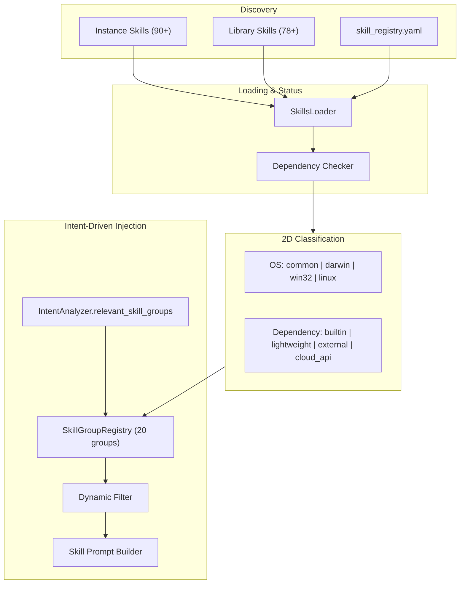
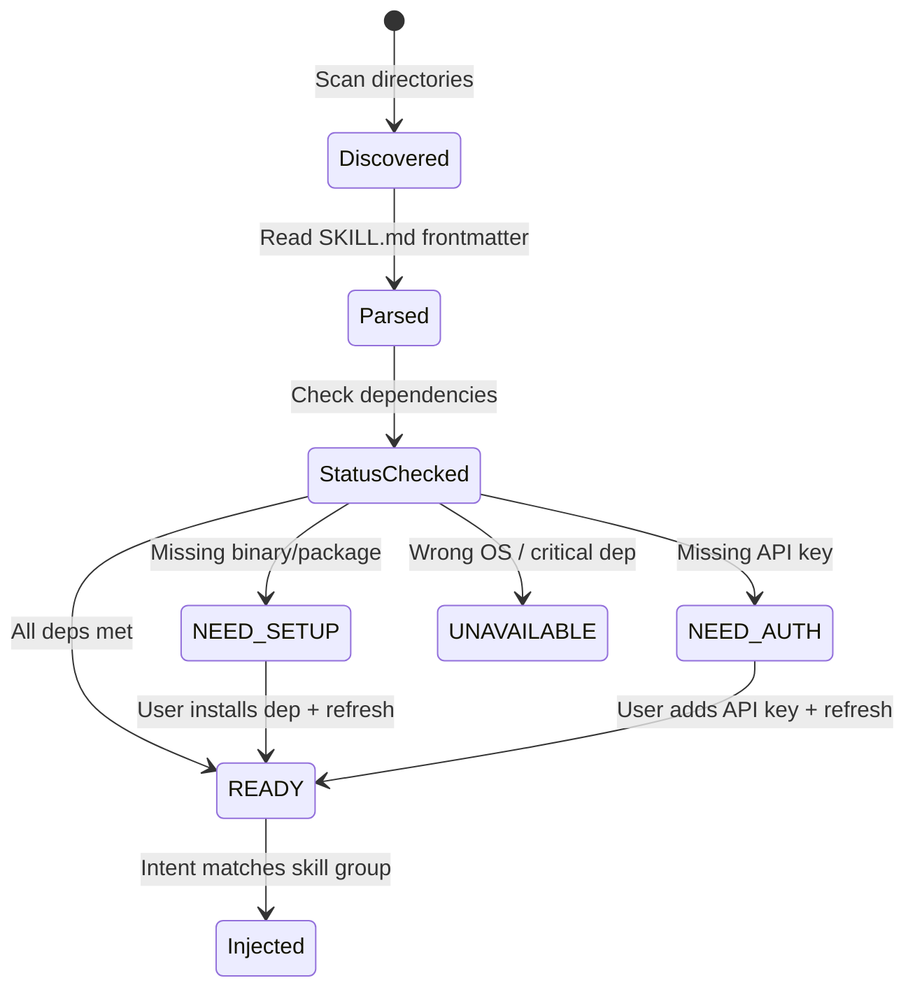

# 07 — Skill Ecosystem

> 150+ plug-and-play skills organized by OS compatibility and dependency complexity, with intent-driven injection and progressive unlock — the core capability layer of the desktop agent.

[< Prev: Tool System](06-tool-system.md) | [Back to Overview](README.md) | [Next: Memory System >](08-memory-system.md)

---

## Design Goals

1. **Skills-First** — Capabilities are skills, not hard-coded features. Adding a new capability means writing a `SKILL.md` file, not modifying agent code.
2. **Progressive unlock** — Zero-config skills work out of the box. More powerful skills unlock as users install dependencies or add API keys.
3. **Cross-platform** — Skills declare OS compatibility. The system automatically filters based on the current platform.

## Architecture



## 2D Classification Matrix

Every skill is classified along two dimensions:

```
                        Dependency Complexity →
               ┌───────────┬─────────────┬───────────┬────────────┐
               │  builtin   │ lightweight │ external  │ cloud_api  │
    OS ↓       │ (zero dep) │ (pip pkg)   │ (CLI/app) │ (API key)  │
┌──────────────┼───────────┼─────────────┼───────────┼────────────┤
│ common       │ summarize  │ excel-      │ obsidian  │ notion     │
│ (all OS)     │ canvas     │ analyzer    │ draw-io   │ gemini     │
├──────────────┼───────────┼─────────────┼───────────┼────────────┤
│ darwin       │ applescript│ apple-notes │ peekaboo  │            │
│ (macOS)      │ screenshot │             │           │            │
├──────────────┼───────────┼─────────────┼───────────┼────────────┤
│ win32        │ screenshot │ outlook-cli │ powershell│            │
│ (Windows)    │ clipboard  │             │           │            │
├──────────────┼───────────┼─────────────┼───────────┼────────────┤
│ linux        │ screenshot │ notify-send │ xdotool   │            │
└──────────────┴───────────┴─────────────┴───────────┴────────────┘
```

This matrix serves two purposes:
1. **Platform filtering** — macOS-only skills don't appear on Windows
2. **Unlock progression** — Users start with `builtin`, unlock more as they install dependencies

## Skill Lifecycle



### Status Checking

`SkillsLoader._check_status()` performs runtime checks:

| Check Type | Method | Example |
|---|---|---|
| CLI binary | `shutil.which(binary)` | `which ffmpeg` |
| System permission | macOS `AXIsProcessTrusted()` | Accessibility access |
| External app | Check if app installed | Bear, Notion desktop |
| API key | `os.getenv(key)` | `OPENAI_API_KEY` |
| Python package | `__import__(pkg)` | `import pandas` |

Status can be refreshed at runtime (e.g., after user installs a dependency) without restarting the server.

## Skill Definition (SKILL.md)

Each skill is a directory with a `SKILL.md` file:

```markdown
---
name: excel-analyzer
description: Analyze Excel files, generate charts and insights
backend: tool
os: common
dependency_level: lightweight
dependencies:
  python: [openpyxl, pandas, matplotlib]
skill_group: data_analysis
---

# Excel Analyzer

## When to Use
- User uploads an .xlsx or .csv file and asks for analysis
- User wants charts, pivot tables, or statistical summaries

## Instructions
1. Read the file using pandas
2. Analyze structure (columns, types, missing values)
3. Generate requested analysis or visualizations
...
```

The frontmatter is parsed for metadata. The body is injected into the agent's prompt when the skill is active.

## 20 Skill Groups

Skills are organized into groups for intent-driven injection:

| Group | Skills | Example Triggers |
|---|---|---|
| `writing` | 11 skills | "Write an article", "Make a PPT" |
| `productivity` | 20 skills | "Add to Notion", "Check my reminders" |
| `app_automation` | 21 skills | "Open Finder", "Take a screenshot" |
| `file_operation` | 11 skills | "Convert this PDF", "Organize my downloads" |
| `research` | 10 skills | "Research this topic", "Find recent papers" |
| `media` | 7 skills | "Transcribe this audio", "Create a video" |
| `content_creation` | 5 skills | "Write a newsletter", "Create social posts" |
| `data_analysis` | 3 skills | "Analyze this spreadsheet" |
| `translation` | 3 skills | "Translate to Japanese" |
| `creative` | 3 skills | "Brainstorm ideas", "Make a GIF" |
| `diagram` | 2 skills | "Draw a flowchart" |
| `image_gen` | 2 skills | "Generate an image" |
| ... | ... | ... |

Group definitions live in `instances/xiaodazi/config/skills.yaml`.

## Intent-Driven Injection

The skill injection pipeline:

```
1. IntentAnalyzer outputs: relevant_skill_groups = ["writing", "data_analysis"]
2. SkillGroupRegistry expands groups → list of skill names
3. SkillsLoader filters: READY skills only, matching OS
4. SkillPromptBuilder constructs prompt fragment:
   - READY skills: full SKILL.md instructions injected
   - NEED_SETUP skills: listed with setup instructions
   - NEED_AUTH skills: listed with "add API key" guidance
   - UNAVAILABLE: listed for user awareness
5. Injected into Phase 1 system message via SkillPromptInjector
```

This means: for a simple "what's the weather" query, zero skill prompts are injected. For "analyze this Excel and make a presentation", the `data_analysis` and `writing` skill groups are injected (~1000 tokens).

## Developer Extension

Adding a new skill:

```bash
# 1. Create skill directory
mkdir instances/xiaodazi/skills/my-skill/

# 2. Write SKILL.md with frontmatter
cat > instances/xiaodazi/skills/my-skill/SKILL.md << 'EOF'
---
name: my-skill
description: Does something useful
backend: tool
os: common
dependency_level: builtin
skill_group: productivity
---
# My Skill
## Instructions
...
EOF

# 3. (Optional) Add tool implementation
mkdir instances/xiaodazi/skills/my-skill/tools/
# Add Python tool file

# 4. Register in skill_registry.yaml (or auto-discovered)
# 5. Add to skill group in config/skills.yaml

# Done — skill is auto-discovered on next request
```

## Key Files

| File | Purpose |
|---|---|
| `core/skill/loader.py` | `SkillsLoader` — discovery, loading, status checking |
| `core/skill/dynamic_loader.py` | `DynamicSkillLoader` — dependency checking |
| `core/skill/group_registry.py` | `SkillGroupRegistry` — group → skill mapping |
| `core/skill/frontmatter.py` | SKILL.md frontmatter parser |
| `core/prompt/skill_prompt_builder.py` | Builds skill injection prompt |
| `instances/xiaodazi/skills/` | 90+ instance-specific skills |
| `skills/library/` | 78+ library skills (shared) |
| `instances/xiaodazi/config/skills.yaml` | Skill groups + 2D classification |
| `instances/xiaodazi/skills/skill_registry.yaml` | 137 registered skills |

## Highlights

- **Zero-code extension** — Writing a `SKILL.md` is enough to add a new capability. No Python code required for prompt-only skills.
- **Progressive unlock** — The system works with zero config (`builtin` skills), and unlocks more as users invest in setup.
- **Intent-aware injection** — Only relevant skills are injected, keeping the context lean. A "translate" request doesn't load PPT-generation instructions.
- **Runtime refresh** — Users can install a dependency, click "refresh" in the Skills UI, and the skill becomes available immediately.

## Limitations & Future Work

- **No skill marketplace** — Skills are local files. A centralized marketplace with install/update is planned.
- **No skill versioning** — Skills don't have version numbers. Updates are manual file replacements.
- **Prompt-only limits** — Prompt-only skills depend entirely on the LLM's capabilities. Complex skills need tool backends.
- **Group coverage** — Adding a new group requires updating `skills.yaml` + few-shot examples in the intent prompt.

---

[< Prev: Tool System](06-tool-system.md) | [Back to Overview](README.md) | [Next: Memory System >](08-memory-system.md)
