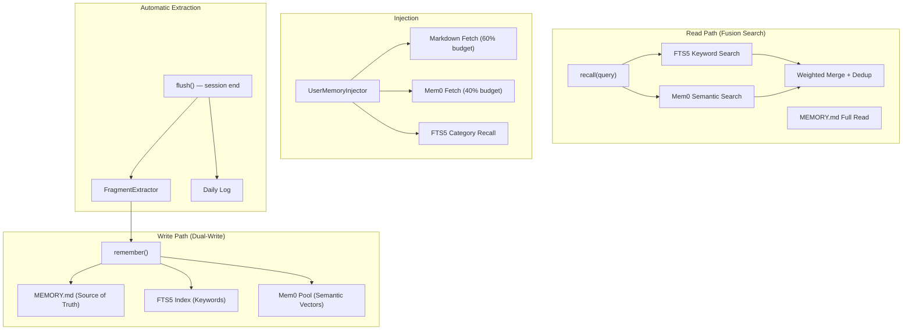

# 08 — Memory System

> Three-layer memory (MEMORY.md + FTS5 + Mem0 vectors) with dual-write consistency, fusion search, automatic fragment extraction, and budget-controlled injection.

[< Prev: Skill Ecosystem](07-skill-ecosystem.md) | [Back to Overview](README.md) | [Next: LLM Multi-Model >](09-llm-multi-model.md)

---

## Design Goals

1. **User-editable memory** — Users can directly edit `MEMORY.md` to correct, add, or remove memories. The file is the source of truth.
2. **Multi-signal recall** — Combine keyword search (FTS5), semantic search (Mem0 vectors), and structured categories for comprehensive recall.
3. **Automatic learning** — The agent extracts memory fragments from conversations without explicit user instruction.

## Architecture



## Three Layers

| Layer | Technology | Role | User Access |
|---|---|---|---|
| **MEMORY.md** | Plain Markdown file | Source of Truth, user-editable | Direct file editing |
| **FTS5** | SQLite FTS5 (full-text search) | Keyword-based recall, category filtering | Indirect (auto-synced) |
| **Mem0** | sqlite-vec vectors | Semantic similarity search | Indirect (auto-synced) |

### Why Three Layers?

- **MEMORY.md** alone can't do semantic search ("find memories about my coding style")
- **FTS5** alone can't handle synonyms or paraphrasing ("programming preferences" should match "coding style")
- **Mem0** alone can't handle exact keyword matches ("find the entry about Python")
- Together: keyword precision (FTS5) + semantic recall (Mem0) + user control (Markdown)

## Dual-Write Strategy

When the agent remembers something, all three layers are updated:

```python
async def remember(content, category="general"):
    # 1. Write to MEMORY.md (user-visible)
    await markdown_layer.append(content, category)

    # 2. Index in FTS5 (keyword search)
    await fts5_layer.index(content, category)

    # 3. Store in Mem0 (semantic vectors)
    await mem0_pool.add(content, metadata={"category": category})

    # With conflict detection:
    #   If existing memory contradicts new content,
    #   replace the old entry instead of adding a duplicate
```

### Conflict Detection

Before writing, the system checks for semantic contradictions:

```
New: "User prefers dark mode"
Existing: "User prefers light mode"
  → Semantic similarity > threshold
  → Replace existing entry with new one
```

## Fusion Search

`recall(query)` combines FTS5 and Mem0 results:

```
1. FTS5 search: keyword matching with BM25 scoring
2. Mem0 search: cosine similarity on embedding vectors
3. Merge: weighted combination (configurable)
4. Dedup: Jaccard similarity > 0.7 → keep higher-scored entry
5. Return: sorted by combined score, limited to top-K
```

### Score Filtering

Low-quality results are filtered: Mem0 results with `score < 0.35` are discarded as noise.

## Memory Injection

`UserMemoryInjector` (Phase 2) fetches memory and injects it into the agent's context:

```
Three parallel fetches (asyncio.gather):
  1. MEMORY.md full read      → 60% of budget (900 chars)
  2. Mem0 semantic search     → 40% of budget (shared)
  3. FTS5 category recall     → Always: "style" + "preference" categories

Total budget: 1500 chars (~500 tokens)
```

The injector can be skipped when `intent.skip_memory=true` (e.g., "what's 2+2?" doesn't need memory).

Output format:
```xml
<user_memory>
## Memory Profile
- User prefers Python for coding tasks
- Writing style: concise, technical
- Calls the agent "小搭子"
- Frequently works with Excel files
</user_memory>
```

## Automatic Fragment Extraction

At the end of each session, `flush()` extracts valuable memory fragments:

```
Session conversation
  → FragmentExtractor analyzes dialogue
  → Extracts: preferences, habits, corrections, identity statements
  → Filters: ephemeral instructions ("just this once, don't use X")
  → Writes to three layers via remember()
  → Appends to daily log
```

### Ephemeral Filtering

Not everything should be remembered:

| Input | Ephemeral? | Reason |
|---|---|---|
| "I prefer dark mode" | No | Persistent preference |
| "Don't use PPT this time" | Yes | "This time" = temporary |
| "Call me Alex" | No | Identity statement (high priority) |
| "Skip the introduction for now" | Yes | "For now" = temporary |

`_is_ephemeral()` detects temporal modifiers to prevent temporary instructions from polluting long-term memory.

## Memory Recall Tool

The agent can also actively query memory via the `memory_recall` tool:

```
memory_recall(query="user preferences", mode="search")
  → Fusion search, returns formatted results

memory_recall(query="", mode="full")
  → Returns complete MEMORY.md content
```

This tool is in the `simple_task_tools` set, available even for simple tasks.

## Key Files

| File | Purpose |
|---|---|
| `core/memory/instance_memory.py` | `InstanceMemoryManager` — orchestrates three layers |
| `core/memory/mem0/pool.py` | `Mem0MemoryPool` — vector storage + semantic search |
| `core/memory/mem0/sqlite_vec_store.py` | SQLite-vec vector store implementation |
| `core/context/injectors/phase2/user_memory.py` | `UserMemoryInjector` — memory → context injection |
| `tools/memory_recall.py` | `MemoryRecallTool` — agent-initiated memory queries |
| `data/instances/{name}/memory/MEMORY.md` | User-editable memory file |

## Highlights

- **User sovereignty** — Users can directly edit `MEMORY.md`. No black-box memory they can't control.
- **Fusion search** — Keyword + semantic search catches both exact matches and paraphrased queries.
- **Automatic learning** — The agent learns from conversations without explicit "remember this" commands.
- **Ephemeral filtering** — "Just this once" instructions don't pollute long-term memory.
- **Budget control** — Memory injection is capped at ~500 tokens, preventing memory from overwhelming the context.

## Limitations & Future Work

- **No memory decay** — Old memories don't lose relevance over time. Planned: time-weighted scoring.
- **Single-user** — Memory is per-instance, not per-user within an instance. Multi-user memory isolation is planned.
- **FTS5 sync lag** — If `MEMORY.md` is edited externally, FTS5 re-syncs opportunistically (on next `get_memory_context()`), not immediately.
- **No memory visualization** — Users edit raw Markdown. A structured memory UI (tags, categories, search) is planned.
- **Vector cold start** — Mem0 requires an embedding model. Without one, the system falls back to FTS5 only.

---

[< Prev: Skill Ecosystem](07-skill-ecosystem.md) | [Back to Overview](README.md) | [Next: LLM Multi-Model >](09-llm-multi-model.md)
