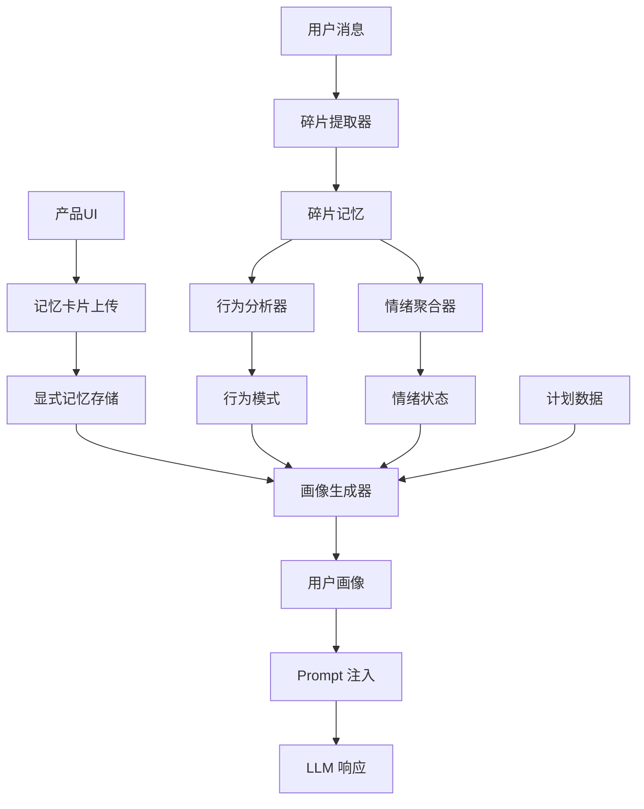

# 记忆能力增强架构文档

> **版本**: v4.5  
> **更新时间**: 2026-01-20  
> **状态**: 已实现

---

## 概述

记忆能力增强（Memory Enhancement）是 ZenFlux Agent V4.5 的核心功能，实现了"显式记忆 + 隐式行为捕获 + 画像注入"三层能力，对齐 OpenAI ChatGPT 的记忆系统设计。

### 核心能力

1. **显式记忆**：用户通过产品交互主动上传记忆卡片
2. **隐式记忆**：从对话中自动提取碎片记忆
3. **行为捕获**：5W1H 分析 + 新增维度（偏好、主题、约束、工具、目标）
4. **画像生成**：聚合多维度数据生成综合用户画像
5. **Prompt 注入**：预计算注入模式，在对话开始前注入用户画像
6. **质量控制**：敏感信息过滤、冲突处理、TTL 管理

---

## 架构设计

### 记忆分类体系

```
记忆类型（MemoryType）
├── explicit      # 显式记忆：用户主动上传的记忆卡片
├── implicit      # 隐式记忆：从对话中自动提取
├── behavior      # 行为模式：5W1H 分析结果
├── emotion       # 情绪状态
└── preference    # 用户偏好

记忆来源（MemorySource）
├── user_card           # 用户记忆卡片
├── conversation        # 对话提取
├── behavior_analysis   # 行为分析
├── emotion_analysis    # 情绪分析
└── system_inference    # 系统推断

记忆可见性（MemoryVisibility）
├── public      # 完全可见（用于 Prompt 注入）
├── private     # 私有（不注入 Prompt，仅存储）
└── filtered    # 过滤后可见（敏感信息已处理）
```

### 数据流



---

## 核心组件

### 1. 显式记忆（MemoryCard）

**数据结构**：
- `id`: 记忆卡片 ID
- `user_id`: 用户 ID
- `content`: 记忆内容
- `category`: 分类（preference/fact/context/constraint/relation/goal/other）
- `title`: 标题（可选）
- `tags`: 标签列表
- `memory_type`: 固定为 `explicit`
- `source`: 固定为 `user_card`
- `visibility`: 可见性（public/private/filtered）
- `ttl_minutes`: 过期时间（分钟）

**使用示例**：
```python
from core.memory import create_memory_manager
from core.memory.mem0.schemas import MemoryCardCategory

manager = create_memory_manager(user_id="user_001")

# 创建记忆卡片
card = manager.create_memory_card(
    content="我偏好使用 Python 进行开发",
    category=MemoryCardCategory.PREFERENCE,
    title="编程语言偏好",
    tags=["programming", "python"]
)

# 列出记忆卡片
cards = manager.list_memory_cards(
    category=MemoryCardCategory.PREFERENCE,
    limit=10
)

# 删除记忆卡片
manager.delete_memory_card(card.id)
```

### 2. 碎片提取增强（FragmentExtractor）

**新增维度**：
- `preference_hint`: 偏好线索（响应格式、沟通风格、偏好工具）
- `topic_hint`: 主题线索（讨论主题、涉及项目、关键词）
- `constraint_hint`: 约束线索（约束条件、禁忌事项、限制）
- `tool_hint`: 工具线索（提到的工具、平台、工作流程）
- `goal_hint`: 目标线索（目标、风险、阻碍、成就）

**使用示例**：
```python
from core.memory.mem0 import get_fragment_extractor

extractor = get_fragment_extractor()

fragment = await extractor.extract(
    user_id="user_001",
    session_id="session_001",
    message="我习惯用 Python 和 Jira，每周三要写周报",
    timestamp=datetime.now()
)

# 访问新维度
if fragment.preference_hint:
    print(f"偏好工具: {fragment.preference_hint.preferred_tools}")

if fragment.tool_hint:
    print(f"提到的工具: {fragment.tool_hint.tools_mentioned}")
```

### 3. 行为分析增强（BehaviorAnalyzer）

**新增分析维度**：
- `preference_stability`: 偏好稳定性（稳定偏好、演进偏好、置信度）
- `periodicity`: 周期性分析（周期模式、频率分布、一致性得分）
- `conflict_detection`: 冲突检测（检测到的冲突、冲突数量、已解决冲突）

**使用示例**：
```python
from core.memory.mem0 import get_behavior_analyzer

analyzer = get_behavior_analyzer()

behavior = await analyzer.analyze(
    user_id="user_001",
    fragments=fragments,
    analysis_days=7
)

# 访问新维度
if behavior.preference_stability:
    print(f"稳定偏好: {behavior.preference_stability.stable_preferences}")

if behavior.periodicity:
    print(f"一致性得分: {behavior.periodicity.consistency_score}")

if behavior.conflict_detection:
    print(f"冲突数量: {behavior.conflict_detection.conflict_count}")
```

### 4. 画像生成（PersonaBuilder）

**聚合数据源**：
- 碎片记忆（FragmentMemory）
- 行为模式（BehaviorPattern）
- 情绪状态（EmotionState）
- 工作计划（WorkPlan）
- 显式记忆（MemoryCard）

**生成画像字段**：
- 身份推断（角色、置信度、工作领域）
- 行为摘要（工作规律、工作风格、时间管理）
- 当前状态（情绪、压力水平、关注点）
- 活跃计划（计划摘要列表）
- 个性化配置（响应格式、主动级别、情绪支持）

**使用示例**：
```python
from core.memory.mem0 import get_persona_builder

builder = get_persona_builder()

persona = await builder.build_persona(
    user_id="user_001",
    fragments=fragments,
    behavior=behavior,
    emotion=emotion,
    plans=plans,
    explicit_memories=cards
)
```

### 5. Prompt 注入（预计算注入）

**注入时机**：每次对话开始前

**注入内容**：
- 用户身份（角色、置信度）
- 工作规律（常规任务、时间模式）
- 当前状态（情绪、关注点）
- 活跃计划（计划状态、阻碍、检查结果、行动项）
- 显式记忆（用户记忆卡片）
- 注意事项（响应格式、关怀提示）

**使用示例**：
```python
from core.memory import create_memory_manager

manager = create_memory_manager(user_id="user_001")

# 获取上下文（自动注入画像）
context = manager.get_context_for_llm(
    include_persona=True,
    max_persona_tokens=500
)

# context["user_persona"] 包含格式化的画像文本
system_prompt = base_prompt + context.get("user_persona", "")
```

### 6. 质量控制（QualityController）

**功能**：
- 更新阶段语义决策（ADD/UPDATE/DELETE/NONE）
- 冲突检测（新旧事实矛盾、偏好变化）
- TTL 管理（过期记忆清理、TTL 状态查询）

**使用示例**：
```python
from core.memory.mem0 import get_quality_controller

controller = get_quality_controller()

# 更新阶段决策（对齐 mem0 事件语义）
decision = controller._run_update_stage("我的密码是 123456", [])
# decision: {"memory": [{"id": "...", "text": "...", "event": "NONE"}]}

# 冲突检测
conflicts = controller.detect_conflicts(
    user_id="user_001",
    new_memory="我不喜欢使用 Python",
    memory_type=MemoryType.EXPLICIT
)

# 清理过期记忆
cleaned_count = controller.clean_expired_memories(
    user_id="user_001",
    memory_types=["explicit", "implicit"]
)
```

---

## 记忆元数据规范

所有记忆类型都支持以下元数据字段：

| 字段 | 类型 | 说明 | 默认值 |
|------|------|------|--------|
| `memory_type` | MemoryType | 记忆类型 | implicit |
| `source` | MemorySource | 记忆来源 | conversation |
| `confidence` | float | 置信度 | 0.0 |
| `visibility` | MemoryVisibility | 可见性 | public |
| `ttl_minutes` | int\|None | 过期时间（分钟） | None（永不过期） |
| `metadata` | Dict | 额外元数据 | {} |

---

## 显式记忆优先级规则

当新记忆与现有记忆冲突时：

1. **显式记忆优先**：显式记忆（MemoryCard）优先级高于隐式记忆
2. **自动解决**：创建显式记忆时自动检测并解决冲突
3. **策略选择**：
   - `explicit_first`: 删除旧记忆（默认）
   - `newest_first`: 更新旧记忆
   - `keep_both`: 保留两者
   - `update_old`: 更新旧记忆

---

## 敏感信息处理

更新阶段不使用硬规则检测，交由 LLM 按语义判断是否应写入：
- `NONE`：不写入（例如敏感内容或无新增价值）
- `ADD/UPDATE/DELETE`：按 mem0 事件语义执行
- 邮箱：标准邮箱格式

### 处理策略

- **拒绝保存**：包含密码或 API Key 的记忆直接拒绝
- **自动过滤**：其他敏感信息自动掩码处理
- **标记记录**：在 metadata 中记录过滤类型

---

## TTL 管理

### 过期策略

- `ttl_minutes=None`: 永不过期
- `ttl_minutes>0`: 指定分钟后过期
- 过期时间自动计算：`expires_at = created_at + timedelta(minutes=ttl_minutes)`

### 清理机制

```python
# 手动清理过期记忆
manager.clean_expired_memories(memory_types=["explicit", "implicit"])

# 查询 TTL 状态
status = manager.get_memory_ttl_status()
# {
#   "total": 100,
#   "with_ttl": 20,
#   "expired": 5,
#   "expiring_soon": 3,
#   "by_type": {...}
# }
```

---

## API 接口（建议）

### 显式记忆 CRUD

```
POST   /api/v1/memory/cards              # 创建记忆卡片
GET    /api/v1/memory/cards               # 列出记忆卡片
GET    /api/v1/memory/cards/{card_id}     # 获取记忆卡片
DELETE /api/v1/memory/cards/{card_id}    # 删除记忆卡片
GET    /api/v1/memory/cards/search        # 搜索记忆卡片
```

### 记忆管理

```
GET    /api/v1/memory/ttl-status          # 获取 TTL 状态
POST   /api/v1/memory/clean-expired       # 清理过期记忆
```

---

## 实施状态

| 功能 | 状态 | 文件位置 |
|------|------|---------|
| **记忆元数据规范** | ✅ 已完成 | `core/memory/mem0/schemas/` |
| **显式记忆 CRUD** | ✅ 已完成 | `core/memory/manager.py` |
| **碎片提取增强** | ✅ 已完成 | `core/memory/mem0/extractor.py` |
| **行为分析增强** | ✅ 已完成 | `core/memory/mem0/analyzer.py` |
| **画像生成器** | ✅ 已完成 | `core/memory/mem0/persona_builder.py` |
| **Prompt 注入** | ✅ 已完成 | `core/memory/manager.py`, `core/memory/mem0/formatter.py` |
| **质量控制** | ✅ 已完成 | `core/memory/mem0/quality_control.py` |
| **单元测试** | ✅ 已完成 | `tests/test_core/test_memory_enhancement.py` |

---

## 相关文档

- [Memory Protocol](./01-MEMORY-PROTOCOL.md) - 记忆协议基础文档
- [OpenAI 记忆能力分析](../../reference/openai-记忆能力.md) - 参考设计文档

---

**文档版本**: v4.5  
**最后更新**: 2026-01-20  
**维护者**: ZenFlux Agent Team
