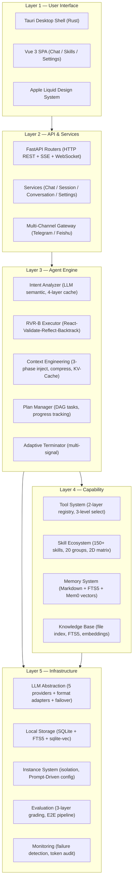
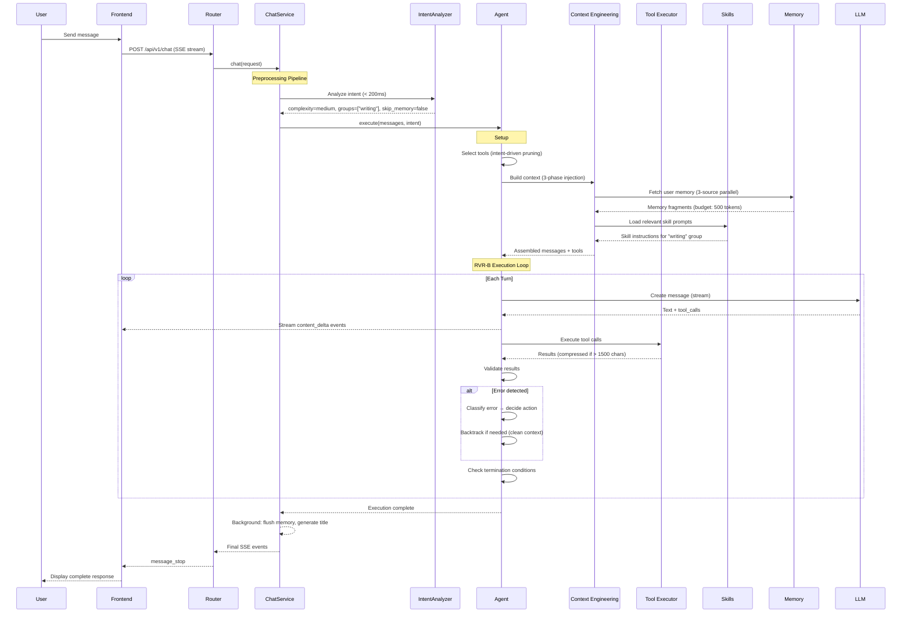

# ZenFlux Agent — Architecture Overview

> A local-first desktop AI agent framework with persistent memory, 150+ skills, and multi-model flexibility.

---

## What is ZenFlux Agent?

ZenFlux Agent is an open-source AI agent framework designed to **live on your desktop**. Unlike cloud-only AI assistants, it runs locally as a Tauri desktop application, keeps all data on your machine, and can operate your computer directly — managing files, automating apps, generating documents, and remembering your preferences across sessions.

The `xiaodazi` ("小搭子", meaning "little buddy") instance is the reference implementation: a personal AI assistant that combines 150+ skills, three-layer memory, and multi-model support into a native desktop experience.

**Key differentiators:**
- **Local-first** — Your data (conversations, memory, files) stays on your machine. SQLite + FTS5 + sqlite-vec, no cloud database required. LLM inference uses cloud APIs by default, with local model support (Ollama/LM Studio) for fully offline use.
- **Persistent memory** — The agent remembers your preferences, habits, and past interactions via a user-editable memory file + semantic vector search.
- **150+ plug-and-play skills** — From Excel analysis to UI automation, organized by OS compatibility and dependency complexity. Add new skills by writing a Markdown file.
- **Multi-model flexibility** — Switch between Claude, OpenAI, Qwen, DeepSeek, Gemini, or local models (Ollama) by changing one config value.
- **Smart error recovery** — The RVR-B execution loop classifies errors, backtracks from failed approaches, and degrades gracefully instead of crashing.

---

## Design Philosophy

Four principles govern every architectural decision:

### LLM-First

All semantic tasks — intent classification, complexity inference, tool selection, backtrack decisions — are performed by the LLM, not by keyword matching or rule-based systems. Hard-coded rules are used only for deterministic tasks: format validation, numeric calculation, security boundaries.

*Why it matters:* "Don't make a PPT" correctly results in zero PPT skills being loaded. A keyword system would match "PPT" and load the wrong tools.

### Prompt-Driven

The agent's behavior is defined by a natural-language persona prompt (`prompt.md`). The framework uses an LLM to analyze this prompt and auto-generate:
- An agent configuration schema (`agent_schema.yaml`)
- Complexity-graded system prompts (simple/medium/complex)
- Tool and skill recommendations

*Why it matters:* Non-technical users can customize agent behavior by editing a Markdown file, not YAML configs or Python code.

### Local-First

All data storage is local by default:
- **Messages & conversations** — SQLite with WAL mode
- **Full-text search** — SQLite FTS5 (built-in, zero-config)
- **Semantic vectors** — sqlite-vec (optional, single file)
- **User memory** — Plain Markdown file (`MEMORY.md`)
- **File attachments** — Local filesystem, instance-isolated

No cloud database, no external vector store, no third-party analytics. LLM inference requires a cloud API (Claude, OpenAI, Qwen, etc.) by default, but local models via Ollama or LM Studio are fully supported for users who need complete offline operation.

### Skills-First

Capabilities are modular skills, not hard-coded features. Each skill is a directory with a `SKILL.md` file that describes when and how to use it. The framework handles discovery, dependency checking, status management, and intent-driven injection.

Skills are classified on two axes:
- **OS compatibility**: common / darwin (macOS) / win32 / linux
- **Dependency complexity**: builtin (zero-config) / lightweight (pip install) / external (CLI/app) / cloud_api (API key)

*Why it matters:* The agent works out of the box with builtin skills, and progressively unlocks more capabilities as users install dependencies.

---

## Full-Stack Architecture

The system is organized into five layers, from user interface down to infrastructure:



### Layer 1 — User Interface

A native desktop application built with **Tauri 2.10** (Rust shell) and **Vue 3.4** (TypeScript SPA). The UI follows an Apple-inspired liquid glass design with amber yellow accent. Communication uses SSE for streaming chat and WebSocket for persistent connections. Key UI features include real-time markdown rendering, HITL confirmation dialogs for dangerous operations, a plan progress widget, and a skill management market.

### Layer 2 — API & Services

A strict three-layer architecture: **Routers** handle protocol (HTTP/WS), **Services** contain business logic (reusable across protocols), **Core** runs the agent engine (no web framework knowledge). The `ChatService` orchestrates a preprocessing pipeline: intent analysis → session management → agent execution → event streaming. A **Gateway** system bridges external channels (Telegram, Feishu) to the same `ChatService`, enabling multi-channel access.

### Layer 3 — Agent Engine

The brain of the system. Every user request first passes through the **Intent Analyzer**, which uses an LLM to classify complexity (simple/medium/complex), detect behavioral signals (follow-up, stop, rollback), and identify relevant skill groups. The classified request then enters the **RVR-B Executor** — a React-Validate-Reflect-Backtrack loop that:

1. **Reacts** — Calls the LLM to generate a response and/or tool calls
2. **Validates** — Executes tools and checks results
3. **Reflects** — Classifies any errors (transient? systematic? critical?)
4. **Backtracks** — If needed, cleans context pollution and tries alternative approaches

The engine is surrounded by supporting systems: **Context Engineering** manages what goes into the LLM's context window (three-phase injection, tool result compression, progressive history decay, KV-Cache optimization). The **Plan Manager** handles multi-step task decomposition. The **Adaptive Terminator** evaluates multiple signals each turn (LLM completion, max turns, duration, failures, user stop, HITL) to decide when to stop.

### Layer 4 — Capability

The agent's hands. The **Tool System** uses a two-layer registry (global capabilities + instance-level dynamic tools) with three-level selection (core tools → capability matching → whitelist filtering). For simple tasks, only 4 core tools are loaded (~500 tokens); complex tasks get the full set (~3000 tokens).

The **Skill Ecosystem** provides 150+ plug-and-play skills across 20 intent-driven groups. Skills are auto-discovered from directories, dependency-checked at runtime, and injected into the agent's prompt only when relevant to the current intent.

The **Memory System** combines three layers: `MEMORY.md` (user-editable source of truth), FTS5 (keyword search), and Mem0 (semantic vector search). Dual-write ensures consistency. Fusion search combines keyword precision with semantic recall. Memory is automatically extracted from conversations and injected into context with budget control (~500 tokens).

### Layer 5 — Infrastructure

The foundation. The **LLM Abstraction** provides a unified interface over 5 providers (Claude, OpenAI, Qwen, DeepSeek, Gemini) plus local models via Ollama. Format adapters handle protocol differences (Claude content blocks vs. OpenAI function calling vs. Gemini parts). A ModelRouter provides automatic failover with health tracking.

**Local Storage** uses SQLite exclusively — WAL mode for concurrent access, FTS5 for full-text search, sqlite-vec for optional vector similarity. The **Instance System** isolates each agent's data (DB, memory, vectors, snapshots, files) and uses Prompt-Driven configuration: write a prompt, get a configured agent.

The **Evaluation System** provides three-layer grading (code-based deterministic + LLM-as-Judge + human review), an automated E2E pipeline, 12-type failure detection, and token audit.

---

## Lifecycle of a Chat Request

To understand how the layers work together, here is the complete lifecycle of a single chat interaction:



**What happens in a typical medium-complexity request (e.g., "Write an article about AI trends"):**

1. **Intent** (~150ms) — Classified as `medium`, `skip_memory=false`, `groups=["writing"]`
2. **Memory** (~100ms) — User's writing style preferences loaded from MEMORY.md + Mem0
3. **Skills** — Writing-group skills (writing-assistant, style-learner, etc.) injected into prompt
4. **Tools** — Core tools + writing-related tools selected (~8 tools total)
5. **Execution** — 3-5 turns: plan → research → draft → refine → deliver
6. **Streaming** — Every token streamed to UI as generated
7. **Post-processing** — Memory fragments extracted and saved for future sessions

---

## Tech Stack

| Layer | Technology | Purpose |
|---|---|---|
| Desktop Shell | Tauri 2.10 (Rust) | Native window, file access, cross-platform |
| Frontend | Vue 3.4 + TypeScript + Tailwind CSS 4.1 + Pinia | Reactive UI, state management |
| Backend | Python 3.12 + FastAPI + asyncio | Async API server |
| Communication | SSE + WebSocket + REST | Real-time streaming + persistent connections |
| Storage | SQLite (WAL) + FTS5 + sqlite-vec | Messages, full-text search, optional vectors |
| LLM | Claude, OpenAI, Qwen, DeepSeek, Gemini, Ollama | Multi-provider with failover |
| Memory | MEMORY.md + FTS5 + Mem0 | User-editable + keyword + semantic |
| Evaluation | Code graders + LLM-as-Judge + Human review | Three-layer quality assurance |

## Project Structure

```
zenflux_agent/
├── frontend/               # Vue 3 + Tauri desktop app
├── routers/                # FastAPI HTTP/WS endpoints
├── services/               # Business logic (protocol-agnostic)
├── core/
│   ├── agent/              # Agent orchestration + RVR-B execution
│   ├── routing/            # Intent analysis + routing
│   ├── context/            # Context engineering (injectors, compression)
│   ├── tool/               # Tool registry, selector, executor
│   ├── skill/              # Skill loader, group registry
│   ├── memory/             # Three-layer memory (Markdown + FTS5 + Mem0)
│   ├── llm/                # LLM abstraction (5 providers + adapters)
│   ├── gateway/            # Multi-channel gateway (Telegram, Feishu)
│   ├── planning/           # Task planning + progress tracking
│   ├── termination/        # Adaptive termination strategies
│   ├── state/              # Snapshot / rollback
│   ├── monitoring/         # Failure detection, token audit
│   └── prompt/             # Prompt parsing + generation
├── tools/                  # Built-in tool implementations
├── instances/              # Agent instance configs (xiaodazi, _template)
├── skills/                 # Shared skill library (78+ skills)
├── config/                 # Global config (capabilities.yaml)
├── evaluation/             # E2E test suites + graders
├── models/                 # Pydantic data models
├── prompts/                # Prompt templates
└── infra/                  # Storage infrastructure (SQLite, cache)
```

---

## Deep Dive — Module Documentation

Read in order, top-down from user interface to infrastructure:

### User Interface
- **[01 — Frontend & Desktop App](01-frontend-and-desktop.md)** — Tauri + Vue 3, Apple Liquid design system, SSE/WebSocket streaming, HITL interactions

### Service Layer
- **[02 — API & Services](02-api-and-services.md)** — Three-layer architecture, preprocessing pipeline, session management, multi-channel gateway

### Agent Engine
- **[03 — Intent Analysis & Routing](03-intent-and-routing.md)** — LLM-First semantic analysis, four-layer caching, skill group mapping
- **[04 — Agent Execution Framework](04-agent-execution.md)** — RVR-B loop, backtracking, adaptive termination, state consistency
- **[05 — Context Engineering](05-context-engineering.md)** — Three-phase injection, compression, KV-Cache optimization

### Capability Layer
- **[06 — Tool System](06-tool-system.md)** — Two-layer registry, three-level selection, intent-driven pruning
- **[07 — Skill Ecosystem](07-skill-ecosystem.md)** — 150+ skills, 2D classification, lifecycle management, progressive unlock
- **[08 — Memory System](08-memory-system.md)** — Three-layer memory, dual-write, fusion search, fragment extraction

### Infrastructure
- **[09 — LLM Multi-Model Support](09-llm-multi-model.md)** — 5 providers, format adapters, ModelRouter failover, local model support
- **[10 — Instance & Configuration](10-instance-and-config.md)** — Instance isolation, Prompt-Driven schema, LLM Profiles, config priority
- **[11 — Evaluation & Quality](11-evaluation.md)** — Three-layer grading, E2E pipeline, failure detection, token audit

---

## Summary

ZenFlux Agent is built on a clear architectural thesis: **a desktop AI agent should be private, extensible, resilient, and model-agnostic**.

- **Private** — All user data (conversations, memory, files) stored 100% locally. LLM inference requires a cloud API by default, but local models (Ollama/LM Studio) are supported for fully offline operation.
- **Extensible** — Add skills by writing Markdown, add tools by implementing a Python class, add channels by implementing an adapter.
- **Resilient** — RVR-B error recovery, context compression, adaptive termination, state rollback.
- **Model-agnostic** — Switch providers with one config value. Format adapters handle the rest.

The framework is designed to make the **simple things effortless** (write a prompt, get an agent) and the **complex things possible** (custom tools, multi-model failover, three-layer evaluation).
