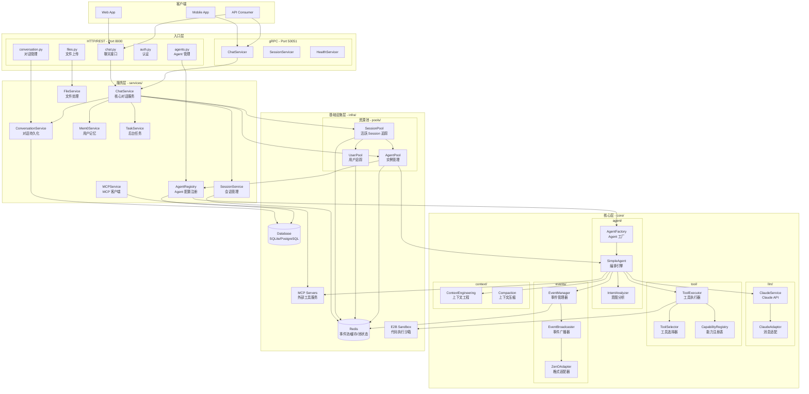
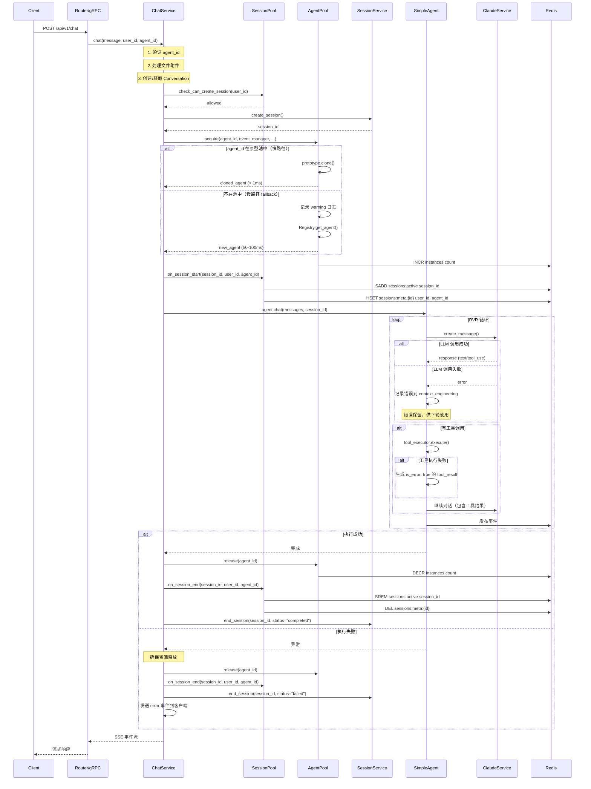
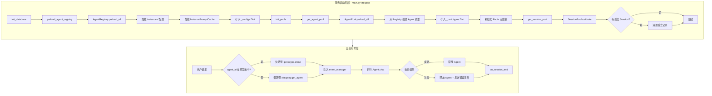
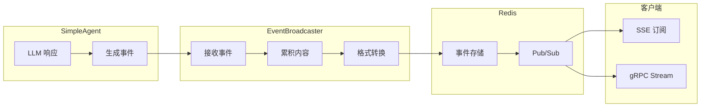
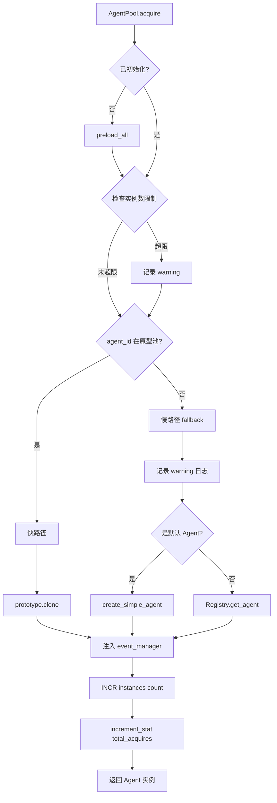

# Zenflux Agent 系统架构

> 版本: 3.8.0  
> 更新时间: 2026-01-16

## 一、系统整体架构

```
┌─────────────────────────────────────────────────────────────────────────────┐
│                              客户端 (Client)                                 │
│                     Web App / Mobile App / API Consumer                      │
└───────────────────────────────┬─────────────────────────────────────────────┘
                                │
                                ▼
┌─────────────────────────────────────────────────────────────────────────────┐
│                              入口层 (Entry Layer)                            │
├─────────────────────────────────┬───────────────────────────────────────────┤
│         HTTP/REST API           │              gRPC API                      │
│    (FastAPI - routers/*.py)     │    (grpc_server/*_servicer.py)            │
│         Port: 8000              │           Port: 50051                      │
└─────────────────────────────────┴───────────────────────────────────────────┘
                                │
                                ▼
┌─────────────────────────────────────────────────────────────────────────────┐
│                              服务层 (Service Layer)                          │
├─────────────────────────────────────────────────────────────────────────────┤
│  ChatService     │  SessionService  │  AgentRegistry  │  ConversationService│
├─────────────────────────────────────────────────────────────────────────────┤
│           Mem0Service  │  KnowledgeService  │  TaskService                  │
└─────────────────────────────────────────────────────────────────────────────┘
                               │
                               ▼
┌─────────────────────────────────────────────────────────────────────────────┐
│                              核心层 (Core Layer)                             │
├─────────────────────────────────────────────────────────────────────────────┤
│    SimpleAgent    │    ClaudeService    │    ToolExecutor    │  EventManager │
│   (编排引擎)       │    (LLM 调用)        │    (工具执行)       │   (事件分发)   │
├─────────────────────────────────────────────────────────────────────────────┤
│  IntentAnalyzer  │  ToolSelector  │  PlanManager  │  ContextEngineering      │
│   (意图分析)       │   (工具选择)     │   (计划管理)   │    (上下文工程)          │
└─────────────────────────────────────────────────────────────────────────────┘
                               │
                               ▼
┌─────────────────────────────────────────────────────────────────────────────┐
│                           基础设施层 (Infrastructure)                        │
├─────────────────────────────────────────────────────────────────────────────┤
│                        资源池架构 (infra/pools)                              │
│     UserPool (用户追踪)  │  AgentPool (实例管理)  │  SessionPool (追踪)      │
├──────────────────┬──────────────────┬──────────────────┬────────────────────┤
│      Redis       │     Database     │    MCP Servers   │    E2B Sandbox     │
│   (事件/缓存)      │   (SQLite/PG)    │   (外部工具)      │    (代码执行)       │
└──────────────────┴──────────────────┴──────────────────┴────────────────────┘
```

## 二、资源池架构详解

```
┌─────────────────────────────────────────────────────────────────────────────┐
│                            ChatService                                       │
│  ├── session_service       → Session 生命周期管理                            │
│  ├── session_pool          → 活跃 Session 追踪（整合各池状态）                │
│  └── agent_pool            → Agent 获取/释放                                 │
└─────────────────────────────────────────────────────────────────────────────┘
                                │
                                ▼
┌─────────────────────────────────────────────────────────────────────────────┐
│                         SessionPool (追踪层)                                 │
│  ├── on_session_start()    → 更新 UserPool + AgentPool + Redis Set          │
│  ├── on_session_end()      → 更新 UserPool + AgentPool + Redis Set          │
│  ├── get_system_stats()    → 汇总系统统计                                    │
│  ├── calibrate()           → 校准活跃 Session（清理孤立记录）                 │
│  └── 维护 zf:sessions:active (Set) 可靠追踪                                  │
├─────────────────────────────────────────────────────────────────────────────┤
│                                   │                                          │
│            ┌──────────────────────┴──────────────────────┐                   │
│            ▼                                             ▼                   │
│   ┌─────────────────────┐                    ┌─────────────────────┐         │
│   │      UserPool       │                    │      AgentPool      │         │
│   │  ├── add_session    │                    │  ├── preload_all    │         │
│   │  ├── remove_session │                    │  ├── acquire        │         │
│   │  ├── get_stats      │                    │  │   ├─ 快路径: clone│         │
│   │  └── 限流预留接口    │                    │  │   └─ 慢路径: 创建 │         │
│   │                     │                    │  ├── release        │         │
│   │                     │                    │  └── get_stats      │         │
│   └─────────────────────┘                    └─────────────────────┘         │
└─────────────────────────────────────────────────────────────────────────────┘
                                │
                                ▼
┌─────────────────────────────────────────────────────────────────────────────┐
│                              Redis                                           │
│  zf:sessions:active           → Set: 所有活跃 Session ID（可靠追踪）          │
│  zf:sessions:meta:{session_id}→ Hash: Session 元数据（user_id, agent_id）    │
│  zf:user:{user_id}:sessions   → Set: 用户活跃 Session 列表                   │
│  zf:user:{user_id}:stats      → Hash: 用户统计                              │
│  zf:agent:{agent_id}:instances→ String: 当前活跃实例数（原子计数）            │
│  zf:agent:{agent_id}:stats    → Hash: Agent 调用统计                        │
└─────────────────────────────────────────────────────────────────────────────┘
```

### 资源池职责

| 组件 | 职责 | 存储 |
|---|------|------|
| **UserPool** | 用户活跃 Session 追踪、统计、限流预留 | Redis |
| **AgentPool** | Agent 原型缓存、实例获取/释放（含 fallback）、使用统计 | 本地内存 + Redis |
| **SessionPool** | 追踪层：追踪活跃 Session 集合、提供统计视图、Session 校准 | Redis |

## 三、系统详细架构



## 四、核心流程图

### 4.1 对话请求流程（含错误处理）



### 4.2 资源池初始化流程



### 4.3 事件流转流程



### 4.4 AgentPool 获取流程（含 fallback）



## 五、目录结构

```
zenflux_agent/
├── main.py                          # 应用入口，lifespan 管理
├── logger.py                        # 日志配置
│
├── routers/                         # HTTP 路由层
│   ├── chat.py                      # 聊天接口
│   ├── conversation.py              # 对话管理
│   ├── agents.py                    # Agent CRUD
│   ├── auth.py                      # 认证
│   ├── files.py                     # 文件上传
│   └── ...
│
├── grpc_server/                     # gRPC 服务
│   ├── server.py                    # gRPC 服务器
│   ├── chat_servicer.py             # Chat 服务实现
│   ├── session_servicer.py          # Session 服务实现
│   └── ...
│
├── services/                        # 服务层（业务逻辑）
│   ├── chat_service.py              # 核心对话服务
│   ├── session_service.py           # Session 生命周期管理
│   ├── agent_registry.py            # Agent 配置注册表
│   ├── conversation_service.py      # 对话持久化
│   ├── redis_manager.py             # Redis 连接管理
│   ├── mem0_service.py              # 用户记忆
│   ├── mcp_client.py                # MCP 客户端
│   └── ...
│
├── core/                            # 核心模块
│   ├── agent/                       # Agent 实现
│   │   ├── simple_agent.py          # 编排引擎
│   │   ├── factory.py               # Agent 工厂
│   │   └── intent_analyzer.py       # 意图分析
│   ├── llm/                         # LLM 服务
│   │   ├── claude_service.py        # Claude API 封装
│   │   ├── adaptor.py               # 消息格式适配器
│   │   └── message.py               # 消息模型
│   ├── tool/                        # 工具系统
│   │   ├── executor.py              # 工具执行器
│   │   ├── selector.py              # 工具选择器
│   │   └── capability.py            # 能力注册表
│   ├── events/                      # 事件系统
│   │   ├── manager.py               # 事件管理器
│   │   ├── broadcaster.py           # 事件广播器
│   │   └── adapters/                # 格式适配器
│   └── context/                     # 上下文管理
│       ├── compaction.py            # 上下文压缩
│       └── runtime.py               # 运行时上下文
│
├── tools/                           # 内置工具
│   ├── web_search.py                # 网页搜索
│   ├── api_calling.py               # API 调用
│   └── ...
│
├── infra/                           # 基础设施
│   ├── pools/                       # 资源池（追踪活跃资源）
│   │   ├── __init__.py              # 导出
│   │   ├── user_pool.py             # 用户池（用户活跃 Session 追踪）
│   │   ├── agent_pool.py            # Agent 池（原型缓存+实例管理）
│   │   └── session_pool.py          # Session 池（活跃 Session 追踪+统计）
│   ├── database/                    # 数据库
│   │   ├── __init__.py              # 连接管理
│   │   ├── crud.py                  # CRUD 操作
│   │   └── models.py                # ORM 模型
│   └── resilience/                  # 容错机制
│       ├── circuit_breaker.py       # 熔断器
│       └── retry.py                 # 重试
│
├── instances/                       # Agent 实例配置
│   ├── _template/                   # 模板
│   ├── test_agent/                  # 测试 Agent
│   │   ├── config.yaml              # 配置
│   │   ├── prompt.md                # 提示词
│   │   └── .cache/                  # 缓存
│   └── ...
│
├── config/                          # 全局配置
│   ├── llm_config.py                # LLM 配置
│   ├── capabilities.yaml            # 工具能力配置
│   └── ...
│
└── docs/                            # 文档
    └── architecture/                # 架构文档
        └── SYSTEM_ARCHITECTURE.md   # 本文件
```

## 六、关键设计决策

### 6.1 资源池架构

**问题**: 
- 每次请求创建 Agent 实例耗时 50-100ms
- 缺乏用户级并发控制
- 缺乏系统级监控视图
- 简单计数器在服务重启后不可靠

**方案**: 资源池架构（UserPool + AgentPool + SessionPool）

| 组件 | 问题解决 | 实现方式 |
|---|---------|---------|
| **AgentPool** | Agent 创建慢 | 原型缓存 + clone() 复用 + fallback 机制 |
| **UserPool** | 用户并发控制 | Redis Set 追踪 + 统计 |
| **SessionPool** | 系统监控 + 可靠性 | 追踪活跃 Session + Set 存储 + 校准机制 |

**Redis Key 设计**（改进版）:
```
# SessionPool 管理
zf:sessions:active              # Set: 所有活跃 Session ID（可靠追踪）
zf:sessions:meta:{session_id}   # Hash: Session 元数据（user_id, agent_id, start_time）

# UserPool 管理
zf:user:{user_id}:sessions      # Set: 用户活跃 Session
zf:user:{user_id}:stats         # Hash: 用户统计

# AgentPool 管理
zf:agent:{agent_id}:instances   # String: 活跃实例计数
zf:agent:{agent_id}:stats       # Hash: Agent 统计
```

**校准机制**:
- 服务启动时自动调用 `SessionPool.calibrate()`
- 检查 `zf:sessions:active` 中的每个 Session
- 移除没有对应元数据的孤立 Session
- 确保计数准确性

### 6.2 AgentRegistry vs AgentPool

| | AgentRegistry | AgentPool |
|--|---------------|-----------|
| **职责** | 配置管理 + 工厂 | 实例缓存 + 统计 |
| **存储** | 内存（配置数据） | 内存（原型） + Redis（统计） |
| **创建 Agent** | 从配置文件创建 | 从原型克隆（含 fallback） |
| **性能** | 慢（每次加载配置） | 快（克隆原型 < 1ms） |

**依赖关系**: AgentPool 依赖 AgentRegistry 的配置来创建原型

**Fallback 机制**:
```
acquire(agent_id) →
  if agent_id in _prototypes:
    快路径: prototype.clone() (< 1ms)
  else:
    慢路径: Registry.get_agent() (50-100ms)
    记录 warning 日志
```

### 6.3 依赖注入支持

为了便于测试，所有单例函数都支持依赖注入：

```python
# 默认使用单例
session_pool = get_session_pool()

# 测试时注入 mock
session_pool = get_session_pool(
    redis_manager=mock_redis,
    user_pool=mock_user_pool,
    agent_pool=mock_agent_pool
)

# 重置单例（测试后清理）
reset_session_pool()
```

### 6.4 双协议支持

**HTTP (FastAPI)**:
- RESTful API，适合 Web 应用
- SSE 流式响应
- 文档自动生成 (Swagger)

**gRPC**:
- 高性能 RPC，适合服务间调用
- 双向流式传输
- 强类型 protobuf

两者共享 `ChatService` 单例，保证业务逻辑一致。

### 6.5 事件驱动架构

- Agent 执行过程产生事件流
- 通过 Redis Pub/Sub 分发
- 支持断线重连和事件补偿
- 使用 ZenO 格式适配器统一输出格式

### 6.6 实例化配置

每个 Agent 实例独立配置：
- `config.yaml`: 模型、工具、API 等配置
- `prompt.md`: 系统提示词
- `.cache/`: Schema 和提示词缓存

支持热更新：修改配置后调用 reload 接口即可生效。

## 七、错误处理策略

### 7.1 资源释放保证

无论执行成功或失败，都确保资源释放：

```python
try:
    # 执行 Agent
    await agent.chat(...)
finally:
    # 确保释放资源
    await agent_pool.release(agent_id)
    await session_pool.on_session_end(...)
```

### 7.2 错误分类和用户提示

| 错误类型 | 错误码 | 用户提示 |
|---------|-------|---------|
| PermissionDeniedError | permission_denied | API 权限错误，请检查 API Key 配置 |
| RateLimitError | rate_limit | 请求频率过高，请稍后重试 |
| AuthenticationError | authentication_error | API 认证失败，请检查 API Key |
| TimeoutError | timeout | 请求超时，请稍后重试 |
| ConnectionError | connection_error | 网络连接失败，请检查网络 |
| 其他 | unknown_error | 执行失败，请稍后重试 |

### 7.3 工具执行失败

工具执行失败时：
1. 生成 `is_error: true` 的 `tool_result`
2. 记录错误到 `context_engineering`（错误保留）
3. 让 Agent 在下轮决定如何处理

## 八、后续优化方向

1. ✅ **资源池架构** - UserPool、AgentPool、SessionPool 已实现
2. ✅ **可靠计数** - 使用 Set 存储 + 校准机制
3. ✅ **依赖注入** - 支持测试时注入 mock
4. **MCP 工具池化** - 复用 MCP 客户端连接
5. **LLM Service 池化** - 复用 HTTP 客户端
6. **上下文压缩优化** - 更智能的历史裁剪策略
7. **Multi-Agent 支持** - 多 Agent 协作编排
8. **UserPool 限流** - 基于 Redis 的滑动窗口限流
