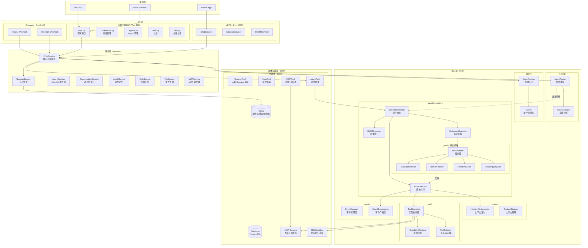
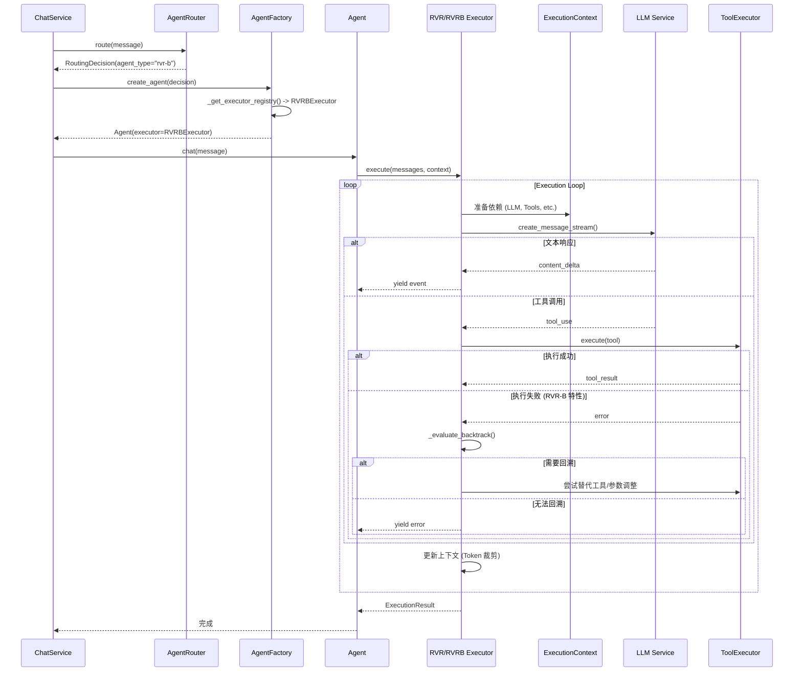
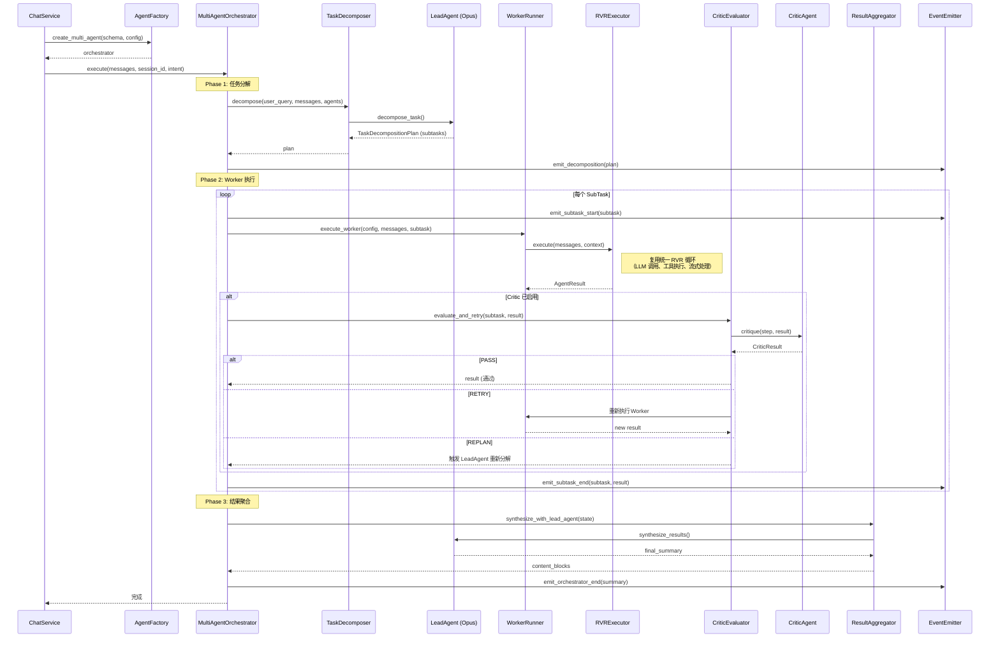
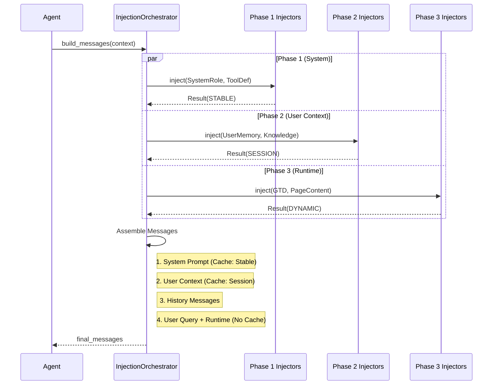
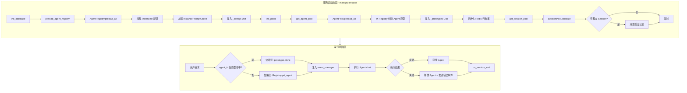
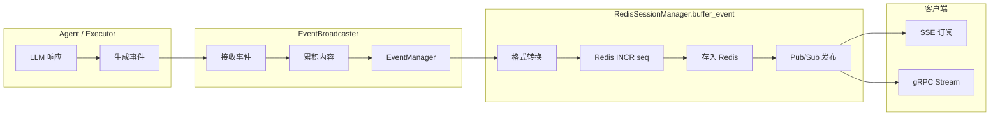

# Zenflux Agent 系统架构

> 版本: 10.3
> 更新时间: 2026-02-06

## 一、系统整体架构

### 1.1 架构总览

```
┌─────────────────────────────────────────────────────────────────────────────┐
│                              客户端 (Client)                                 │
│                     Web App / Mobile App / API Consumer                      │
└───────────────────────────────────┬─────────────────────────────────────────┘
                                    │
                                    ▼
┌─────────────────────────────────────────────────────────────────────────────┐
│                              入口层 (Entry Layer)                            │
├─────────────────────────────────┬───────────────────────────────────────────┤
│         HTTP/REST API           │              gRPC API                      │
│    (FastAPI - routers/*.py)     │    (grpc_server/*_servicer.py)            │
│         Port: 8000              │           Port: 50051                      │
└─────────────────────────────────┴───────────────────────────────────────────┘
                                    │
                                    ▼
┌─────────────────────────────────────────────────────────────────────────────┐
│                              渠道层 (Channels Layer) 🆕                      │
├─────────────────────────────────────────────────────────────────────────────┤
│   Gateway (网关)    │    Feishu / DingTalk    │   Adapters (协议适配)        │
└─────────────────────────────────────────────────────────────────────────────┘
                                    │
                                    ▼
┌─────────────────────────────────────────────────────────────────────────────┐
│                              服务层 (Service Layer)                          │
├─────────────────────────────────────────────────────────────────────────────┤
│  ChatService     │  SessionService  │  AgentRegistry  │  ConversationService│
├─────────────────────────────────────────────────────────────────────────────┤
│  KnowledgeService │  Mem0Service    │  TaskService    │  MCPService         │
└─────────────────────────────────────────────────────────────────────────────┘
                                    │
                                    ▼
┌─────────────────────────────────────────────────────────────────────────────┐
│                              路由层 (Routing Layer)                          │
├─────────────────────────────────────────────────────────────────────────────┤
│     AgentRouter (路由决策)    │    IntentAnalyzer (意图分析)                 │
└─────────────────────────────────────────────────────────────────────────────┘
                                    │
                                    ▼
┌─────────────────────────────────────────────────────────────────────────────┐
│                           执行核心层 (Execution Core) 🆕                     │
├─────────────────────────────────────────────────────────────────────────────┤
│   Execution Engine (执行引擎)  │      Context System (上下文系统)            │
│  ┌─────────────────────────┐  │  ┌──────────────────────────────────────┐   │
│  │     ExecutorProtocol    │  │  │         InjectionOrchestrator        │   │
│  │ ┌──────┐ ┌──────┐ ┌─────┤  │  │ ┌─────────┐ ┌─────────┐ ┌──────────┐ │   │
│  │ │ RVR  │ │ RVRB │ │Multi│  │  │ │ Phase 1 │ │ Phase 2 │ │ Phase 3  │ │   │
│  │ └──────┘ └──────┘ └─────┘  │  │ └─────────┘ └─────────┘ └──────────┘ │   │
│  └─────────────────────────┘  │  └──────────────────────────────────────┘   │
├─────────────────────────────────────────────────────────────────────────────┤
│   Components (组件)            │      Tooling (工具系统) 🆕                  │
│  LeadAgent | Critic | Manager  │   CapabilityRegistry (统一注册表)           │
│                                │   InstanceRegistry (实例工具)               │
└─────────────────────────────────────────────────────────────────────────────┘
                                    │
                                    ▼
┌─────────────────────────────────────────────────────────────────────────────┐
│                           基础设施层 (Infrastructure)                        │
├─────────────────────────────────────────────────────────────────────────────┤
│                        资源池架构 (infra/pools)                              │
│     UserPool (用户追踪)  │  AgentPool (实例管理)  │  SessionPool (追踪)      │
├──────────────────┬──────────────────┬──────────────────┬────────────────────┤
│      Redis       │     Database     │    MCP Servers   │    E2B Sandbox     │
│   (事件/缓存)      │   (PostgreSQL)   │   (外部工具)      │    (代码执行)       │
└──────────────────┴──────────────────┴──────────────────┴────────────────────┘
```

### 1.2 路由决策流程

路由层采用统一语义的路由决策机制，直接将用户意图映射到具体的执行策略：

```
用户请求
    │
    ▼
┌──────────────────────────────────────┐
│         AgentRouter (路由层)          │
│    core/routing/router.py            │
└──────────────────────────────────────┘
    │
    │  1. IntentAnalyzer 分析意图与复杂度 (LLM-First)
    │  2. 映射到执行策略 (agent_type)
    │
    ├─── "rvr" ───────► RVRExecutor (简单任务)
    │                   无回溯，快速响应，低成本
    │
    ├─── "rvr-b" ─────► RVRBExecutor (中等任务)
    │                   支持错误回溯 (Backtrack)，自动纠错
    │
    └─── "multi" ─────► MultiAgentExecutor (复杂任务)
                        多智能体协作，Lead/Worker/Critic 模式
```

### 1.3 上下文管理系统 (Context System)

核心层引入了强大的 `InjectionOrchestrator`，负责分阶段注入上下文，并与 LLM 的 `Prompt Caching` 机制深度集成。

**Context 注入阶段 (Phases):**

| 阶段 | 目标位置 | 内容示例 | 缓存策略 |
|------|---------|---------|---------|
| **Phase 1: System** | `messages[0] (system)` | 系统角色、工具定义、框架规则 | **STABLE** (1h) |
| **Phase 2: Context** | `messages[1] (user)` | 用户画像、长期记忆 (Mem0)、知识库 | **SESSION** (5min) |
| **Phase 3: Runtime** | `messages[n] (user)` | 实时状态 (Todo)、页面内容、历史摘要 | **DYNAMIC** (不缓存) |

## 二、渠道与网关层详解 (Channels & Gateway)

独立的 **渠道层 (Channels Layer)**，负责处理多渠道接入、消息标准化和协议适配。

### 2.1 渠道层架构

```
┌─────────────────────────────────────────────────────────────────────────────┐
│                              Gateway (网关)                                  │
│  channels/gateway/                                                          │
├─────────────────────────────────────────────────────────────────────────────┤
│  1. SecurityChecker: 签名验证、IP 白名单                                      │
│  2. MessagePreprocessor:                                                    │
│     ├── MessageDeduper (Redis Set): 消息去重 (10min)                        │
│     ├── InboundDebouncer (Redis): 防抖动                                     │
│     └── Merger (Text/Media): 消息合并                                        │
└─────────────────────────────────────────────────────────────────────────────┘
            │
            ▼
┌─────────────────────────────────────────────────────────────────────────────┐
│                           Channel Plugins (插件)                             │
│  channels/{channel_id}/                                                     │
├─────────────────────────────────────────────────────────────────────────────┤
│  Each Plugin implements `ChannelPlugin` Protocol:                           │
│                                                                             │
│  ┌──────────────────┐   ┌──────────────────┐   ┌──────────────────┐         │
│  │ ConfigAdapter    │   │ GatewayAdapter   │   │ OutboundAdapter  │         │
│  │ (配置管理)        │   │ (入站事件处理)    │   │ (出站消息发送)    │         │
│  └──────────────────┘   └──────────────────┘   └──────────────────┘         │
│                                                                             │
│  ┌──────────────────┐   ┌──────────────────┐   ┌──────────────────┐         │
│  │ SecurityAdapter  │   │ ActionsAdapter   │   │ StreamingAdapter │         │
│  │ (安全验证)        │   │ (卡片交互)        │   │ (流式响应)        │         │
│  └──────────────────┘   └──────────────────┘   └──────────────────┘         │
└─────────────────────────────────────────────────────────────────────────────┘
```

### 2.2 飞书渠道 (Feishu Channel) 实现细节

以飞书渠道为例，展示了如何实现标准的 `ChannelPlugin` 协议：

*   **GatewayAdapter (`channels/feishu/gateway.py`)**:
    *   处理 URL 验证 (`url_verification`)。
    *   处理 V2.0 事件格式 (`schema: "2.0"`).
    *   将飞书特定事件 (`im.message.receive_v1`) 转换为通用 `InboundMessage`。
    *   处理卡片交互 (`card.action.trigger`)。

*   **消息转换**:
    *   `FeishuMessage` -> `InboundMessage` (标准格式)。
    *   提取 `mentions` 中的 `open_id`/`user_id`/`union_id`，供上层精准匹配。

*   **安全机制**:
    *   使用 `FeishuSecurityAdapter` 验证 `X-Lark-Signature`。
    *   支持 `Encrypt Key` 解密。

## 三、路由与工具系统详解 (Routing & Tooling)

### 3.1 意图分析 (Intent Analyzer)

`IntentAnalyzer` 是路由决策的核心，采用 **LLM-First** 的设计理念：

*   **极简输出**: 只解析 3 个核心字段 `complexity`, `agent_type`, `skip_memory`，减少 LLM 幻觉。
*   **语义驱动**: 通过 System Prompt (`prompts/intent_recognition_prompt.py`) 引导 LLM 理解用户意图。
*   **Prompt Caching**: 意图识别的 Prompt 也被缓存，降低延迟和成本。

**决策映射:**
- `agent_type="rvr"` → 简单直给，无需规划。
- `agent_type="rvr-b"` → 需要尝试和修正（如代码编写、复杂搜索）。
- `agent_type="multi"` → 需要多角色协作（如深度研报、全栈开发）。

### 3.2 统一工具注册表 (Capability Registry)

统一的 `CapabilityRegistry` 管理所有类型的能力：

1.  **CapabilityRegistry (全局单例)**:
    -   从 `config/capabilities.yaml` 加载核心工具和 MCP 配置。
    -   扫描 `skills/library/` 目录自动发现 Skill 能力。
    -   支持按任务类型 (`task_type_mappings`) 推荐工具。

2.  **InstanceRegistry (实例级)**:
    -   管理 Agent 运行时动态添加的工具 (MCP, REST API)。
    -   每个 Agent 实例独立，互不干扰。

**工具分类体系:**
- **Level 1 (Core)**: 核心工具，始终加载 (e.g. `memory_read`).
- **Level 2 (Dynamic)**: 动态工具，按需加载 (e.g. `web_search`).
- **Skill**: 复杂能力的封装集合 (e.g. `github-skill`).

## 四、资源池架构详解

```
┌─────────────────────────────────────────────────────────────────────────────┐
│                            ChatService                                       │
│  ├── session_service       → Session 生命周期管理                            │
│  ├── session_pool          → 活跃 Session 追踪（整合各池状态）                │
│  └── agent_pool            → Agent 获取/释放                                 │
└─────────────────────────────────────────────────────────────────────────────┘
                                │
                                ▼
┌─────────────────────────────────────────────────────────────────────────────┐
│                         SessionPool (追踪层)                                 │
│  ├── on_session_start()    → 更新 UserPool + AgentPool + Redis Set          │
│  ├── on_session_end()      → 更新 UserPool + AgentPool + Redis Set          │
│  ├── get_system_stats()    → 汇总系统统计                                    │
│  ├── calibrate()           → 校准活跃 Session（清理孤立记录）                 │
│  └── 维护 zf:sessions:active (Set) 可靠追踪                                  │
├─────────────────────────────────────────────────────────────────────────────┤
│                                   │                                          │
│    ┌──────────────────────────────┼──────────────────────────────┐           │
│    ▼                              ▼                              ▼           │
│ ┌─────────────────┐    ┌─────────────────────┐    ┌─────────────────────┐   │
│ │    UserPool     │    │      AgentPool      │    │  🆕 MCPPool         │   │
│ │ ├─ add_session  │    │  ├── preload_all    │    │  ├── preconnect_all │   │
│ │ ├─ remove_sess  │    │  ├── acquire        │    │  ├── get_client     │   │
│ │ ├─ get_stats    │    │  │   ├─ 快路径:clone │    │  ├── health_check   │   │
│ │ └─ 限流预留     │    │  │   └─ 慢路径:创建  │    │  ├── auto_reconnect │   │
│ │                 │    │  ├── release        │    │  └── get_stats      │   │
│ │                 │    │  └── get_stats      │    │                     │   │
│ └─────────────────┘    └─────────────────────┘    └─────────────────────┘   │
└─────────────────────────────────────────────────────────────────────────────┘
                                │
                                ▼
┌─────────────────────────────────────────────────────────────────────────────┐
│                              Redis                                           │
│  zf:sessions:active           → Set: 所有活跃 Session ID（可靠追踪）          │
│  zf:sessions:meta:{session_id}→ Hash: Session 元数据（user_id, agent_id）    │
│  zf:user:{user_id}:sessions   → Set: 用户活跃 Session 列表                   │
│  zf:user:{user_id}:stats      → Hash: 用户统计                              │
│  zf:agent:{agent_id}:instances→ String: 当前活跃实例数（原子计数）            │
│  zf:agent:{agent_id}:stats    → Hash: Agent 调用统计                        │
│  🆕 zf:mcp:{server}:stats     → Hash: MCP 调用统计                          │
│  🆕 zf:mcp:{server}:health    → String: 最后健康检查时间                     │
│  🆕 zf:mcp:active             → Set: 活跃的 MCP 服务器                       │
└─────────────────────────────────────────────────────────────────────────────┘
```

### 4.1 MCPPool 架构

```
┌─────────────────────────────────────────────────────────────────────────────┐
│                            MCPPool (连接池)                                  │
├─────────────────────────────────────────────────────────────────────────────┤
│  职责：                                                                      │
│  - 应用启动时预连接所有 MCP 服务器                                            │
│  - 提供统一的客户端获取接口（带并发控制）                                      │
│  - 健康检查和自动重连                                                        │
│  - 统计监控                                                                  │
├─────────────────────────────────────────────────────────────────────────────┤
│                                                                             │
│  ┌─────────────────────────────────────────────────────────────────────┐    │
│  │                     MCPServerState (每个服务器)                       │    │
│  │  ├── config: MCPConfig        # 配置（URL、认证、超时等）             │    │
│  │  ├── client: MCPClientWrapper # 客户端实例                           │    │
│  │  ├── connected: bool          # 连接状态                             │    │
│  │  ├── tools_count: int         # 工具数量                             │    │
│  │  └── reconnect_attempts: int  # 重连尝试次数                          │    │
│  └─────────────────────────────────────────────────────────────────────┘    │
│                                                                             │
│  主要方法：                                                                  │
│  ├── preconnect_all()      → 并行预连接所有 MCP 服务器                       │
│  ├── get_client(url)       → 获取/复用 MCP 客户端（带并发信号量）            │
│  ├── start_health_check()  → 启动后台健康检查任务                            │
│  ├── stop_health_check()   → 停止健康检查                                   │
│  └── cleanup()             → 清理所有连接                                   │
└─────────────────────────────────────────────────────────────────────────────┘
```

### 4.2 MCPPool 启动流程

```
应用启动 (main.py lifespan)
    │
    ├── 1. MCPPool.preconnect_all()    ← 在 AgentPool 之前
    │       ├── 从 AgentRegistry 收集 MCP 配置
    │       ├── 并行连接所有 MCP 服务器
    │       └── 建立连接，缓存客户端实例
    │
    ├── 2. AgentPool.preload_all()     ← 使用 MCPPool 中的连接
    │       └── 创建 Agent 原型时，MCP 工具使用已建立的连接
    │
    └── 3. MCPPool.start_health_check()
            └── 启动后台健康检查任务（30s 间隔）
```

### 4.3 资源池职责

| 组件 | 职责 | 存储 |
|---|------|------|
| **UserPool** | 用户活跃 Session 追踪、统计、限流预留 | Redis |
| **AgentPool** | Agent 原型缓存、实例获取/释放（含 fallback）、使用统计 | 本地内存 + Redis |
| **SessionPool** | 追踪层：追踪活跃 Session 集合、提供统计视图、Session 校准 | Redis |
| **🆕 MCPPool** | MCP 客户端连接复用、健康检查、自动重连、调用统计 | 本地内存 + Redis |

## 五、系统详细架构



## 六、核心流程图

### 6.1 核心执行流程 (Executor Protocol)

统一的 `ExecutorProtocol`，所有执行策略（RVR/RVR-B/Multi）都遵循此协议。



### 6.2 多智能体执行流程 (Multi-Agent)

V10.3 采用组合模式，MultiAgentOrchestrator 将职责委托给 5 个子模块：



**组件职责：**

| 子模块 | 职责 | 依赖组件 |
|--------|------|----------|
| TaskDecomposer | 复杂任务 → 子任务列表 | LeadAgent (Opus) |
| WorkerRunner | 执行单个子任务 | RVRExecutor (Sonnet) |
| CriticEvaluator | 质量评估 → pass/retry/replan | CriticAgent |
| ResultAggregator | 多结果 → 最终摘要 | LeadAgent (Opus) |
| EventEmitter | SSE 事件格式化和发送 | EventBroadcaster |

**强弱模型配对策略：**
- **Lead Agent / Critic Agent**: 使用 Opus（强模型，负责决策和评估）
- **Worker Agent**: 使用 Sonnet（快速模型，负责执行）

### 6.3 上下文注入流程 (Context Injection)



### 6.4 资源池初始化流程



### 6.5 事件流转流程



### 6.5.1 事件系统架构

```
┌─────────────────────────────────────────────────────────────────────────────┐
│                              事件流程（简化版）                               │
├─────────────────────────────────────────────────────────────────────────────┤
│                                                                             │
│    Agent (Executor) / ChatService                                           │
│         │                                                                   │
│         ▼                                                                   │
│    EventBroadcaster / EventManager  ← 统一事件入口                           │
│         │                                                                   │
│         │  Agent/Executor 使用 EventBroadcaster（含累积、持久化等增强功能）   │
│         │  Service 使用 EventManager（纯粹的事件发送）                       │
│         │                                                                   │
│         ▼                                                                   │
│    BaseEventManager._send_event()  ← 所有事件最终走这里                      │
│         │                                                                   │
│         ▼                                                                   │
│    storage.buffer_event()  ← 统一处理入口                                    │
│         │                                                                   │
│         ├── 格式转换（ZenO adapter，如果需要）                               │
│         ├── Redis INCR 生成 seq（原子操作）                                  │
│         ├── 存入 Redis List                                                 │
│         └── Pub/Sub 发布（实时推送）                                         │
│                                                                             │
└─────────────────────────────────────────────────────────────────────────────┘
```

**事件系统设计原则：**

| 原则 | 说明 |
|------|------|
| **单一入口** | 所有事件通过 `EventManager` 进入 |
| **统一 seq 生成** | seq 在 `buffer_event` 中由 Redis INCR 原子生成 |
| **格式转换前置** | 进入 Redis 前完成格式转换（Zenflux → ZenO） |
| **存储实现分离** | 生产环境用 `RedisSessionManager`，开发环境用 `InMemoryEventStorage` |

**Redis Key 设计：**
```
session:{session_id}:seq      → String: 事件序号计数器（Redis INCR）
session:{session_id}:events   → List: 事件缓冲列表
session:{session_id}:stream   → Pub/Sub: 实时事件通道
```

## 七、目录结构

```
zenflux_agent/
├── main.py                          # 应用入口，lifespan 管理
├── logger.py                        # 日志配置
│
├── channels/                        # 🆕 渠道层 (Channels Layer)
│   ├── __init__.py
│   ├── base/                        # 基础适配器与插件定义
│   │   ├── adapters.py
│   │   └── plugin.py
│   ├── feishu/                      # 飞书渠道实现
│   │   ├── gateway.py               # 飞书网关
│   │   └── cards.py                 # 卡片消息构建
│   ├── gateway/                     # 统一网关入口
│   │   └── preprocessor.py          # 消息预处理
│   └── registry.py                  # 渠道插件注册
│
├── routers/                         # HTTP 路由层
│   ├── chat.py                      # 聊天接口
│   ├── conversation.py              # 对话管理
│   ├── agents.py                    # Agent CRUD
│   ├── auth.py                      # 认证
│   ├── files.py                     # 文件上传
│   └── ...
│
├── grpc_server/                     # gRPC 服务
│   ├── server.py                    # gRPC 服务器
│   ├── chat_servicer.py             # Chat 服务实现
│   └── ...
│
├── services/                        # 服务层（业务逻辑）
│   ├── chat_service.py              # 核心对话服务
│   ├── session_service.py           # Session 生命周期管理
│   ├── agent_registry.py            # Agent 配置注册表
│   ├── knowledge_service.py         # 知识库服务
│   ├── mcp_service.py               # MCP 服务
│   └── ...
│
├── core/                            # 核心模块
│   ├── agent/                       # Agent 核心
│   │   ├── base.py                  # Agent 统一实现类
│   │   ├── factory.py               # AgentFactory（创建入口）
│   │   ├── models.py                # 数据模型（AgentConfig, CriticResult...）
│   │   ├── errors.py                # 统一错误定义
│   │   │
│   │   ├── execution/               # 执行策略 (Executor Layer)
│   │   │   ├── protocol.py          # ExecutorProtocol + BaseExecutor
│   │   │   ├── rvr.py               # RVR 策略
│   │   │   ├── rvrb.py              # RVR-B 回溯策略
│   │   │   ├── multi.py             # 多智能体适配器
│   │   │   └── _multi/              # 多智能体内部实现（V10.3 组合模式）
│   │   │       ├── orchestrator.py  #   编排器核心
│   │   │       ├── task_decomposer.py  # TaskDecomposer
│   │   │       ├── worker_runner.py    # WorkerRunner（复用 RVRExecutor）
│   │   │       ├── critic_evaluator.py # CriticEvaluator
│   │   │       ├── result_aggregator.py # ResultAggregator
│   │   │       └── events.py        #   EventEmitter
│   │   │
│   │   ├── components/              # 多智能体共享组件
│   │   │   ├── lead_agent.py        # 主控 Agent（任务分解 + 结果综合）
│   │   │   ├── critic.py            # 评审 Agent
│   │   │   └── checkpoint.py        # 检查点管理
│   │   │
│   │   ├── context/                 # Prompt 构建
│   │   │   └── prompt_builder.py    # System Prompt 构建器
│   │   │
│   │   └── tools/                   # Agent 工具执行流
│   │       ├── flow.py              # ToolExecutionFlow
│   │       └── special.py           # 特殊工具 Handler
│   │
│   ├── context/                     # 上下文系统
│   │   ├── injectors/               # 🆕 注入器编排 (Phase 1-3)
│   │   │   ├── orchestrator.py      # 注入编排器
│   │   │   ├── phase1/              # System Phase
│   │   │   ├── phase2/              # Context Phase
│   │   │   └── phase3/              # Runtime Phase
│   │   └── compaction/              # 上下文压缩
│   │
│   ├── routing/                     # 路由层
│   │   ├── router.py                # AgentRouter 路由决策器
│   │   └── intent_analyzer.py       # IntentAnalyzer 意图分析
│   │
│   ├── llm/                         # LLM 服务
│   ├── tool/                        # 工具系统 🆕
│   │   ├── registry.py              # CapabilityRegistry
│   │   ├── selector.py              # ToolSelector
│   │   └── executor.py              # ToolExecutor
│   ├── events/                      # 事件系统
│   └── monitoring/                  # 监控系统
│
├── infra/                           # 基础设施
│   ├── pools/                       # 资源池
│   ├── database/                    # 数据库
│   └── resilience/                  # 容错机制
│
└── docs/                            # 文档
    └── architecture/                # 架构文档
```

## 八、关键设计决策

### 8.1 资源池架构

**问题**: 
- 每次请求创建 Agent 实例耗时 50-100ms
- 缺乏用户级并发控制
- 缺乏系统级监控视图
- 简单计数器在服务重启后不可靠

**方案**: 资源池架构（UserPool + AgentPool + SessionPool）

| 组件 | 问题解决 | 实现方式 |
|---|---------|---------|
| **AgentPool** | Agent 创建慢 | 原型缓存 + clone() 复用 + fallback 机制 |
| **UserPool** | 用户并发控制 | Redis Set 追踪 + 统计 |
| **SessionPool** | 系统监控 + 可靠性 | 追踪活跃 Session + Set 存储 + 校准机制 |

**Redis Key 设计**（改进版）:
```
# SessionPool 管理
zf:sessions:active              # Set: 所有活跃 Session ID（可靠追踪）
zf:sessions:meta:{session_id}   # Hash: Session 元数据（user_id, agent_id, start_time）

# UserPool 管理
zf:user:{user_id}:sessions      # Set: 用户活跃 Session
zf:user:{user_id}:stats         # Hash: 用户统计

# AgentPool 管理
zf:agent:{agent_id}:instances   # String: 活跃实例计数
zf:agent:{agent_id}:stats       # Hash: Agent 统计
```

**校准机制**:
- 服务启动时自动调用 `SessionPool.calibrate()`
- 检查 `zf:sessions:active` 中的每个 Session
- 移除没有对应元数据的孤立 Session
- 确保计数准确性

### 8.2 AgentRegistry vs AgentPool

| | AgentRegistry | AgentPool |
|--|---------------|-----------|
| **职责** | 配置管理 + 工厂 | 实例缓存 + 统计 |
| **存储** | 内存（配置数据） | 内存（原型） + Redis（统计） |
| **创建 Agent** | 从配置文件创建 | 从原型克隆（含 fallback） |
| **性能** | 慢（每次加载配置） | 快（克隆原型 < 1ms） |

**依赖关系**: AgentPool 依赖 AgentRegistry 的配置来创建原型

**Fallback 机制**:
```
acquire(agent_id) →
  if agent_id in _prototypes:
    快路径: prototype.clone() (< 1ms)
  else:
    慢路径: Registry.get_agent() (50-100ms)
    记录 warning 日志
```

### 8.3 依赖注入支持

为了便于测试，所有单例函数都支持依赖注入：

```python
# 默认使用单例
session_pool = get_session_pool()

# 测试时注入 mock
session_pool = get_session_pool(
    redis_manager=mock_redis,
    user_pool=mock_user_pool,
    agent_pool=mock_agent_pool
)

# 重置单例（测试后清理）
reset_session_pool()
```

### 8.4 双协议支持

**HTTP (FastAPI)**:
- RESTful API，适合 Web 应用
- SSE 流式响应
- 文档自动生成 (Swagger)

**gRPC**:
- 高性能 RPC，适合服务间调用
- 双向流式传输
- 强类型 protobuf

两者共享 `ChatService` 单例，保证业务逻辑一致。

### 8.5 事件驱动架构

**核心设计：**
- Agent 执行过程产生事件流（Zenflux 内部格式）
- 统一通过 `EventManager` 入口（Agent 使用 EventBroadcaster 包装）
- `buffer_event` 负责：格式转换 → seq 生成 → 存储 → Pub/Sub
- 支持断线重连和事件补偿（基于 seq）

**事件格式：**

| 格式 | 用途 | 说明 |
|------|------|------|
| **Zenflux** | 内部处理 | 原始格式，包含完整上下文 |
| **ZenO** | 前端展示 | 简化格式，符合 ZenO SSE 规范 |

**组件职责：**

| 组件 | 职责 |
|------|------|
| `EventBroadcaster` | Agent 事件发送入口，内容累积，持久化 |
| `RedisSessionManager.buffer_event` | 格式转换、seq 生成、存储、Pub/Sub |
| `InMemoryEventStorage` | 开发环境的内存实现 |
| `EventDispatcher` | 外部 Webhook 发送（可选） |
| `ZenOAdapter` | Zenflux → ZenO 格式转换 |

### 8.6 实例化配置

每个 Agent 实例独立配置：
- `config.yaml`: 模型、工具、API 等配置
- `prompt.md`: 系统提示词
- `.cache/`: Schema 和提示词缓存

支持热更新：修改配置后调用 reload 接口即可生效。

## 九、错误处理策略

### 9.1 资源释放保证

无论执行成功或失败，都确保资源释放：

```python
try:
    # 执行 Agent
    await agent.chat(...)
finally:
    # 确保释放资源
    await agent_pool.release(agent_id)
    await session_pool.on_session_end(...)
```

### 9.2 错误分类和用户提示

| 错误类型 | 错误码 | 用户提示 |
|---------|-------|---------|
| PermissionDeniedError | permission_denied | API 权限错误，请检查 API Key 配置 |
| RateLimitError | rate_limit | 请求频率过高，请稍后重试 |
| AuthenticationError | authentication_error | API 认证失败，请检查 API Key |
| TimeoutError | timeout | 请求超时，请稍后重试 |
| ConnectionError | connection_error | 网络连接失败，请检查网络 |
| 其他 | unknown_error | 执行失败，请稍后重试 |

### 9.3 工具执行失败

工具执行失败时：
1. 生成 `is_error: true` 的 `tool_result`
2. 记录错误到 `context_engineering`（错误保留）
3. 让 Agent 在下轮决定如何处理

## 十、版本演进

| 版本 | 核心变更 |
|------|----------|
| V7.x | 路由层（AgentRouter, IntentAnalyzer）、多智能体（Lead/Critic）、监控计费 |
| V9.0 | LLM-First 架构、意图识别极简化、上下文注入器 |
| V10.0 | Agent 统一化（Strategy 模式）、Executor 体系、工具注册表统一 |
| V10.3 | Orchestrator 组合模式拆分、Worker 复用 RVRExecutor |
| V10.4 | 依赖注入（inject_dependencies）、Prompt 异步化 |

## 十一、后续优化方向

1. **Executor 状态机文档**: 详细描述 RVR/RVRB 内部状态流转
2. **渠道层接入指南**: 补充新渠道开发的 step-by-step 指南
3. **测试框架重建**: 旧测试已清理，需要建立新的自动化测试套件
4. **Realtime 语音架构**: 补充 OpenAI Realtime API 集成的架构文档
5. **Tauri 桌面端架构**: 补充前端 Tauri 集成的架构说明
