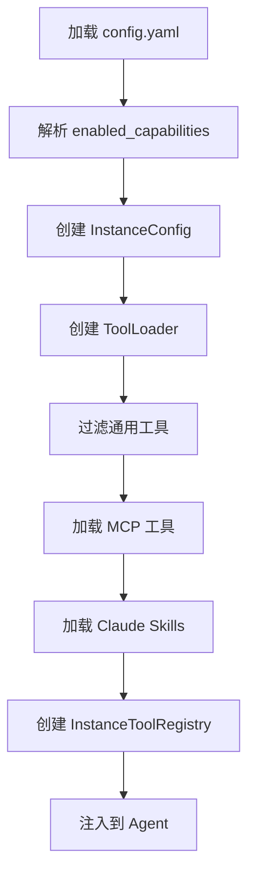

# 智能体工具配置指南

## 概述

本指南说明如何在智能体实例化阶段配置和管理工具能力。系统支持三类工具：

1. **通用工具** - 从 `capabilities.yaml` 定义，包括 TOOL/SKILL/CODE 类型
2. **MCP 工具** - 运行时连接的 MCP 服务器
3. **Claude Skills** - 官方 Claude Skills API

## 配置文件结构

### 1. `config.yaml` Schema

实例配置文件位于 `instances/{instance_name}/config.yaml`，包含以下主要部分：

```yaml
# 实例基本信息
instance:
  name: my-agent
  description: "我的智能体"
  version: 1.0.0

# Agent 配置
agent:
  model: claude-sonnet-4-20250514
  max_turns: 20

# 🆕 通用工具启用配置
enabled_capabilities:
  web_search: 1      # 1 表示启用
  plan_todo: 1
  ppt_generator: 0   # 0 表示禁用

# MCP 工具配置
mcp_tools:
  - name: dify_flowchart
    server_url: "https://api.dify.ai/mcp"
    description: "生成流程图"

# Claude Skills 配置（在 skills/skill_registry.yaml）
```

### 2. `enabled_capabilities` 字段说明

`enabled_capabilities` 是一个字典，用于控制通用工具的启用状态：

- **键**：工具名称（与 `capabilities.yaml` 中的 `name` 字段对应）
- **值**：启用状态
  - `1` 或 `true` → 启用
  - `0` 或 `false` → 禁用
  - 未列出的工具默认禁用

**可用工具列表**：

```yaml
# 内容生成类 (Claude Skills)
pptx: 1              # PPT 生成
xlsx: 1              # Excel 操作
docx: 1              # Word 文档
pdf: 1               # PDF 生成

# 信息获取类
web_search: 1        # 互联网搜索
exa_search: 1        # Exa 语义搜索
knowledge_search: 1  # 知识库检索

# 数据处理类（沙盒工具）
sandbox_run_code: 1           # 代码执行
sandbox_create_project: 1     # 项目创建
sandbox_run_project: 1        # 项目运行
sandbox_list_dir: 1           # 列目录
sandbox_read_file: 1          # 读文件
sandbox_write_file: 1         # 写文件
sandbox_delete_file: 1        # 删文件
sandbox_file_exists: 1        # 检查文件
sandbox_run_command: 1        # 运行命令

# PPT 生成类
ppt_generator: 1     # 闭环 PPT 生成
slidespeak_render: 1 # SlideSpeak 渲染

# 核心工具（建议始终启用）
plan_todo: 1                    # 任务规划
api_calling: 1                  # API 调用
hitl: 1                         # HITL (Human-in-the-Loop)
code_execution: 1               # 代码执行
```

## 工具初始化流程

### 架构图



### 详细流程

#### 1. 配置加载阶段

```python
# instance_loader.py
config = load_instance_config(instance_name)
# config.enabled_capabilities: {"web_search": True, "plan_todo": True}
```

#### 2. 工具过滤阶段

```python
# 创建 ToolLoader
from core.tool import create_tool_loader
loader = create_tool_loader()

# 加载工具（自动过滤）
result = loader.load_tools(
    enabled_capabilities=config.enabled_capabilities,
    mcp_tools=config.mcp_tools,
    skills=config.skills,
)

# 结果统计
print(f"通用工具: {result.generic_count} 个")
print(f"MCP 工具: {result.mcp_count} 个")
print(f"Claude Skills: {result.skills_count} 个")
print(f"总计: {result.total_count} 个")
```

#### 3. 注册表创建阶段

```python
# 创建过滤后的全局注册表
filtered_registry = loader.create_filtered_registry(
    config.enabled_capabilities
)

# 创建实例级注册表
instance_registry = InstanceToolRegistry(
    global_registry=filtered_registry
)

# 注入到 Agent
agent._instance_registry = instance_registry
```

#### 4. MCP 工具注册

```python
# 注册 MCP 工具到实例注册表
for mcp_tool in config.mcp_tools:
    await instance_registry.register_mcp_tool(
        name=mcp_tool["name"],
        server_url=mcp_tool["server_url"],
        # ...
    )
```

#### 5. Claude Skills 注册

```python
# 注册 Claude Skills 到 Anthropic API
enabled_skills = [s for s in config.skills if s.enabled]
await _register_skills(instance_name, enabled_skills)
```

## 使用示例

### 示例 1: 最小化配置

仅启用核心工具，适合简单任务：

```yaml
# instances/minimal-agent/config.yaml
instance:
  name: minimal-agent
  description: "最小化智能体"

enabled_capabilities:
  plan_todo: 1
  hitl: 1
  web_search: 1
  knowledge_search: 1
  # 其他工具全部禁用（不列出）

mcp_tools: []
```

### 示例 2: 文档处理专用配置

启用文档相关工具：

```yaml
# instances/doc-processor/config.yaml
instance:
  name: doc-processor
  description: "文档处理专家"

enabled_capabilities:
  # 文档生成工具
  pptx: 1
  xlsx: 1
  docx: 1
  pdf: 1
  
  # 核心工具
  plan_todo: 1
  # file_read 已删除，请使用 sandbox_read_file
  
  # 信息获取
  web_search: 1
  knowledge_search: 1
  
  # 禁用其他工具
  ppt_generator: 0
  exa_search: 0
  sandbox_run_code: 0
```

### 示例 3: 代码执行专用配置

启用沙盒和代码执行工具：

```yaml
# instances/code-runner/config.yaml
instance:
  name: code-runner
  description: "代码执行专家"

enabled_capabilities:
  # 沙盒工具
  sandbox_run_code: 1
  sandbox_create_project: 1
  sandbox_run_project: 1
  sandbox_read_file: 1
  sandbox_write_file: 1
  
  # 核心工具
  plan_todo: 1
  code_execution: 1
  
  # 禁用文档工具
  pptx: 0
  xlsx: 0
  docx: 0
  pdf: 0
```

## API 参考

### ToolLoader

```python
class ToolLoader:
    """统一工具加载器"""
    
    def __init__(self, global_registry: CapabilityRegistry):
        """初始化加载器"""
        
    def load_tools(
        self,
        enabled_capabilities: Dict[str, bool],
        mcp_tools: Optional[List[Dict]] = None,
        skills: Optional[List[Any]] = None,
    ) -> ToolLoadResult:
        """加载所有工具"""
        
    def create_filtered_registry(
        self,
        enabled_capabilities: Dict[str, bool]
    ) -> CapabilityRegistry:
        """创建过滤后的注册表"""
        
    def get_tool_statistics(
        self,
        enabled_capabilities: Dict[str, bool]
    ) -> Dict[str, Any]:
        """获取工具统计信息"""
```

### ToolLoadResult

```python
@dataclass
class ToolLoadResult:
    """工具加载结果"""
    generic_tools: List[Capability]    # 通用工具列表
    generic_count: int                 # 通用工具数量
    mcp_tools: List[Dict]              # MCP 工具列表
    mcp_count: int                     # MCP 工具数量
    skills: List[Dict]                 # Skills 列表
    skills_count: int                  # Skills 数量
    total_count: int                   # 总工具数量
    enabled_tools: List[str]           # 启用的工具名
    disabled_tools: List[str]          # 禁用的工具名
```

### CapabilityRegistry.filter_by_enabled()

```python
def filter_by_enabled(
    self, 
    enabled_map: Dict[str, bool]
) -> "CapabilityRegistry":
    """
    根据启用配置过滤能力
    
    Args:
        enabled_map: 工具名 -> 是否启用
        
    Returns:
        过滤后的新 Registry 实例
    """
```

## 最佳实践

### 1. 按需启用工具

只启用任务所需的工具，避免工具过多导致性能问题：

```yaml
# ✅ 推荐：按需启用
enabled_capabilities:
  web_search: 1
  plan_todo: 1
  # file_read 已删除，请使用 sandbox_read_file

# ❌ 不推荐：启用所有工具
enabled_capabilities:
  web_search: 1
  exa_search: 1
  ppt_generator: 1
  # ... 所有工具
```

### 2. 核心工具始终启用

以下工具建议始终启用：

```yaml
enabled_capabilities:
  plan_todo: 1                    # 任务规划
  hitl: 1                         # HITL (Human-in-the-Loop)
  # file_read 已删除，请使用 sandbox_read_file
```

### 3. 根据场景分组

为不同场景创建专用配置：

```
instances/
├── minimal-agent/         # 最小化配置
├── doc-processor/         # 文档处理
├── code-runner/           # 代码执行
└── full-featured/         # 完整功能
```

### 4. 使用配置继承

对于相似的配置，可以通过复制模板快速创建：

```bash
cp instances/_template/config.yaml instances/my-agent/config.yaml
# 然后修改 enabled_capabilities
```

## 调试和验证

### 查看加载日志

启动 Agent 时会输出详细的工具加载日志：

```
🔧 开始加载工具...
   📋 已启用 2 个通用工具
   启用: web_search, plan_todo
📊 工具加载摘要
  通用工具: 2 个
    启用: web_search, plan_todo
  MCP 工具: 1 个
    列表: dify_flowchart
  Claude Skills: 0 个
  总计: 4 个工具
```

### 使用测试脚本

运行测试验证配置：

```bash
cd /path/to/zenflux_agent
pytest tests/test_tool_loader.py -v
```

### 获取工具统计

```python
from core.tool import create_tool_loader

loader = create_tool_loader()
stats = loader.get_tool_statistics(enabled_capabilities)

print(f"可用工具: {stats['total_available']}")
print(f"已启用: {stats['enabled_count']}")
print(f"已禁用: {stats['disabled_count']}")
```

## 常见问题

### Q1: 如何查看所有可用工具？

查看 `config/capabilities.yaml` 文件，或运行：

```python
from core.tool import get_capability_registry
registry = get_capability_registry()
print(list(registry.capabilities.keys()))
```

### Q2: 配置不生效怎么办？

1. 检查工具名称是否正确（区分大小写）
2. 检查配置值是否为 0/1 或 true/false
3. 查看启动日志确认工具是否被加载

### Q3: 如何动态添加新工具？

新工具需要在 `capabilities.yaml` 中定义，然后在实例配置中启用：

```yaml
# 1. 在 capabilities.yaml 中添加工具定义
capabilities:
  - name: my_new_tool
    type: TOOL
    # ...

# 2. 在实例配置中启用
enabled_capabilities:
  my_new_tool: 1
```

### Q4: MCP 工具和通用工具的区别？

- **通用工具**：预定义在 `capabilities.yaml`，静态配置
- **MCP 工具**：运行时连接的外部服务，动态注册

## 相关文件

- `config/capabilities.yaml` - 通用工具定义
- `instances/_template/config.yaml` - 配置模板
- `scripts/instance_loader.py` - 加载逻辑
- `core/tool/loader.py` - 工具加载器
- `core/tool/capability/registry.py` - 能力注册表
- `core/tool/instance_registry.py` - 实例工具注册表

## 更新日志

- **V5.1** (2025-01-11)
  - 新增 `enabled_capabilities` 配置
  - 新增 `ToolLoader` 统一加载器
  - 新增 `CapabilityRegistry.filter_by_enabled()` 方法
  - 支持通用工具按需启用/禁用
