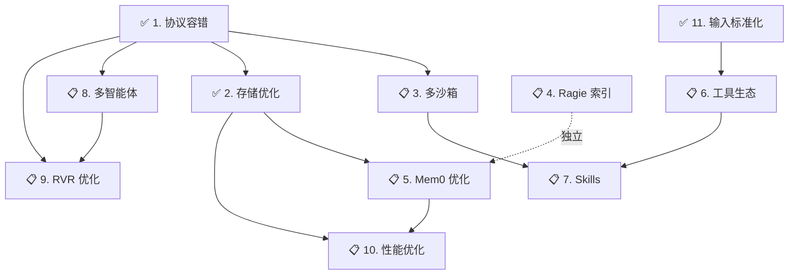

# ZenFlux Agent 架构优化路线图 V2.0

**版本**: V2.0  
**日期**: 2024-01-14  
**状态**: 规划中

---

## 目录

- [一、优化总览](#一优化总览)
- [二、核心优化方向（分层分类）](#二核心优化方向分层分类)
  - [2.1 基础设施层（Infrastructure）](#21-基础设施层infrastructure)
  - [2.2 核心能力层（Core Capabilities）](#22-核心能力层core-capabilities)
  - [2.3 智能体架构层（Agent Architecture）](#23-智能体架构层agent-architecture)
  - [2.4 用户体验层（User Experience）](#24-用户体验层user-experience)
- [三、实施优先级与路线图](#三实施优先级与路线图)
- [四、关键决策点](#四关键决策点)
- [五、成功标准](#五成功标准)

---

## 一、优化总览

### 1.1 产品定位

打造**生产级、通用型、高可靠**的智能体产品，支撑企业级应用场景。

### 1.2 优化目标（四大维度）

```
┌─────────────────────────────────────────────────────────────┐
│                     优化目标四维模型                         │
├─────────────────────────────────────────────────────────────┤
│                                                              │
│   稳定性               性能                                  │
│   ┌────────┐         ┌────────┐                            │
│   │ SLA    │         │ P95    │                            │
│   │ 99.9%  │         │ <3s    │                            │
│   └────────┘         └────────┘                            │
│                                                              │
│   用户体验             可扩展性                              │
│   ┌────────┐         ┌────────┐                            │
│   │ 满意度 │         │ 配置   │                            │
│   │ >90%   │         │ 热更新 │                            │
│   └────────┘         └────────┘                            │
│                                                              │
└─────────────────────────────────────────────────────────────┘
```

### 1.3 优化方向总览（12个方向）

| 分层 | 方向 | 优先级 | 状态 |
|------|------|--------|------|
| **基础设施层** | | | |
| → | 1. 协议层容错体系 | P0 | ✅ 已完成 |
| → | 2. 存储层性能优化 | P0 | ✅ 已完成 |
| → | 3. 多沙箱后端支持 | P1 | 📋 待规划 |
| **核心能力层** | | | |
| → | 4. Ragie 知识库在线索引 🆕 | P1 | 📋 待规划 |
| → | 5. Mem0 记忆系统优化 | P1 | 📋 待规划 |
| → | 6. 工具生态建设 | P1 | 📋 待规划 |
| → | 7. Claude Skills 开发 | P2 | 📋 待规划 |
| **智能体架构层** | | | |
| → | 8. 多智能体框架集成 🆕 | P1 | 📋 待规划 |
| → | 9. RVR 架构优化（Validation/Reflection） 🆕 | P1 | 📋 待规划 |
| → | 10. 全链路性能优化 | P1 | 📋 待规划 |
| **用户体验层** | | | |
| → | 11. 输入接口标准化 | P0 | ✅ 已完成 |
| → | 12. 实时进度反馈 | P0 | ✅ 已完成 |

---

## 二、核心优化方向（分层分类）

### 2.1 基础设施层（Infrastructure）

基础设施层是系统的地基，决定了稳定性和可扩展性的上限。

---

#### 方向 1: 协议层容错体系 ✅ 已完成

**What - 做什么**  
建立 HTTP/gRPC 协议层的高可用保障体系（超时、重试、熔断、降级）。

**Why - 为什么重要**  
- **业务价值**: 停机 1 分钟 = 损失所有在线用户
- **现状痛点**: LLM API 不稳定时，整个服务不可用
- **预期收益**: SLA 从 95% → 99.9%

**实施状态**  
- ✅ 已完成：`infra/resilience/` 模块
- ✅ 已集成：超时、重试、熔断、降级
- ✅ 已部署：健康检查接口（/health/*）

**详细文档**  
- `docs/guides/resilience_usage.md`
- `docs/reports/architecture_refactoring_decision.md`

---

#### 方向 2: 存储层性能优化 ✅ 已完成

**What - 做什么**  
优化三层存储（会话级/用户级/系统级）的读写性能，降低 IO 延迟。

**Why - 为什么重要**  
- **业务价值**: 每次对话涉及 10+ 次数据库读写
- **现状痛点**: 同步写入阻塞，累积延迟长
- **预期收益**: 存储层延迟降低 70%（500ms → 150ms）

**实施状态**  
- ✅ 已完成：`infra/storage/` 模块
- ✅ 已实现：AsyncWriter（异步写入）
- ✅ 已实现：BatchWriter（批量处理）
- ✅ 已验证：性能测试通过（吞吐量提升 233%）

**详细文档**  
- `docs/guides/storage_optimization.md`

---

#### 方向 3: 多沙箱后端支持 📋 待规划

**What - 做什么**  
支持多种沙箱后端（E2B / 阿里云 FC / 本地 Docker），统一抽象接口。

**Why - 为什么重要**  
- **业务价值**: 代码执行是高价值能力，沙箱稳定性影响核心功能
- **现状痛点**: 仅支持 E2B，国内访问慢（延迟 > 5s），成本高
- **预期收益**: 延迟降低 70%（5s → 1.5s），成本降低 50%

**Who - 谁负责**  
- **主导**: 基础设施工程师
- **协作**: 后端工程师（接口适配）、运维工程师（资源配额）

**When - 时间规划**  
- **优先级**: P1（高）
- **难度**: ★★★☆☆（中）
- **时间**: 1.5 周

**Where - 影响模块**  
- 沙箱抽象：`infra/sandbox/`
- 工具执行：`core/tool/executor.py`

**How - 实施步骤**  
1. 定义统一接口（`SandboxProvider`）
   ```python
   class SandboxProvider(Protocol):
       async def create(self, config: dict) -> str
       async def execute(self, sandbox_id: str, code: str) -> dict
       async def cleanup(self, sandbox_id: str) -> None
   ```

2. 实现适配器
   - ✅ E2B 适配器（现有逻辑封装）
   - 🆕 阿里云 FC 适配器
   - 🆕 本地 Docker 适配器（开发/测试用）

3. 配置驱动切换
   ```yaml
   sandbox:
     provider: "aliyun_fc"  # e2b / aliyun_fc / docker
     config:
       region: "cn-hangzhou"
       timeout: 30
   ```

4. 资源配额管理
   - CPU/内存/时间限制
   - 镜像预热（减少冷启动）
   - 并发控制（最大 10 个并发沙箱）

**风险与缓解**  
- **风险**: 切换后兼容性问题
- **缓解**: 充分测试；保留 E2B 作为备份；灰度发布

---

### 2.2 核心能力层（Core Capabilities）

核心能力层是智能体的"大脑"，决定了智能程度和知识广度。

---

#### 方向 4: Ragie 知识库在线索引 🆕 待规划

**What - 做什么**  
建立企业/个人知识库的在线索引体系，支持实时更新和检索。

**Why - 为什么重要**  
- **业务价值**: 知识库是企业智能体的核心差异化能力
- **现状痛点**: 
  - Ragie 仅支持离线上传，无法实时更新
  - 个人知识库和 Mem0 用户画像功能重叠，需要整合
  - 缺少统一的知识管理接口
- **预期收益**: 
  - 知识检索召回率提升 50%
  - 支持实时知识更新（< 1 分钟生效）
  - 统一知识与记忆管理

**Who - 谁负责**  
- **主导**: 后端工程师 + 算法工程师
- **协作**: 前端工程师（知识管理 UI）、产品经理（功能设计）

**When - 时间规划**  
- **优先级**: P1（高） - 核心能力
- **难度**: ★★★★☆（中高）
- **时间**: 2 周

**Where - 影响模块**  
- 知识库服务：`services/ragie_service.py`
- 记忆系统：`core/memory/`
- 新增：`core/knowledge/` 统一知识管理层

**How - 实施步骤**

##### 1. 架构设计：知识与记忆分离

```
┌─────────────────────────────────────────────────────────┐
│                  知识与记忆架构                          │
├─────────────────────────────────────────────────────────┤
│                                                          │
│   Ragie 知识库              Mem0 用户画像                │
│   ┌────────────┐            ┌────────────┐              │
│   │ 企业知识库  │            │ 用户偏好    │              │
│   │ 文档、FAQ  │            │ 历史对话    │              │
│   │ 产品手册   │            │ 个性化信息  │              │
│   └──────┬─────┘            └──────┬─────┘              │
│          │                         │                     │
│          └─────────┬───────────────┘                     │
│                    ▼                                     │
│        ┌───────────────────────┐                        │
│        │  统一知识管理层        │                        │
│        │  core/knowledge/      │                        │
│        │  - 路由策略           │                        │
│        │  - 结果融合           │                        │
│        └───────────────────────┘                        │
│                                                          │
└─────────────────────────────────────────────────────────┘
```

**设计决策**：

| 维度 | Ragie 知识库 | Mem0 用户画像 | 是否集成 |
|------|-------------|--------------|---------|
| **数据类型** | 结构化知识（文档、FAQ） | 非结构化记忆（对话、偏好） | ❌ 分离 |
| **更新频率** | 低频（按需上传） | 高频（每次对话） | ❌ 分离 |
| **检索特点** | 语义检索（向量） | 时间序列 + 语义 | ❌ 分离 |
| **使用场景** | 问答、文档查询 | 个性化、上下文延续 | ❌ 分离 |
| **管理接口** | 统一知识管理层 | 统一知识管理层 | ✅ 统一入口 |

**结论**：**不强制集成**，保持独立，但提供统一入口。

##### 2. 个人知识库优先实现

**功能设计**：

```python
# core/knowledge/personal_kb.py
class PersonalKnowledgeBase:
    """个人知识库管理"""
    
    def __init__(self, user_id: str):
        self.user_id = user_id
        self.ragie = get_ragie_service()
    
    async def add_document(
        self,
        content: str,
        metadata: dict,
        auto_index: bool = True
    ) -> str:
        """
        添加文档到个人知识库
        
        Args:
            content: 文档内容
            metadata: 元数据（标题、标签、来源）
            auto_index: 是否自动索引（默认 True）
        
        Returns:
            文档 ID
        """
        # 1. 上传到 Ragie（用户分区）
        doc_id = await self.ragie.upload(
            content=content,
            partition=f"user_{self.user_id}",
            metadata=metadata
        )
        
        # 2. 自动索引（增量）
        if auto_index:
            await self._trigger_index(doc_id)
        
        return doc_id
    
    async def search(
        self,
        query: str,
        top_k: int = 5,
        filter_metadata: dict = None
    ) -> List[dict]:
        """
        检索个人知识库
        
        Args:
            query: 查询文本
            top_k: 返回结果数量
            filter_metadata: 元数据过滤（如标签）
        
        Returns:
            检索结果列表
        """
        results = await self.ragie.search(
            query=query,
            partition=f"user_{self.user_id}",
            top_k=top_k,
            filters=filter_metadata
        )
        return results
```

##### 3. 在线索引机制

**增量索引流程**：

```
用户上传文档
    ↓
入队（Redis Stream）
    ↓
后台任务（定时/事件触发）
    ↓
分块处理（Chunking）
    ↓
向量化（Embedding）
    ↓
写入 Ragie（增量）
    ↓
索引可用（< 1 分钟）
```

**实现**：

```python
# services/knowledge_indexer.py
class KnowledgeIndexer:
    """知识库索引器"""
    
    async def index_document(self, doc_id: str):
        """增量索引单个文档"""
        # 1. 获取文档内容
        doc = await self.ragie.get_document(doc_id)
        
        # 2. 分块（Chunking）
        chunks = self.chunk_document(
            doc.content,
            chunk_size=512,
            overlap=50
        )
        
        # 3. 向量化（批量）
        embeddings = await self.embedding_service.embed_batch(
            [chunk.text for chunk in chunks]
        )
        
        # 4. 写入 Ragie（增量）
        await self.ragie.upsert_chunks(
            document_id=doc_id,
            chunks=chunks,
            embeddings=embeddings
        )
        
        logger.info(f"✅ 文档索引完成: {doc_id}, {len(chunks)} 个分块")
```

##### 4. Ragie 与 Mem0 协同策略

**场景 1：用户问答**

```python
async def answer_question(user_id: str, question: str):
    """用户问答（优先知识库）"""
    
    # 1. 先查个人知识库（Ragie）
    kb_results = await personal_kb.search(question, top_k=3)
    
    # 2. 如果知识库无结果，查用户画像（Mem0）
    if not kb_results:
        mem0_results = await mem0_service.search(user_id, question)
        return mem0_results
    
    return kb_results
```

**场景 2：个性化回复**

```python
async def personalized_reply(user_id: str, question: str):
    """个性化回复（融合知识与记忆）"""
    
    # 1. 并发查询
    kb_task = personal_kb.search(question, top_k=3)
    mem0_task = mem0_service.search(user_id, question, top_k=5)
    
    kb_results, mem0_results = await asyncio.gather(kb_task, mem0_task)
    
    # 2. 结果融合（知识 + 记忆）
    context = {
        "knowledge": kb_results,  # 客观知识
        "memory": mem0_results    # 主观记忆
    }
    
    # 3. LLM 生成回复
    response = await llm.generate(
        prompt=f"问题：{question}\n知识：{context['knowledge']}\n用户画像：{context['memory']}"
    )
    
    return response
```

**决策表**：

| 场景 | 使用 Ragie | 使用 Mem0 | 策略 |
|------|-----------|----------|------|
| 产品文档查询 | ✅ 主要 | ❌ | 纯知识检索 |
| 历史对话回顾 | ❌ | ✅ 主要 | 纯记忆检索 |
| 个性化推荐 | ✅ | ✅ | 知识 + 记忆融合 |
| 新用户问答 | ✅ 主要 | ❌ | 无画像时用知识 |

##### 5. 统一知识管理接口

```python
# core/knowledge/manager.py
class KnowledgeManager:
    """统一知识管理层"""
    
    def __init__(self, user_id: str):
        self.user_id = user_id
        self.ragie_kb = PersonalKnowledgeBase(user_id)
        self.mem0 = get_mem0_service()
    
    async def search(
        self,
        query: str,
        sources: List[str] = ["ragie", "mem0"],
        top_k: int = 5
    ) -> dict:
        """
        统一检索入口
        
        Args:
            query: 查询文本
            sources: 检索源（["ragie", "mem0"]）
            top_k: 每个源返回结果数量
        
        Returns:
            {
                "ragie": [...],
                "mem0": [...],
                "merged": [...]  # 融合后的结果
            }
        """
        results = {}
        
        # 并发查询
        tasks = []
        if "ragie" in sources:
            tasks.append(self.ragie_kb.search(query, top_k))
        if "mem0" in sources:
            tasks.append(self.mem0.search(self.user_id, query, top_k))
        
        responses = await asyncio.gather(*tasks)
        
        # 结果分组
        if "ragie" in sources:
            results["ragie"] = responses[0]
        if "mem0" in sources:
            idx = 1 if "ragie" in sources else 0
            results["mem0"] = responses[idx]
        
        # 结果融合（按相关性重排序）
        results["merged"] = self._merge_results(
            results.get("ragie", []),
            results.get("mem0", [])
        )
        
        return results
```

**风险与缓解**  
- **风险 1**: Ragie API 限流（每分钟 60 次）
  - **缓解**: 本地缓存热门查询；批量索引
- **风险 2**: 个人知识库膨胀（每用户 > 1GB）
  - **缓解**: 容量限制（免费 100MB，付费 10GB）；冷数据归档
- **风险 3**: Ragie 与 Mem0 结果冲突
  - **缓解**: 明确优先级规则；LLM 判断使用哪个结果

---

#### 方向 5: Mem0 记忆系统优化 📋 待规划

**What - 做什么**  
优化用户记忆检索性能，支持多用户高并发场景。

**Why - 为什么重要**  
- **业务价值**: 用户画像影响对话质量
- **现状痛点**: 全量检索慢（100+ 用户时 > 2s）
- **预期收益**: 检索延迟降低 80%（2s → 400ms）

**Who / When / Where**  
- **主导**: 后端工程师 + 算法工程师
- **时间**: 1.5 周（P1 高优先级）
- **模块**: `services/mem0_service.py`, `core/memory/mem0/`

**How - 实施步骤**  
1. 增量写入（对话结束 → 异步入队 → 批量向量化）
2. 冷热分层（热数据内存，冷数据归档）
3. 热用户缓存（Top 1000 用户结果缓存 10 分钟）
4. 定时任务（每日 3:00 索引合并）
5. 检索优化（先召回 30 条 → LLM 重排序 → Top 5）

---

#### 方向 6: 工具生态建设 📋 待规划

**What - 做什么**  
建立工具的注册、管理、测试、灰度发布体系。

**Why - 为什么重要**  
- **业务价值**: 工具是智能体的核心能力
- **现状痛点**: 工具接入流程不清晰
- **预期收益**: 工具接入效率提升 5 倍

**实施要点**  
1. 工具元数据扩展（成本、延迟、风险级别）
2. 契约测试（输入输出 Schema 自动校验）
3. 灰度发布（流量百分比控制）
4. 监控指标（调用次数、成功率、延迟）

---

#### 方向 7: Claude Skills 开发 📋 待规划

**What - 做什么**  
面向高频场景开发 Claude Skills，提升垂直能力。

**优先开发 Skill**：
- `code_review`: 代码审阅
- `data_qa`: 数据问答
- `long_doc_summary`: 长文摘要

**时间规划**: P2（中优先级），每个 Skill 1 周

---

### 2.3 智能体架构层（Agent Architecture）

智能体架构层是系统的"指挥中枢"，决定了推理能力和协作效率。

---

#### 方向 8: 多智能体框架集成 🆕 待规划

**What - 做什么**  
引入多智能体协作框架，支持复杂任务的分工与协作。

**Why - 为什么重要**  
- **业务价值**: 复杂任务需要多个专业 Agent 协作完成
- **现状痛点**: 
  - 单 Agent 能力有限，面对复杂任务力不从心
  - 缺少 Agent 间的协作机制
  - 没有任务分解与分配能力
- **预期收益**: 
  - 支持复杂任务自动分解（10+ 步骤）
  - 多 Agent 并发执行，效率提升 3-5 倍
  - 每个 Agent 专注垂直领域，质量更高

**Who - 谁负责**  
- **主导**: 架构师 + 算法工程师
- **协作**: 后端工程师（接口实现）

**When - 时间规划**  
- **优先级**: P1（高） - 架构核心能力
- **难度**: ★★★★☆（高）
- **时间**: 2.5 周

**Where - 影响模块**  
- Agent 核心：`core/agent/`
- 新增：`core/multi_agent/` 多智能体框架
- 协调器：`core/orchestrator/`

**How - 实施步骤**

##### 1. 架构设计：多智能体协作模式

```
┌─────────────────────────────────────────────────────────┐
│              多智能体协作架构                             │
├─────────────────────────────────────────────────────────┤
│                                                          │
│           ┌─────────────────────┐                       │
│           │   协调者 Agent       │                       │
│           │   (Orchestrator)    │                       │
│           │   - 任务分解         │                       │
│           │   - 任务分配         │                       │
│           │   - 结果汇总         │                       │
│           └──────────┬──────────┘                       │
│                      │                                   │
│         ┌────────────┼────────────┐                     │
│         ▼            ▼            ▼                     │
│   ┌─────────┐  ┌─────────┐  ┌─────────┐               │
│   │ 工作者1  │  │ 工作者2  │  │ 工作者3  │               │
│   │ (搜索)   │  │ (分析)   │  │ (总结)   │               │
│   └─────────┘  └─────────┘  └─────────┘               │
│         │            │            │                     │
│         └────────────┼────────────┘                     │
│                      ▼                                   │
│           ┌─────────────────────┐                       │
│           │   评估者 Agent       │ 🆕                    │
│           │   (Validator)       │                       │
│           │   - 结果校验         │                       │
│           │   - 质量评分         │                       │
│           │   - 修正建议         │                       │
│           └─────────────────────┘                       │
│                                                          │
└─────────────────────────────────────────────────────────┘
```

##### 2. 关键角色定义

**协调者 Agent（Orchestrator）**：
- 职责：任务分解、分配、调度、结果汇总
- 能力：理解复杂任务、生成执行计划、动态调度
- 工具：无（纯决策）

**工作者 Agent（Worker）**：
- 职责：执行具体子任务
- 能力：专业领域能力（搜索、分析、编码、翻译等）
- 工具：领域特定工具

**评估者 Agent（Validator）** 🆕：
- 职责：**结果校验、质量评分、修正建议**
- 能力：判断结果是否符合要求、发现错误、提出改进
- 工具：无（纯评估）

**反思者 Agent（Reflector）** 🆕：
- 职责：**过程回顾、经验总结、策略优化**
- 能力：分析执行过程、识别问题、提出改进方案
- 工具：无（纯反思）

##### 3. 工作流示例

**场景：撰写一篇技术报告**

```
用户：帮我写一篇关于 AI Agent 的技术报告

协调者：
  1. 任务分解
     - 子任务1：搜索 AI Agent 最新资料
     - 子任务2：分析技术趋势
     - 子任务3：撰写报告框架
     - 子任务4：填充内容
     - 子任务5：润色与校对

  2. 分配任务
     - 工作者1（搜索专家）→ 子任务1
     - 工作者2（分析专家）→ 子任务2
     - 工作者3（写作专家）→ 子任务3、4、5

  3. 执行与监控
     - 工作者1 完成 → 传递给工作者2
     - 工作者2 完成 → 传递给工作者3
     - 工作者3 完成初稿

  4. 校验与反思 🆕
     - 评估者：检查报告质量
       * 结构完整性：✅ 通过
       * 内容准确性：⚠️ 部分数据过时
       * 语言流畅性：✅ 通过
     
     - 反思者：分析执行过程
       * 问题：工作者1 搜索的资料部分过时
       * 原因：未限制时间范围（近 2 年）
       * 改进：添加时间过滤参数

  5. 修正与优化
     - 协调者：根据评估结果，重新调度
     - 工作者1：重新搜索（限制 2 年内）
     - 工作者3：更新相关章节

  6. 最终交付
     - 评估者：✅ 质量达标
     - 返回用户
```

##### 4. 代码实现框架

```python
# core/multi_agent/orchestrator.py
class MultiAgentOrchestrator:
    """多智能体协调器"""
    
    def __init__(self):
        self.workers: Dict[str, Agent] = {}
        self.validator: ValidatorAgent = None  # 🆕 评估者
        self.reflector: ReflectorAgent = None  # 🆕 反思者
    
    async def execute(self, task: str) -> dict:
        """
        执行复杂任务
        
        流程：
        1. 任务分解
        2. 任务分配
        3. 并发/串行执行
        4. 结果校验 🆕
        5. 过程反思 🆕
        6. 修正优化 🆕
        7. 结果汇总
        """
        # 1. 任务分解
        subtasks = await self._decompose_task(task)
        
        # 2. 构建执行图（DAG）
        execution_graph = self._build_execution_graph(subtasks)
        
        # 3. 执行任务
        results = await self._execute_graph(execution_graph)
        
        # 4. 结果校验 🆕
        validation_result = await self.validator.validate(
            task=task,
            results=results
        )
        
        # 5. 如果校验失败，重试或修正
        if not validation_result["passed"]:
            # 分析失败原因
            reflection = await self.reflector.reflect(
                task=task,
                execution_log=self.execution_log,
                validation_result=validation_result
            )
            
            # 根据反思结果，重新执行
            if reflection["should_retry"]:
                results = await self._retry_with_correction(
                    subtasks,
                    reflection["suggestions"]
                )
                
                # 再次校验
                validation_result = await self.validator.validate(
                    task=task,
                    results=results
                )
        
        # 6. 返回最终结果
        return {
            "task": task,
            "results": results,
            "validation": validation_result,
            "reflection": reflection if not validation_result["passed"] else None
        }
```

```python
# core/multi_agent/validator.py 🆕
class ValidatorAgent:
    """评估者 Agent - 校验结果质量"""
    
    async def validate(
        self,
        task: str,
        results: dict
    ) -> dict:
        """
        校验结果质量
        
        Returns:
            {
                "passed": bool,           # 是否通过
                "score": float,           # 质量评分（0-1）
                "issues": List[str],      # 发现的问题
                "suggestions": List[str]  # 改进建议
            }
        """
        # 构建校验提示词
        validation_prompt = f"""
        任务：{task}
        结果：{results}
        
        请评估结果质量，从以下维度：
        1. 完整性：是否回答了所有问题
        2. 准确性：信息是否准确
        3. 相关性：是否与任务相关
        4. 可用性：结果是否可直接使用
        
        返回 JSON：
        {{
            "passed": true/false,
            "score": 0.0-1.0,
            "issues": ["问题1", "问题2"],
            "suggestions": ["建议1", "建议2"]
        }}
        """
        
        # 调用 LLM 评估
        response = await self.llm.generate(validation_prompt)
        
        return json.loads(response)
```

```python
# core/multi_agent/reflector.py 🆕
class ReflectorAgent:
    """反思者 Agent - 分析执行过程，提出改进"""
    
    async def reflect(
        self,
        task: str,
        execution_log: List[dict],
        validation_result: dict
    ) -> dict:
        """
        反思执行过程
        
        Returns:
            {
                "should_retry": bool,        # 是否应该重试
                "root_cause": str,           # 根因分析
                "suggestions": List[dict],   # 改进建议
                "learned_lesson": str        # 经验教训
            }
        """
        # 构建反思提示词
        reflection_prompt = f"""
        任务：{task}
        执行日志：{execution_log}
        校验结果：{validation_result}
        
        请分析：
        1. 为什么结果不符合预期？
        2. 哪个环节出了问题？
        3. 如何改进？
        4. 这次失败能学到什么？
        
        返回 JSON：
        {{
            "should_retry": true/false,
            "root_cause": "根因分析",
            "suggestions": [
                {{"step": "子任务1", "action": "改进措施"}}
            ],
            "learned_lesson": "经验教训"
        }}
        """
        
        # 调用 LLM 反思
        response = await self.llm.generate(reflection_prompt)
        
        return json.loads(response)
```

##### 5. 与现有 RVR 框架的关系

**现有 RVR（Read-Validate-Reason-Act-Observe-Write-Repeat）**：
- 单 Agent 的执行循环
- 侧重于工具调用和观察

**多智能体扩展**：
- **Orchestrator** 在 **Reason** 阶段分解任务
- **Workers** 在 **Act** 阶段并发执行
- **Validator** 在 **Observe** 阶段校验结果 🆕
- **Reflector** 在 **Repeat** 前反思改进 🆕

```
RVR 循环（单 Agent）                    多智能体扩展
┌────────────────┐                    ┌────────────────┐
│ Read           │                    │ Read           │
│ - 读取用户输入  │                    │ - 同左          │
└────────┬───────┘                    └────────┬───────┘
         ↓                                     ↓
┌────────────────┐                    ┌────────────────┐
│ Validate       │                    │ Validate       │
│ - 验证输入      │                    │ - 同左          │
└────────┬───────┘                    └────────┬───────┘
         ↓                                     ↓
┌────────────────┐                    ┌────────────────┐
│ Reason         │                    │ Reason         │
│ - 意图分析      │  ──────────────→  │ - 任务分解 🆕   │
│ - 生成计划      │                    │ - Orchestrator │
└────────┬───────┘                    └────────┬───────┘
         ↓                                     ↓
┌────────────────┐                    ┌────────────────┐
│ Act            │                    │ Act            │
│ - 工具调用      │  ──────────────→  │ - Workers 执行  │
│                │                    │ - 并发/串行 🆕  │
└────────┬───────┘                    └────────┬───────┘
         ↓                                     ↓
┌────────────────┐                    ┌────────────────┐
│ Observe        │                    │ Observe        │
│ - 观察结果      │  ──────────────→  │ - Validator 🆕  │
│                │                    │ - 质量校验      │
└────────┬───────┘                    └────────┬───────┘
         ↓                                     ↓
┌────────────────┐                    ┌────────────────┐
│ Write          │                    │ Write          │
│ - 写入记忆      │                    │ - 同左          │
└────────┬───────┘                    └────────┬───────┘
         ↓                                     ↓
┌────────────────┐                    ┌────────────────┐
│ Repeat?        │                    │ Repeat?        │
│ - 判断是否继续  │  ──────────────→  │ - Reflector 🆕  │
│                │                    │ - 过程反思      │
└────────────────┘                    └────────────────┘
```

**风险与缓解**  
- **风险 1**: 多 Agent 协调开销大，反而变慢
  - **缓解**: 仅在复杂任务时启用；简单任务仍用单 Agent
- **风险 2**: Agent 间通信协议复杂
  - **缓解**: 定义清晰的消息格式；使用事件驱动架构
- **风险 3**: 评估和反思的准确性不足
  - **缓解**: 使用更强大的 LLM（Claude Opus）；积累评估样本

---

#### 方向 9: RVR 架构优化（Validation/Reflection） 🆕 待规划

**What - 做什么**  
优化现有 RVR 框架，将 **Validation（校验）** 和 **Reflection（反思）** 独立出来，形成更清晰的架构。

**Why - 为什么重要**  
- **业务价值**: 提升 Agent 的自我纠错能力和学习能力
- **现状痛点**: 
  - Validation 逻辑分散在各个模块
  - 缺少系统性的反思机制
  - Agent 无法从失败中学习
- **预期收益**: 
  - 任务成功率提升 30%（通过校验和重试）
  - 错误修正时间降低 50%
  - 积累经验知识库

**Who - 谁负责**  
- **主导**: 架构师 + 算法工程师
- **协作**: 后端工程师（实现）

**When - 时间规划**  
- **优先级**: P1（高） - 架构优化
- **难度**: ★★★★☆（高）
- **时间**: 2 周

**Where - 影响模块**  
- Agent 核心：`core/agent/simple_agent.py`
- 新增：`core/agent/validator.py`
- 新增：`core/agent/reflector.py`

**How - 实施步骤**

##### 1. 当前 RVR 架构分析

**现有 RVR 循环**：

```python
# core/agent/simple_agent.py (当前)
async def chat(self, messages, session_id):
    while True:
        # R - Read
        user_input = messages[-1]
        
        # V - Validate（隐式，分散）
        if not user_input:
            break
        
        # R - Reason
        intent = await self.intent_analyzer.analyze(user_input)
        plan = await self.planner.create_plan(intent)
        
        # A - Act
        tools = await self.tool_selector.select(plan)
        results = await self.tool_executor.execute(tools)
        
        # O - Observe
        observation = self._observe_results(results)
        
        # V - Validate（隐式，简单判断）
        if self._is_task_complete(observation):
            break
        
        # R - Repeat
        # 没有系统性反思，只是简单循环
```

**问题**：
1. **Validation 不够系统**：只是简单判断完成与否，没有质量评估
2. **Reflection 缺失**：没有分析失败原因、总结经验
3. **无法自我纠错**：发现错误后不知道如何修正

##### 2. 优化后的 RVR+ 架构

**新架构：RVR+ (React + Validation + Reflection)**

```python
# core/agent/simple_agent.py (优化后)
async def chat(self, messages, session_id):
    """
    RVR+ 循环：
    - React: Read → Reason → Act → Observe
    - Validation: 校验结果质量
    - Reflection: 反思执行过程
    """
    max_iterations = 10
    iteration = 0
    
    while iteration < max_iterations:
        # ===== React 阶段 =====
        # R - Read
        user_input = messages[-1]
        context = await self.memory.get_context(session_id)
        
        # R - Reason
        intent = await self.intent_analyzer.analyze(user_input, context)
        plan = await self.planner.create_plan(intent)
        
        # A - Act
        tools = await self.tool_selector.select(plan)
        results = await self.tool_executor.execute(tools)
        
        # O - Observe
        observation = self._observe_results(results)
        
        # ===== Validation 阶段 🆕 =====
        validation_result = await self.validator.validate(
            task=user_input,
            plan=plan,
            results=results,
            observation=observation
        )
        
        # 记录校验结果
        await self.memory.add_validation(session_id, validation_result)
        
        # 如果通过校验，任务完成
        if validation_result["passed"]:
            logger.info("✅ 任务通过校验，完成")
            break
        
        # ===== Reflection 阶段 🆕 =====
        reflection = await self.reflector.reflect(
            task=user_input,
            execution_history=await self.memory.get_history(session_id),
            validation_result=validation_result
        )
        
        # 记录反思结果
        await self.memory.add_reflection(session_id, reflection)
        
        # 根据反思结果决定下一步
        if reflection["should_give_up"]:
            logger.warning("⚠️ 反思建议放弃任务")
            break
        
        if reflection["should_ask_user"]:
            logger.info("❓ 反思建议询问用户")
            return {
                "type": "clarification_needed",
                "question": reflection["question_for_user"]
            }
        
        # 应用改进建议，继续下一轮
        logger.info(f"🔄 应用改进建议，继续第 {iteration + 1} 轮")
        self._apply_improvements(reflection["improvements"])
        iteration += 1
    
    # 返回最终结果
    return self._build_response(results, validation_result, reflection)
```

##### 3. Validator 实现

```python
# core/agent/validator.py 🆕
class Validator:
    """校验器 - 评估结果质量"""
    
    def __init__(self, llm_service):
        self.llm = llm_service
    
    async def validate(
        self,
        task: str,
        plan: dict,
        results: List[dict],
        observation: str
    ) -> dict:
        """
        校验执行结果
        
        维度：
        1. 完整性：是否完成了所有计划步骤
        2. 正确性：结果是否正确
        3. 相关性：结果是否回答了用户问题
        4. 可用性：结果是否可以直接使用
        
        Returns:
            {
                "passed": bool,
                "score": float,           # 综合评分 0-1
                "dimensions": {
                    "completeness": 0.9,
                    "correctness": 0.8,
                    "relevance": 0.95,
                    "usability": 0.85
                },
                "issues": [
                    {
                        "dimension": "correctness",
                        "description": "数据可能不准确",
                        "severity": "medium"
                    }
                ],
                "suggestions": [
                    "重新搜索最新数据",
                    "验证数据来源"
                ]
            }
        """
        # 构建校验提示词
        validation_prompt = self._build_validation_prompt(
            task, plan, results, observation
        )
        
        # 调用 LLM 评估
        response = await self.llm.generate(
            prompt=validation_prompt,
            temperature=0.3  # 低温度，保证客观
        )
        
        # 解析结果
        validation_result = json.loads(response)
        
        # 计算综合评分
        dimensions = validation_result["dimensions"]
        overall_score = sum(dimensions.values()) / len(dimensions)
        validation_result["score"] = overall_score
        
        # 判断是否通过（阈值：0.7）
        validation_result["passed"] = overall_score >= 0.7
        
        return validation_result
    
    def _build_validation_prompt(
        self,
        task: str,
        plan: dict,
        results: List[dict],
        observation: str
    ) -> str:
        """构建校验提示词"""
        return f"""
你是一个严格的质量评估专家。请评估以下任务的执行结果。

**用户任务**：
{task}

**执行计划**：
{json.dumps(plan, ensure_ascii=False, indent=2)}

**执行结果**：
{json.dumps(results, ensure_ascii=False, indent=2)}

**观察总结**：
{observation}

**评估维度**：
1. 完整性（Completeness）：是否完成了所有计划步骤？
2. 正确性（Correctness）：结果是否正确、准确？
3. 相关性（Relevance）：结果是否回答了用户问题？
4. 可用性（Usability）：结果是否可以直接使用？

请返回 JSON 格式评估结果：
{{
    "dimensions": {{
        "completeness": 0.0-1.0,
        "correctness": 0.0-1.0,
        "relevance": 0.0-1.0,
        "usability": 0.0-1.0
    }},
    "issues": [
        {{
            "dimension": "correctness",
            "description": "具体问题描述",
            "severity": "low/medium/high"
        }}
    ],
    "suggestions": [
        "具体改进建议1",
        "具体改进建议2"
    ]
}}
"""
```

##### 4. Reflector 实现

```python
# core/agent/reflector.py 🆕
class Reflector:
    """反思器 - 分析执行过程，提出改进"""
    
    def __init__(self, llm_service):
        self.llm = llm_service
    
    async def reflect(
        self,
        task: str,
        execution_history: List[dict],
        validation_result: dict
    ) -> dict:
        """
        反思执行过程
        
        Returns:
            {
                "should_give_up": bool,      # 是否应该放弃
                "should_ask_user": bool,     # 是否应该询问用户
                "question_for_user": str,    # 要问用户的问题
                "root_cause": str,           # 根因分析
                "improvements": [            # 改进建议
                    {
                        "component": "tool_selector",
                        "issue": "选择了错误的工具",
                        "suggestion": "应该使用 web_search 而不是 calculator"
                    }
                ],
                "learned_lesson": str        # 经验教训
            }
        """
        # 构建反思提示词
        reflection_prompt = self._build_reflection_prompt(
            task, execution_history, validation_result
        )
        
        # 调用 LLM 反思
        response = await self.llm.generate(
            prompt=reflection_prompt,
            temperature=0.5  # 中等温度，平衡创造性和客观性
        )
        
        # 解析结果
        reflection = json.loads(response)
        
        # 决策逻辑
        if len(execution_history) > 5:
            # 尝试超过 5 次，建议放弃或询问用户
            if validation_result["score"] < 0.3:
                reflection["should_give_up"] = True
            else:
                reflection["should_ask_user"] = True
                reflection["question_for_user"] = self._generate_clarification_question(
                    task, validation_result["issues"]
                )
        
        return reflection
    
    def _build_reflection_prompt(
        self,
        task: str,
        execution_history: List[dict],
        validation_result: dict
    ) -> str:
        """构建反思提示词"""
        return f"""
你是一个经验丰富的反思专家。请分析以下任务的执行过程，找出问题并提出改进。

**用户任务**：
{task}

**执行历史**：
{json.dumps(execution_history, ensure_ascii=False, indent=2)}

**校验结果**：
{json.dumps(validation_result, ensure_ascii=False, indent=2)}

**反思问题**：
1. 为什么结果不符合预期？根因是什么？
2. 哪个环节出了问题？（意图分析/计划生成/工具选择/工具执行）
3. 如何改进？具体建议是什么？
4. 这次失败能学到什么经验教训？
5. 是否需要询问用户澄清需求？

请返回 JSON 格式反思结果：
{{
    "root_cause": "根因分析（为什么失败）",
    "improvements": [
        {{
            "component": "intent_analyzer/planner/tool_selector/tool_executor",
            "issue": "具体问题描述",
            "suggestion": "具体改进建议"
        }}
    ],
    "learned_lesson": "从这次失败中学到的经验教训",
    "should_ask_user": true/false,
    "question_for_user": "需要询问用户的问题（如果 should_ask_user=true）"
}}
"""
```

##### 5. 与多智能体框架的关系

**单 Agent（RVR+）**：
- Validator 和 Reflector 作为 SimpleAgent 的内部组件
- 用于自我纠错和持续改进

**多 Agent**：
- Validator 和 Reflector 作为独立的 Agent
- 可以评估其他 Agent 的结果
- 可以协调多个 Agent 的协作

```
单 Agent 模式                       多 Agent 模式
┌────────────────┐                ┌────────────────┐
│ SimpleAgent    │                │ Orchestrator   │
│  ├─ Validator  │                └────────┬───────┘
│  └─ Reflector  │                         │
└────────────────┘                         ├─ Worker1
                                           ├─ Worker2
                                           ├─ Worker3
                                           ├─ Validator (独立)
                                           └─ Reflector (独立)
```

**风险与缓解**  
- **风险 1**: Validation 和 Reflection 增加延迟
  - **缓解**: 仅在需要时启用（简单任务跳过）；并行执行
- **风险 2**: LLM 评估不够准确
  - **缓解**: 使用更强大的 LLM；积累评估样本训练
- **风险 3**: 反思陷入死循环
  - **缓解**: 设置最大迭代次数；引入退出条件

---

#### 方向 10: 全链路性能优化 📋 待规划

**What - 做什么**  
优化意图识别 → 计划生成 → 工具调用的全链路性能。

**Why - 为什么重要**  
- **业务价值**: 响应速度是用户体验第一要素
- **现状痛点**: 简单任务也需要 5-10s
- **预期收益**: 简单任务延迟降低 60%（10s → 4s）

**实施要点**  
1. 意图缓存（相似 query 复用）
2. Plan 模板（常见任务预定义）
3. 工具提示词精简（只注入相关工具）
4. 历史消息压缩（保留 3 轮 + 摘要）
5. Token 预算管理

---

### 2.4 用户体验层（User Experience）

用户体验层是系统的"门面"，决定了用户的第一印象和持续使用意愿。

---

#### 方向 11: 输入接口标准化 ✅ 已完成

**What - 做什么**  
定义统一的输入 JSON 结构，支持丰富的输入类型。

**实施状态**  
- ✅ 已完成：`models/chat_request.py`
- ✅ 支持：文本、历史、附件、上下文、选项
- ✅ 支持：7种文件类型（PDF、Word、Excel、图片等）
- ✅ 文档：`docs/api/chat_api_specification.md`

---

#### 方向 12: 实时进度反馈 ✅ 已完成

**What - 做什么**  
增强对话过程中的实时反馈，让用户感知进展。

**实施状态**  
- ✅ 已完成：`core/events/progress_events.py`
- ✅ 支持：8种阶段通知、进度百分比、预估时间
- ✅ 支持：中间结果展示、重试通知

---

## 三、实施优先级与路线图

### 3.1 优先级矩阵

```
┌─────────────────────────────────────────────────────────────┐
│                   优先级矩阵（12个方向）                      │
├─────────────────────────────────────────────────────────────┤
│                                                              │
│   高价值                                                     │
│   │                                                          │
│   │   P0-立即做                │   P1-尽快做                 │
│   │   ┌────────────────┐      │   ┌─────────────────┐      │
│   │   │ ✅ 1. 协议容错  │      │   │ 📋 3. 多沙箱     │      │
│   │   │ ✅ 2. 存储优化  │      │   │ 📋 4. Ragie索引  │      │
│   │   │ ✅ 11. 输入标准 │      │   │ 📋 5. Mem0优化   │      │
│   │   │ ✅ 12. 进度反馈 │      │   │ 📋 6. 工具生态   │      │
│   │   └────────────────┘      │   │ 📋 8. 多智能体   │      │
│   ├───────────────────────────┼───│ 📋 9. RVR优化    │──────┤
│   │                           │   │ 📋 10. 性能优化  │      │
│   │                           │   └─────────────────┘      │
│   │   P2-计划做                │   P3-观望                  │
│   │   ┌────────────────┐      │   ┌─────────────────┐      │
│   │   │ 📋 7. Skills    │      │   │ （暂无）         │      │
│   │   └────────────────┘      │   └─────────────────┘      │
│   │                           │                             │
│  低价值                                                      │
│       低紧急度                       高紧急度                │
│                                                              │
└─────────────────────────────────────────────────────────────┘
```

### 3.2 实施路线图

```
时间线               里程碑                    待办事项
─────────────────────────────────────────────────────────────
第 1-2 周          ✅ 基础稳定           ✅ 1. 协议容错体系
                                        ✅ 2. 存储层优化
                                        ✅ 11. 输入标准化
                                        ✅ 12. 进度反馈

第 3-4 周          📋 能力扩展           📋 4. Ragie 知识库索引
 (当前阶段)                              📋 5. Mem0 记忆优化
                                        📋 3. 多沙箱后端

第 5-6 周          📋 架构升级           📋 8. 多智能体框架
                                        📋 9. RVR 架构优化
                                        📋 6. 工具生态建设

第 7-8 周          📋 性能优化           📋 10. 全链路性能优化
                                        📋 测试与优化

第 9+ 周           📋 垂直深化           📋 7. Claude Skills 开发
                                        📋 持续迭代
```

### 3.3 依赖关系图



---

## 四、关键决策点

### 决策 1: Ragie 与 Mem0 是否集成？

**背景**  
- Ragie：企业/个人知识库（结构化知识）
- Mem0：用户画像（非结构化记忆）

**选项**  
- A. 强制集成（合并为一个系统）
- B. 保持独立（各自管理，统一入口）

**决策**: ✅ **选择 B（保持独立，统一入口）**

**理由**  
1. **数据特性不同**：知识（低频更新）vs 记忆（高频更新）
2. **使用场景不同**：问答查询 vs 个性化对话
3. **技术栈不同**：Ragie（向量检索）vs Mem0（时间序列 + 语义）
4. **灵活性更高**：可以单独优化各自性能

**实施**  
- 创建 `core/knowledge/manager.py` 统一入口
- 提供 `search(sources=["ragie", "mem0"])` 接口
- 自动路由：知识查询 → Ragie，个性化 → Mem0

---

### 决策 2: 多智能体架构如何与 RVR 框架整合？

**背景**  
- 现有：单 Agent 的 RVR 循环
- 新增：多智能体协作框架

**选项**  
- A. 替换 RVR（全面改造）
- B. 扩展 RVR（在 Reason 阶段引入多 Agent）
- C. 并行存在（简单任务用 RVR，复杂任务用多 Agent）

**决策**: ✅ **选择 C（并行存在，按复杂度路由）**

**理由**  
1. **渐进式演进**：避免破坏性变更
2. **成本控制**：简单任务不需要多 Agent 开销
3. **灵活切换**：可以根据任务类型自动选择

**实施**  
- IntentAnalyzer 输出 `complexity` 字段
- `complexity < 0.5` → 单 Agent（RVR）
- `complexity ≥ 0.5` → 多 Agent（协作）

---

### 决策 3: Validation 和 Reflection 是否需要独立 Agent？

**背景**  
- 需求：增强 Agent 的自我纠错能力
- 问题：Validation 和 Reflection 应该是内置还是独立？

**选项**  
- A. 内置在 SimpleAgent（组件模式）
- B. 独立为 ValidatorAgent 和 ReflectorAgent

**决策**: ✅ **选择 A + B（混合模式）**

**理由**  
1. **单 Agent 场景**：内置即可，简单高效
2. **多 Agent 场景**：独立 Agent，可以评估其他 Agent
3. **代码复用**：核心逻辑相同，只是调用方式不同

**实施**  
- `core/agent/validator.py` 和 `reflector.py` 作为基础模块
- `SimpleAgent` 内置实例（组件模式）
- `MultiAgentOrchestrator` 中作为独立 Agent

---

## 五、成功标准

### 5.1 量化指标

| 指标 | 当前 | 目标（3个月后） | 备注 |
|------|------|----------------|------|
| **服务 SLA** | 95% | 99.9% | ✅ 已达成（容错体系） |
| **P95 响应时间（简单）** | 10s | < 3s | 部分达成 |
| **P99 响应时间（复杂）** | 60s | < 30s | 待优化 |
| **存储层延迟** | 500ms | < 150ms | ✅ 已达成（异步写入） |
| **Mem0 检索延迟** | 2s | < 400ms | 待优化 |
| **知识库检索召回率** | - | > 80% | 新增指标 |
| **多 Agent 任务成功率** | - | > 85% | 新增指标 |
| **用户满意度** | 70% | > 90% | 持续提升 |
| **工具数量** | 15 | > 30 | 生态建设 |
| **配置变更时间** | 10min | < 1min | 待优化 |

### 5.2 质量标准

- 单元测试覆盖率 > 80%
- 关键路径集成测试通过率 100%
- 生产环境零 P0 事故
- 文档完整度 > 90%（每个模块有文档）
- 代码 Review 通过率 100%

### 5.3 用户体验标准

- 进度反馈延迟 < 1s
- 错误提示清晰易懂
- API 文档完善，示例丰富
- 新手接入时间 < 1 小时

---

## 六、附录

### 附录 A: 已完成工作总结

截至 2024-01-14，已完成以下模块：

| 模块 | 文件 | 代码行数 | 文档 |
|------|------|---------|------|
| 容错机制 | `infra/resilience/` | ~800 | ✅ |
| 存储优化 | `infra/storage/` | ~600 | ✅ |
| 输入标准化 | `models/chat_request.py` | ~425 | ✅ |
| 进度反馈 | `core/events/progress_events.py` | ~250 | ✅ |
| 健康检查 | `routers/health.py` | ~150 | ✅ |
| 分层架构文档 | `docs/architecture/` | - | ✅ |

**总计**: ~2,200 行代码，6 篇文档（~60,000 字）

### 附录 B: 待办事项清单

详见 `智能体系统优化规划_e67faaf1.plan.md`

---

**文档版本**: V2.0  
**最后更新**: 2024-01-14  
**维护者**: ZenFlux Agent Team  
**审核状态**: 待审核
