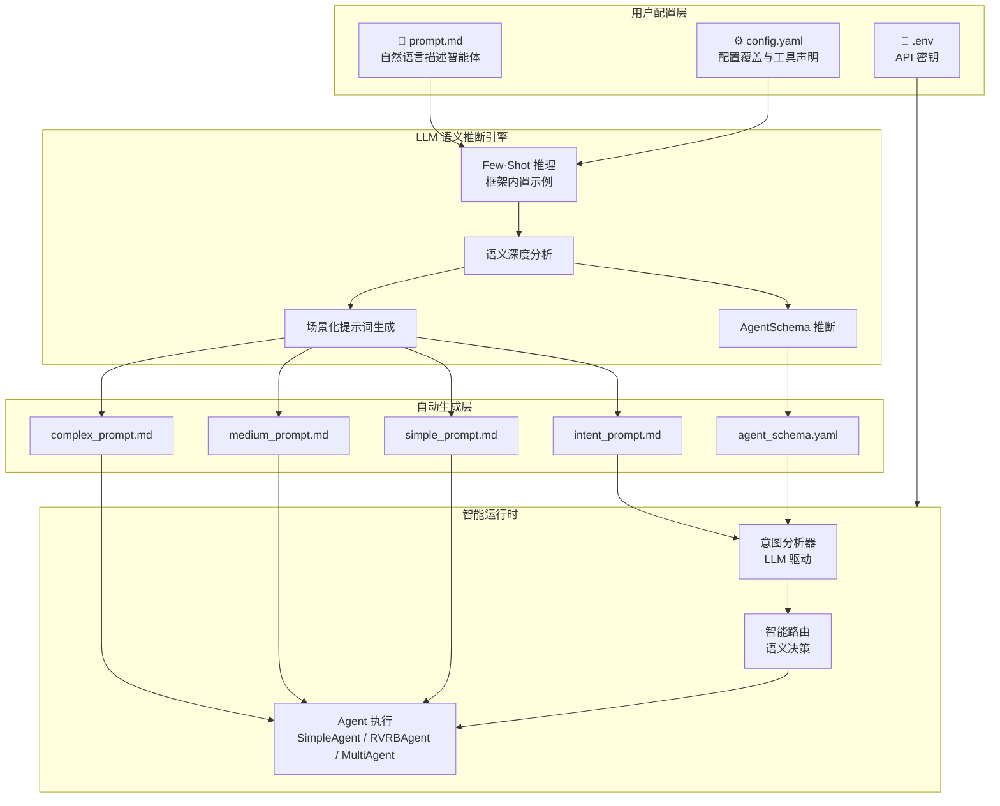
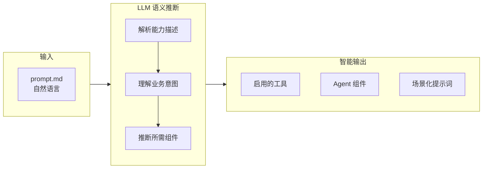
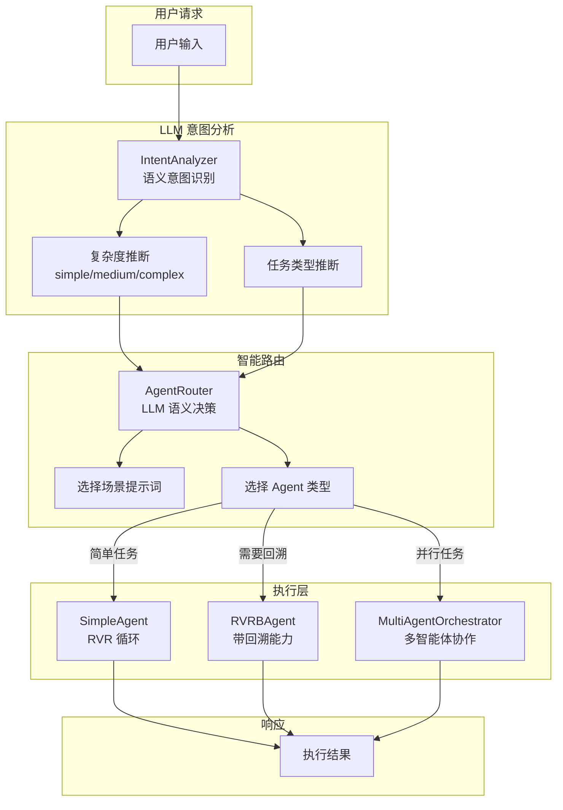

# ZenFlux Agent 配置全景图

> **面向**: 解决方案工程师 / 客户演示  
> **核心理念**: LLM-First（大模型优先）

---

## 设计理念：LLM-First

```
┌─────────────────────────────────────────────────────────────────────────────────┐
│                                                                                  │
│                         🧠 LLM-First 架构设计                                    │
│                                                                                  │
│   ┌───────────────────────────────────────────────────────────────────────────┐ │
│   │                                                                            │ │
│   │   传统方式（关键词匹配）              ZenFlux 方式（语义推断）              │ │
│   │   ─────────────────────              ─────────────────────                │ │
│   │                                                                            │ │
│   │   用户: "构造CRM系统"                 用户: "构造CRM系统"                   │ │
│   │          ↓                                   ↓                            │ │
│   │   if "系统" in text:                 LLM 深度语义分析:                     │ │
│   │       return "complex"                • "构造"是 build 动作                │ │
│   │                                       • "系统"表示完整架构                 │ │
│   │   用户: "系统怎么用?"                 • 需要多轮设计和建模                 │ │
│   │          ↓                                   ↓                            │ │
│   │   if "系统" in text:                 → complexity: complex                 │ │
│   │       return "complex" ❌ 误判        → needs_plan: true                   │ │
│   │                                                                            │ │
│   │   用户: "系统怎么用?"                                                      │ │
│   │          ↓                                                                 │ │
│   │   LLM 分析: 虽有"系统"，但是询问用法                                       │ │
│   │   → complexity: simple ✅ 正确                                             │ │
│   │                                                                            │ │
│   └───────────────────────────────────────────────────────────────────────────┘ │
│                                                                                  │
│   核心原则:                                                                      │
│   ━━━━━━━━━━━━━━━━━━━━━━━━━━━━━━━━━━━━━━━━━━━━━━━━━━━━━━━━━━━━━━━━━━━━━━━━━━━  │
│   • 规则写在 Prompt 里，不写在代码里                                             │
│   • Few-Shot 示例教会 LLM 推理模式                                               │
│   • 代码只做调用和解析，不做规则判断                                             │
│   • 充分信任大模型的语义理解和深度推理能力                                       │
│                                                                                  │
└─────────────────────────────────────────────────────────────────────────────────┘
```

---

## 整体架构全景



---

## 3 步快速配置

```
┌─────────────────────────────────────────────────────────────────────────────────┐
│                                                                                  │
│   Step 1                    Step 2                    Step 3                    │
│   ━━━━━━━━━━━━━━           ━━━━━━━━━━━━━━            ━━━━━━━━━━━━━━             │
│                                                                                  │
│   📁 复制模板               📝 编写提示词              🔑 配置密钥               │
│                                                                                  │
│   cp -r _template           用自然语言描述：           cp env.example .env       │
│         my_agent            • 角色定义                 填入 API 密钥             │
│                             • 核心能力                                           │
│                             • 工作规则                                           │
│                                                                                  │
│                             框架自动理解语义           🚀 启动                    │
│                             无需配置规则映射           python scripts/           │
│                                                        instance_loader.py       │
│                                                        --instance my_agent      │
│                                                                                  │
└─────────────────────────────────────────────────────────────────────────────────┘
```

---

## LLM 语义推断流程



### 语义推断 vs 关键词匹配

| 对比维度 | LLM 语义推断 | 关键词匹配 |
|---------|-------------|-----------|
| **理解能力** | 理解语义、上下文、隐含意图 | 只能匹配字面文字 |
| **泛化能力** | 处理未见过的表达方式 | 只能处理预定义关键词 |
| **否定语义** | 区分"做PPT"和"不要做PPT" | 两者都匹配到"PPT" |
| **修饰语理解** | "简单的PPT"→medium | 忽略"简单"修饰 |
| **维护成本** | 修改 Few-Shot 示例 | 不断添加新规则 |
| **错误模式** | 保守 fallback，不猜测 | 规则遗漏导致误判 |

### 推断示例

```
输入: "你是一个数据分析师，能够处理 Excel 和进行数据可视化"

LLM 语义分析过程:
├─ 角色: 数据分析师
├─ 能力1: "处理 Excel" → 需要 Excel 读写能力
├─ 能力2: "数据可视化" → 需要图表生成能力
├─ 隐含需求: 可能需要 Python 沙箱执行分析代码
│
推断结果:
├─ enabled_capabilities:
│   ├─ xlsx: true
│   ├─ sandbox_tools: true
│   └─ chart_generation: true
├─ components:
│   └─ plan_manager: true (数据分析通常需要多步骤)
└─ complexity_hint: medium
```

---

## 能力扩展矩阵

```
┌─────────────────────────────────────────────────────────────────────────────────┐
│                            能力扩展方式                                          │
├─────────────────────────────────────────────────────────────────────────────────┤
│                                                                                  │
│   ┌─────────────────┐  ┌─────────────────┐  ┌─────────────────┐                │
│   │  Claude Skills  │  │  Multi-Agent    │  │   MCP 工具      │                │
│   │  ─────────────  │  │  ─────────────  │  │  ─────────────  │                │
│   │                 │  │                 │  │                 │                │
│   │  skills/        │  │  workers/       │  │  config.yaml    │                │
│   │  ├─ SKILL.md    │  │  ├─ prompt.md   │  │  mcp_tools:     │                │
│   │  └─ scripts/    │  │  └─ config.yaml │  │  - name: xxx    │                │
│   │                 │  │                 │  │    server_url:  │                │
│   │  适用:          │  │  适用:          │  │                 │                │
│   │  • 文档生成     │  │  • 并行任务     │  │  适用:          │                │
│   │  • 专业领域     │  │  • 多角色协作   │  │  • Dify 工作流  │                │
│   │  • 复杂流程     │  │  • 研究分析     │  │  • Coze 应用    │                │
│   │                 │  │                 │  │  • 外部服务     │                │
│   └─────────────────┘  └─────────────────┘  └─────────────────┘                │
│                                                                                  │
│   ┌─────────────────┐                                                           │
│   │   REST APIs     │                                                           │
│   │  ─────────────  │                                                           │
│   │                 │                                                           │
│   │  api_desc/      │                                                           │
│   │  └─ api.md      │   用自然语言描述 API 用法                                  │
│   │                 │   LLM 自动理解如何调用                                     │
│   │  适用:          │                                                           │
│   │  • 企业内部 API │                                                           │
│   │  • 第三方服务   │                                                           │
│   └─────────────────┘                                                           │
│                                                                                  │
└─────────────────────────────────────────────────────────────────────────────────┘
```

---

## 实例目录结构

```
my_agent/
│
├── 📝 prompt.md                  # 核心！智能体定义（自然语言）
├── ⚙️ config.yaml                # 配置覆盖（可选）
├── 🔑 .env                       # API 密钥
├── 📋 env.example                # 密钥模板
│
├── 🤖 prompt_results/            # LLM 自动生成
│   ├── agent_schema.yaml         #   → Agent 配置（语义推断）
│   ├── intent_prompt.md          #   → 意图识别提示词
│   ├── simple_prompt.md          #   → 简单任务提示词
│   ├── medium_prompt.md          #   → 中等任务提示词
│   └── complex_prompt.md         #   → 复杂任务提示词
│
├── 🎯 skills/                    # Claude Skills
│   ├── skill_registry.yaml       #   → 技能注册表
│   └── {skill-name}/             #   → 技能目录
│       └── SKILL.md              #       → 技能定义
│
├── 👥 workers/                   # Multi-Agent
│   ├── worker_registry.yaml      #   → Worker 注册表
│   └── {worker-name}/            #   → Worker 目录
│       └── prompt.md             #       → Worker 提示词
│
└── 🔌 api_desc/                  # REST API 描述
    └── {api-name}.md             #   → API 用法说明（自然语言）
```

---

## 运行时架构



---

## 配置优先级

```
┌─────────────────────────────────────────────────────────────────────────────────┐
│                                                                                  │
│   配置优先级（高 → 低）                                                          │
│   ━━━━━━━━━━━━━━━━━━━━━━━━━━━━━━━━━━━━━━━━━━━━━━━━━━━━━━━━━━━━━━━━━━━━━━━━━━━  │
│                                                                                  │
│   ┌─────────────────────────────────────────────────────────────────────────┐   │
│   │  Level 1: config.yaml 显式配置                                          │   │
│   │  ─────────────────────────────────────────────────────────────────────  │   │
│   │  运营显式指定的配置，优先级最高                                          │   │
│   │  例: agent.model: "claude-sonnet-4-5-20250929"                          │   │
│   └─────────────────────────────────────────────────────────────────────────┘   │
│                          ↓                                                       │
│   ┌─────────────────────────────────────────────────────────────────────────┐   │
│   │  Level 2: LLM 语义推断                                                   │   │
│   │  ─────────────────────────────────────────────────────────────────────  │   │
│   │  从 prompt.md 智能分析，理解业务意图                                     │   │
│   │  例: 检测到"数据分析"→ 自动启用 sandbox_tools                            │   │
│   └─────────────────────────────────────────────────────────────────────────┘   │
│                          ↓                                                       │
│   ┌─────────────────────────────────────────────────────────────────────────┐   │
│   │  Level 3: 框架默认值                                                     │   │
│   │  ─────────────────────────────────────────────────────────────────────  │   │
│   │  保守的兜底配置                                                          │   │
│   │  例: max_turns: 15, complexity: medium                                   │   │
│   └─────────────────────────────────────────────────────────────────────────┘   │
│                                                                                  │
└─────────────────────────────────────────────────────────────────────────────────┘
```

---

## 硬规则使用场景（仅限补充）

LLM-First 并不意味着完全不用规则。以下场景适合使用硬编码规则作为补充：

| 场景 | 示例 | 原因 |
|------|------|------|
| **格式验证** | 邮箱格式、URL 格式 | 规则明确，无需推理 |
| **数值计算** | 金额汇总、数量统计 | 纯数学运算，确定性 |
| **安全边界** | 输入长度限制、路径净化 | 必须 100% 确定性保证 |
| **低延迟场景** | 快速垃圾过滤（<10ms） | 延迟敏感，无法等待 LLM |

```
混合架构示例:

┌─────────────────────────────────────────────────────────────────┐
│                                                                  │
│   用户请求 ──→ 快速预检（硬规则）──→ 深度处理（LLM）──→ 响应   │
│                    ↓                      ↓                      │
│              • 格式验证              • 语义理解                  │
│              • 长度检查              • 意图分析                  │
│              • 安全过滤              • 任务规划                  │
│              ~1-5ms                  ~100-500ms                  │
│                                                                  │
└─────────────────────────────────────────────────────────────────┘
```

---

## 常见问题

### Q: prompt_results 是如何生成的？

框架启动时，LLM 会分析 `prompt.md` 内容，通过 Few-Shot 提示词进行语义推断，自动生成场景化的提示词和配置。这个过程只在首次启动或配置变更时执行。

### Q: 可以手动编辑 prompt_results 吗？

可以。系统会检测手动编辑，下次更新时不会覆盖您的修改。如需重新生成，删除 `_metadata.json` 或使用 `--force-refresh` 参数。

### Q: LLM 推断失败怎么办？

框架采用保守的 fallback 策略，使用默认值而非猜测。您可以在 `config.yaml` 中显式配置来覆盖。

### Q: 如何添加新能力？

在 `prompt.md` 中用自然语言描述即可。例如添加"具备数据可视化能力"，LLM 会自动推断需要启用相关工具。

### Q: 配置没生效？

检查优先级：`config.yaml` > LLM 推断 > 默认值。如果需要强制覆盖 LLM 推断，在 `config.yaml` 中显式配置。

---

## 技术亮点总结

| 特性 | 价值 |
|------|------|
| **LLM-First** | 充分发挥大模型语义理解能力，告别脆弱的关键词匹配 |
| **Few-Shot 驱动** | 框架内置高质量示例，LLM 学习推理模式后泛化 |
| **3 步配置** | 复制模板 → 写提示词 → 配密钥，分钟级上线 |
| **自动生成** | 场景化提示词自动生成，运营无需理解技术细节 |
| **配置优先级** | 显式配置可覆盖 LLM 推断，灵活可控 |
| **保守 Fallback** | 推断失败不猜测，使用安全默认值 |
